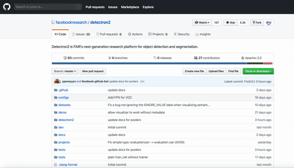

# Github star, fork, and watch stats. 


I was looking into knowing who are those who fork, star, and watch my GitHub repositories at the same time. 

Something like this:

```
                                                   stargazers (68)    watcher (20)    forks (100)    
https://github.com/account_1                              *                *              *    
https://github.com/account_2                              *                *              *    
https://github.com/account_3                              *                *              *    
https://github.com/account_4                              *                *              *   
```


This ```https://github.com/nelsonic/github-scraper``` is an exciting GitHub scraper but one, it is not in python and two it only reports the watchers, stars and forks counts
without the account information 
```
  watchers: 3,
  stars: 8,
  forks: 1,
  ...
```

After a few minutes spent trying to find something that does that, but in vain, I decided to work on this script.


## How to?
There still a bit of manual work so bare with me:

- Step one
Go to Github the repository you are interested in then repeat the following steps in order to get all the urls 
from the watch, star and fork pages:



Here is the script used for generating the file:
```
var urls = [];
for(var i = document.links.length; i --> 0;)
    if(document.links[i].hostname === location.hostname)
        urls.push(document.links[i].href);
var hiddenElement = document.createElement('a');
hiddenElement.href = 'data:attachment/text,' + encodeURI(urls);
hiddenElement.target = '_blank';
hiddenElement.download = 'url_list.txt';
hiddenElement.click();
```
Open the file that was generated and copy and assign its content as a string variable to the correct variable name.
  
```

url_watcher = "https://github.com/facebookresearch/detectron2/watchers,https://github.com/facebookresearch/detectron2/watchers,https://github.com/about,https://github.com/pricing,https://github.com/contact,https://github.com/,https://github.com/security,https://github.com/site/privacy,https://github.com/site/terms,https://github.com/facebookresearch/detectron2/watchers?page=2,https://github.com/facebookresearch/detectron2/watchers?page=3,https://github.com/facebookresearch/detectron2/watchers?page=2,https://github.com/mschipperheyn,https://github.com/mschipperheyn,https://github.com/baishuijianjia,https://github.com/baishuijianjia,https://github.com/wagnlinzh,https://github.com/wagnlinzh,https://github.com/wuqijin,https://github.com/wuqijin,https://github.com/hguowei,https://github.com/hguowei,https://github.com/toborobot,https://github.com/toborobot,https://github.com/reyl27,https://github.com/reyl27,https://github.com/curiousily,https://github.com/curiousily,https://github.com/xiongzubiao,https://github.com/xiongzubiao,https://github.com/fendaq,https://github.com/fendaq,https://github.com/chensnathan,https://github.com/chensnathan,https://github.com/tshizys,https://github.com/tshizys,https://github.com/jingruhou,https://github.com/jingruhou,https://github.com/zhangbaotju,https://github.com/zhangbaotju,https://github.com/pandeyamit81,https://github.com/pandeyamit81,https://github.com/wangg12,https://github.com/wangg12,https://github.com/dcyoung,https://github.com/dcyoung,https://github.com/Garethlomax,https://github.com/Garethlomax,https://github.com/spytensor,https://github.com/spytensor,https://github.com/lyming531,https://github.com/lyming531,https://github.com/ted8201,https://github.com/ted8201,https://github.com/luoqiuluoqiu,https://github.com/luoqiuluoqiu,https://github.com/djangogo,https://github.com/djangogo,https://github.com/ailias,https://github.com/ailias,https://github.com/pgsrv,https://github.com/pgsrv,https://github.com/Just5D,https://github.com/Just5D,https://github.com/ravikantb,https://github.com/ravikantb,https://github.com/naranjuelo,https://github.com/naranjuelo,https://github.com/jfzhang95,https://github.com/jfzhang95,https://github.com/Angzz,https://github.com/Angzz,https://github.com/blandocs,https://github.com/blandocs,https://github.com/Incenter2016,https://github.com/Incenter2016,https://github.com/liuguoyou,https://github.com/liuguoyou,https://github.com/JasonShiyong,https://github.com/JasonShiyong,https://github.com/chenchr,https://github.com/chenchr,https://github.com/lbin,https://github.com/lbin,https://github.com/ysfalo,https://github.com/ysfalo,https://github.com/Zehaos,https://github.com/Zehaos,https://github.com/csuhan,https://github.com/csuhan,https://github.com/vlad3996,https://github.com/vlad3996,https://github.com/kgl-prml,https://github.com/kgl-prml,https://github.com/tatsuya-ishihara,https://github.com/tatsuya-ishihara,https://github.com/wangzheallen,https://github.com/wangzheallen,https://github.com/qianyizhang,https://github.com/qianyizhang,https://github.com/michalwols,https://github.com/michalwols,https://github.com/chongruo,https://github.com/chongruo,https://github.com/dongzhuoyao,https://github.com/dongzhuoyao,https://github.com/alexander-kirillov,https://github.com/alexander-kirillov,https://github.com/rbgirshick,https://github.com/rbgirshick,https://github.com/ppwwyyxx,https://github.com/ppwwyyxx,https://github.com/killian,https://github.com/killian,https://github.com/facebookresearch/detectron2/pulse,https://github.com/facebookresearch/detectron2/security/advisories,https://github.com/facebookresearch/detectron2/projects,https://github.com/facebookresearch/detectron2/actions,https://github.com/facebookresearch/detectron2/pulls,https://github.com/facebookresearch/detectron2/issues,https://github.com/facebookresearch/detectron2,https://github.com/facebookresearch/detectron2,https://github.com/facebookresearch,https://github.com/facebookresearch/detectron2/network/members,https://github.com/facebookresearch/detectron2/stargazers,https://github.com/facebookresearch/detectron2/stargazers,https://github.com/facebookresearch/detectron2/watchers,https://github.com/settings/profile,https://github.com/dragona?tab=stars,https://github.com/dragona?tab=projects,https://github.com/dragona?tab=repositories,https://github.com/dragona,https://github.com/dragona,https://github.com/facebookresearch/detectron2/issues/new/choose,https://github.com/organizations/new,https://github.com/new/import,https://github.com/new,https://github.com/notifications,https://github.com/explore,https://github.com/marketplace,https://github.com/issues,https://github.com/pulls,https://github.com/facebookresearch/detectron2/watchers,https://github.com/facebookresearch/detectron2/watchers,https://github.com/facebookresearch/detectron2/watchers,https://github.com/,https://github.com/facebookresearch/detectron2/watchers,https://github.com/facebookresearch/detectron2/watchers?page=2,https://github.com/facebookresearch/detectron2/watchers?page=2,https://github.com/about,https://github.com/pricing,https://github.com/contact,https://github.com/,https://github.com/security,https://github.com/site/privacy,https://github.com/site/terms,https://github.com/facebookresearch/detectron2/watchers?page=3,https://github.com/facebookresearch/detectron2/watchers?page=3,https://github.com/facebookresearch/detectron2/watchers?page=1,https://github.com/facebookresearch/detectron2/watchers?page=1,https://github.com/schwabse,https://github.com/schwabse,https://github.com/vandesa003,https://github.com/vandesa003,https://github.com/codingbelief,https://github.com/codingbelief,https://github.com/jetyingjia,https://github.com/jetyingjia,https://github.com/k30r88,https://github.com/k30r88,https://github.com/roger1993,https://github.com/roger1993,https://github.com/carlzhangxuan,https://github.com/carlzhangxuan,https://github.com/hn18001,https://github.com/hn18001,https://github.com/hjpwhu,https://github.com/hjpwhu,https://github.com/tfgbestneal,https://github.com/tfgbestneal,https://github.com/dale1202,https://github.com/dale1202,https://github.com/jncz,https://github.com/jncz,https://github.com/jfey,https://github.com/jfey,https://github.com/rex-yue-wu,https://github.com/rex-yue-wu,https://github.com/zawabest,https://github.com/zawabest,https://github.com/zhangwenwen,https://github.com/zhangwenwen,https://github.com/slf007,https://github.com/slf007,https://github.com/njpsanghani,https://github.com/njpsanghani,https://github.com/betsyalan,https://github.com/betsyalan,https://github.com/chengstone,https://github.com/chengstone,https://github.com/Konard,https://github.com/Konard,https://github.com/Vieeo,https://github.com/Vieeo,https://github.com/bendidi,https://github.com/bendidi,https://github.com/WuLoing,https://github.com/WuLoing,https://github.com/overkazaf,https://github.com/overkazaf,https://github.com/rotorliu,https://github.com/rotorliu,https://github.com/loveychen,https://github.com/loveychen,https://github.com/thnt,https://github.com/thnt,https://github.com/h1a0,https://github.com/h1a0,https://github.com/ruxiaobao,https://github.com/ruxiaobao,https://github.com/aranhaagency,https://github.com/aranhaagency,https://github.com/ebizmis,https://github.com/ebizmis,https://github.com/ejbdev,https://github.com/ejbdev,https://github.com/zxf8665905,https://github.com/zxf8665905,https://github.com/cbing88,https://github.com/cbing88,https://github.com/xiangliZUEL,https://github.com/xiangliZUEL,https://github.com/cxds123,https://github.com/cxds123,https://github.com/BingShaw,https://github.com/BingShaw,https://github.com/tpys,https://github.com/tpys,https://github.com/isaiasneto,https://github.com/isaiasneto,https://github.com/vicwue,https://github.com/vicwue,https://github.com/venkatesh-sakthivel,https://github.com/venkatesh-sakthivel,https://github.com/thangvubk,https://github.com/thangvubk,https://github.com/maplelinyuan,https://github.com/maplelinyuan,https://github.com/wiplug,https://github.com/wiplug,https://github.com/znsoftm,https://github.com/znsoftm,https://github.com/clover-xj,https://github.com/clover-xj,https://github.com/stonegao,https://github.com/stonegao,https://github.com/MaeThird,https://github.com/MaeThird,https://github.com/yangfanx,https://github.com/yangfanx,https://github.com/hgjinfan,https://github.com/hgjinfan,https://github.com/facebookresearch/detectron2/pulse,https://github.com/facebookresearch/detectron2/security/advisories,https://github.com/facebookresearch/detectron2/projects,https://github.com/facebookresearch/detectron2/actions,https://github.com/facebookresearch/detectron2/pulls,https://github.com/facebookresearch/detectron2/issues,https://github.com/facebookresearch/detectron2,https://github.com/facebookresearch/detectron2,https://github.com/facebookresearch,https://github.com/facebookresearch/detectron2/network/members,https://github.com/facebookresearch/detectron2/stargazers,https://github.com/facebookresearch/detectron2/stargazers,https://github.com/facebookresearch/detectron2/watchers,https://github.com/settings/profile,https://github.com/dragona?tab=stars,https://github.com/dragona?tab=projects,https://github.com/dragona?tab=repositories,https://github.com/dragona,https://github.com/dragona,https://github.com/facebookresearch/detectron2/issues/new/choose,https://github.com/organizations/new,https://github.com/new/import,https://github.com/new,https://github.com/notifications,https://github.com/explore,https://github.com/marketplace,https://github.com/issues,https://github.com/pulls,https://github.com/facebookresearch/detectron2/watchers?page=2,https://github.com/facebookresearch/detectron2/watchers?page=2,https://github.com/facebookresearch/detectron2/watchers?page=2,https://github.com/,https://github.com/facebookresearch/detectron2/watchers?page=2,https://github.com/facebookresearch/detectron2/watchers?page=3,https://github.com/facebookresearch/detectron2/watchers?page=3,https://github.com/about,https://github.com/pricing,https://github.com/contact,https://github.com/,https://github.com/security,https://github.com/site/privacy,https://github.com/site/terms,https://github.com/facebookresearch/detectron2/watchers?page=2,https://github.com/facebookresearch/detectron2/watchers?page=1,https://github.com/facebookresearch/detectron2/watchers?page=2,https://github.com/noisecraft,https://github.com/noisecraft,https://github.com/erkanbalaban,https://github.com/erkanbalaban,https://github.com/servercalap,https://github.com/servercalap,https://github.com/maphysart,https://github.com/maphysart,https://github.com/Gaurav14cs17,https://github.com/Gaurav14cs17,https://github.com/myaniu,https://github.com/myaniu,https://github.com/FanShuixing,https://github.com/FanShuixing,https://github.com/rinetd,https://github.com/rinetd,https://github.com/NunoEdgarGub1,https://github.com/NunoEdgarGub1,https://github.com/abcdcamey,https://github.com/abcdcamey,https://github.com/Medrbt,https://github.com/Medrbt,https://github.com/cdl93,https://github.com/cdl93,https://github.com/soreiyu52,https://github.com/soreiyu52,https://github.com/vansondang,https://github.com/vansondang,https://github.com/1992Zz,https://github.com/1992Zz,https://github.com/anilknayak,https://github.com/anilknayak,https://github.com/trippycode,https://github.com/trippycode,https://github.com/xmyqsh,https://github.com/xmyqsh,https://github.com/roughsoft,https://github.com/roughsoft,https://github.com/andykit,https://github.com/andykit,https://github.com/prepare,https://github.com/prepare,https://github.com/Remember2018,https://github.com/Remember2018,https://github.com/Baby47,https://github.com/Baby47,https://github.com/takatosp1,https://github.com/takatosp1,https://github.com/wuyuanyi135,https://github.com/wuyuanyi135,https://github.com/demon386,https://github.com/demon386,https://github.com/windddk,https://github.com/windddk,https://github.com/ichaida,https://github.com/ichaida,https://github.com/camark,https://github.com/camark,https://github.com/yangjzx,https://github.com/yangjzx,https://github.com/armandmcqueen,https://github.com/armandmcqueen,https://github.com/marongchao,https://github.com/marongchao,https://github.com/qizhonglin,https://github.com/qizhonglin,https://github.com/Stick-To,https://github.com/Stick-To,https://github.com/krishna999,https://github.com/krishna999,https://github.com/facebookresearch/detectron2/pulse,https://github.com/facebookresearch/detectron2/security/advisories,https://github.com/facebookresearch/detectron2/projects,https://github.com/facebookresearch/detectron2/actions,https://github.com/facebookresearch/detectron2/pulls,https://github.com/facebookresearch/detectron2/issues,https://github.com/facebookresearch/detectron2,https://github.com/facebookresearch/detectron2,https://github.com/facebookresearch,https://github.com/facebookresearch/detectron2/network/members,https://github.com/facebookresearch/detectron2/stargazers,https://github.com/facebookresearch/detectron2/stargazers,https://github.com/facebookresearch/detectron2/watchers,https://github.com/settings/profile,https://github.com/dragona?tab=stars,https://github.com/dragona?tab=projects,https://github.com/dragona?tab=repositories,https://github.com/dragona,https://github.com/dragona,https://github.com/facebookresearch/detectron2/issues/new/choose,https://github.com/organizations/new,https://github.com/new/import,https://github.com/new,https://github.com/notifications,https://github.com/explore,https://github.com/marketplace,https://github.com/issues,https://github.com/pulls,https://github.com/facebookresearch/detectron2/watchers?page=3,https://github.com/facebookresearch/detectron2/watchers?page=3,https://github.com/facebookresearch/detectron2/watchers?page=3,https://github.com/,https://github.com/facebookresearch/detectron2/watchers?page=3"
url_stargazers = "https://github.com/facebookresearch/detectron2/stargazers,https://github.com/facebookresearch/detectron2/stargazers,https://github.com/about,https://github.com/pricing,https://github.com/contact,https://github.com/,https://github.com/security,https://github.com/site/privacy,https://github.com/site/terms,https://github.com/facebookresearch/detectron2/stargazers?after=Y3Vyc29yOnYyOpO5MjAxOS0xMS0wOFQxNDozNzowOCswODowMADOC4yVaA%3D%3D,https://github.com/CRonaldo1997,https://github.com/CRonaldo1997,https://github.com/t25jin,https://github.com/t25jin,https://github.com/tdyczek,https://github.com/tdyczek,https://github.com/marktube,https://github.com/marktube,https://github.com/amitadate,https://github.com/amitadate,https://github.com/zhaotun,https://github.com/zhaotun,https://github.com/servercalap,https://github.com/servercalap,https://github.com/TriplePool,https://github.com/TriplePool,https://github.com/issacnewbo,https://github.com/issacnewbo,https://github.com/oceanlvr,https://github.com/oceanlvr,https://github.com/whispercosat,https://github.com/whispercosat,https://github.com/XH-Liang,https://github.com/XH-Liang,https://github.com/yangyu12,https://github.com/yangyu12,https://github.com/ouclong,https://github.com/ouclong,https://github.com/simochen,https://github.com/simochen,https://github.com/andr2880,https://github.com/andr2880,https://github.com/fenguoerbian,https://github.com/fenguoerbian,https://github.com/dq-soulie,https://github.com/dq-soulie,https://github.com/zischwartz,https://github.com/zischwartz,https://github.com/smollada,https://github.com/smollada,https://github.com/xuedue,https://github.com/xuedue,https://github.com/oarriaga,https://github.com/oarriaga,https://github.com/xingkongyj2,https://github.com/xingkongyj2,https://github.com/benathi,https://github.com/benathi,https://github.com/WangZiyueAiden,https://github.com/WangZiyueAiden,https://github.com/l1xnan,https://github.com/l1xnan,https://github.com/Frostmoune,https://github.com/Frostmoune,https://github.com/ammarfaizi2,https://github.com/ammarfaizi2,https://github.com/edisonlee55,https://github.com/edisonlee55,https://github.com/capoomilkddorong,https://github.com/capoomilkddorong,https://github.com/facebookresearch/detectron2/stargazers/you_know,https://github.com/facebookresearch/detectron2/stargazers,https://github.com/facebookresearch/detectron2/pulse,https://github.com/facebookresearch/detectron2/security/advisories,https://github.com/facebookresearch/detectron2/projects,https://github.com/facebookresearch/detectron2/actions,https://github.com/facebookresearch/detectron2/pulls,https://github.com/facebookresearch/detectron2/issues,https://github.com/facebookresearch/detectron2,https://github.com/facebookresearch/detectron2,https://github.com/facebookresearch,https://github.com/facebookresearch/detectron2/network/members,https://github.com/facebookresearch/detectron2/stargazers,https://github.com/facebookresearch/detectron2/stargazers,https://github.com/facebookresearch/detectron2/watchers,https://github.com/settings/profile,https://github.com/dragona?tab=stars,https://github.com/dragona?tab=projects,https://github.com/dragona?tab=repositories,https://github.com/dragona,https://github.com/dragona,https://github.com/facebookresearch/detectron2/issues/new/choose,https://github.com/organizations/new,https://github.com/new/import,https://github.com/new,https://github.com/notifications,https://github.com/explore,https://github.com/marketplace,https://github.com/issues,https://github.com/pulls,https://github.com/facebookresearch/detectron2/stargazers,https://github.com/facebookresearch/detectron2/stargazers,https://github.com/facebookresearch/detectron2/stargazers,https://github.com/,https://github.com/facebookresearch/detectron2/stargazers,https://github.com/facebookresearch/detectron2/stargazers?after=Y3Vyc29yOnYyOpO5MjAxOS0xMS0wOFQxNDozNzowOCswODowMADOC4yVaA%3D%3D,https://github.com/facebookresearch/detectron2/stargazers?after=Y3Vyc29yOnYyOpO5MjAxOS0xMS0wOFQxNDozNzowOCswODowMADOC4yVaA%3D%3D,https://github.com/about,https://github.com/pricing,https://github.com/contact,https://github.com/,https://github.com/security,https://github.com/site/privacy,https://github.com/site/terms,https://github.com/facebookresearch/detectron2/stargazers?after=Y3Vyc29yOnYyOpO5MjAxOS0xMS0wOFQwMDowMDozOSswODowMADOC4tvAA%3D%3D,https://github.com/facebookresearch/detectron2/stargazers?before=Y3Vyc29yOnYyOpO5MjAxOS0xMS0wOFQxNDowMjo0MyswODowMADOC4yDZw%3D%3D,https://github.com/bloolizard,https://github.com/bloolizard,https://github.com/eddex,https://github.com/eddex,https://github.com/WinKILLER,https://github.com/WinKILLER,https://github.com/sheldonchiu,https://github.com/sheldonchiu,https://github.com/orakle,https://github.com/orakle,https://github.com/souzapsl,https://github.com/souzapsl,https://github.com/ChrisSun2010,https://github.com/ChrisSun2010,https://github.com/dbrunonascimento,https://github.com/dbrunonascimento,https://github.com/jasongottschalk,https://github.com/jasongottschalk,https://github.com/hansen7,https://github.com/hansen7,https://github.com/shehabk,https://github.com/shehabk,https://github.com/EruditePanda,https://github.com/EruditePanda,https://github.com/raltech,https://github.com/raltech,https://github.com/cheesama,https://github.com/cheesama,https://github.com/iwanggp,https://github.com/iwanggp,https://github.com/ybpei,https://github.com/ybpei,https://github.com/ruiqianheartseed,https://github.com/ruiqianheartseed,https://github.com/taoboq,https://github.com/taoboq,https://github.com/Soo95,https://github.com/Soo95,https://github.com/liygcheng,https://github.com/liygcheng,https://github.com/jeason353,https://github.com/jeason353,https://github.com/ee06b110,https://github.com/ee06b110,https://github.com/kunker001,https://github.com/kunker001,https://github.com/jkzhang7,https://github.com/jkzhang7,https://github.com/leesnhyun,https://github.com/leesnhyun,https://github.com/ohenepee,https://github.com/ohenepee,https://github.com/mikesongming,https://github.com/mikesongming,https://github.com/SiddharthChillale,https://github.com/SiddharthChillale,https://github.com/miyaki,https://github.com/miyaki,https://github.com/VisionTekF,https://github.com/VisionTekF,https://github.com/facebookresearch/detectron2/stargazers/you_know,https://github.com/facebookresearch/detectron2/stargazers,https://github.com/facebookresearch/detectron2/pulse,https://github.com/facebookresearch/detectron2/security/advisories,https://github.com/facebookresearch/detectron2/projects,https://github.com/facebookresearch/detectron2/actions,https://github.com/facebookresearch/detectron2/pulls,https://github.com/facebookresearch/detectron2/issues,https://github.com/facebookresearch/detectron2,https://github.com/facebookresearch/detectron2,https://github.com/facebookresearch,https://github.com/facebookresearch/detectron2/network/members,https://github.com/facebookresearch/detectron2/stargazers,https://github.com/facebookresearch/detectron2/stargazers,https://github.com/facebookresearch/detectron2/watchers,https://github.com/settings/profile,https://github.com/dragona?tab=stars,https://github.com/dragona?tab=projects,https://github.com/dragona?tab=repositories,https://github.com/dragona,https://github.com/dragona,https://github.com/facebookresearch/detectron2/issues/new/choose,https://github.com/organizations/new,https://github.com/new/import,https://github.com/new,https://github.com/notifications,https://github.com/explore,https://github.com/marketplace,https://github.com/issues,https://github.com/pulls,https://github.com/facebookresearch/detectron2/stargazers?after=Y3Vyc29yOnYyOpO5MjAxOS0xMS0wOFQxNDozNzowOCswODowMADOC4yVaA%3D%3D,https://github.com/facebookresearch/detectron2/stargazers?after=Y3Vyc29yOnYyOpO5MjAxOS0xMS0wOFQxNDozNzowOCswODowMADOC4yVaA%3D%3D,https://github.com/facebookresearch/detectron2/stargazers?after=Y3Vyc29yOnYyOpO5MjAxOS0xMS0wOFQxNDozNzowOCswODowMADOC4yVaA%3D%3D,https://github.com/,https://github.com/facebookresearch/detectron2/stargazers?after=Y3Vyc29yOnYyOpO5MjAxOS0xMS0wOFQxNDozNzowOCswODowMADOC4yVaA%3D%3D,https://github.com/facebookresearch/detectron2/stargazers?after=Y3Vyc29yOnYyOpO5MjAxOS0xMS0wOFQwMDowMDozOSswODowMADOC4tvAA%3D%3D,https://github.com/facebookresearch/detectron2/stargazers?after=Y3Vyc29yOnYyOpO5MjAxOS0xMS0wOFQwMDowMDozOSswODowMADOC4tvAA%3D%3D,https://github.com/about,https://github.com/pricing,https://github.com/contact,https://github.com/,https://github.com/security,https://github.com/site/privacy,https://github.com/site/terms,https://github.com/facebookresearch/detectron2/stargazers?after=Y3Vyc29yOnYyOpO5MjAxOS0xMS0wN1QxMzoxNTowMyswODowMADOC4ok9A%3D%3D,https://github.com/facebookresearch/detectron2/stargazers?before=Y3Vyc29yOnYyOpO5MjAxOS0xMS0wN1QyMzo0OToxMSswODowMADOC4tqOg%3D%3D,https://github.com/meticulousCraftman,https://github.com/meticulousCraftman,https://github.com/abhianand7,https://github.com/abhianand7,https://github.com/michaelshiyu,https://github.com/michaelshiyu,https://github.com/stevenphf,https://github.com/stevenphf,https://github.com/WeiXuVanG,https://github.com/WeiXuVanG,https://github.com/Jeswin17,https://github.com/Jeswin17,https://github.com/RawanAlharbi,https://github.com/RawanAlharbi,https://github.com/Luojiaqimath,https://github.com/Luojiaqimath,https://github.com/fzh0917,https://github.com/fzh0917,https://github.com/ThomasChisholm,https://github.com/ThomasChisholm,https://github.com/sp1thas,https://github.com/sp1thas,https://github.com/msanpe,https://github.com/msanpe,https://github.com/panpepson,https://github.com/panpepson,https://github.com/yunusdgntr,https://github.com/yunusdgntr,https://github.com/marciorf,https://github.com/marciorf,https://github.com/djimmo,https://github.com/djimmo,https://github.com/leidaguo,https://github.com/leidaguo,https://github.com/lidq92,https://github.com/lidq92,https://github.com/vlad-filin,https://github.com/vlad-filin,https://github.com/indulgingcode,https://github.com/indulgingcode,https://github.com/alshell7,https://github.com/alshell7,https://github.com/rasd3,https://github.com/rasd3,https://github.com/kuzmind,https://github.com/kuzmind,https://github.com/a1300,https://github.com/a1300,https://github.com/Alex-Sol,https://github.com/Alex-Sol,https://github.com/m-pedro,https://github.com/m-pedro,https://github.com/hoaipham97,https://github.com/hoaipham97,https://github.com/twice154,https://github.com/twice154,https://github.com/tianpi,https://github.com/tianpi,https://github.com/Eradictor,https://github.com/Eradictor,https://github.com/facebookresearch/detectron2/stargazers/you_know,https://github.com/facebookresearch/detectron2/stargazers,https://github.com/facebookresearch/detectron2/pulse,https://github.com/facebookresearch/detectron2/security/advisories,https://github.com/facebookresearch/detectron2/projects,https://github.com/facebookresearch/detectron2/actions,https://github.com/facebookresearch/detectron2/pulls,https://github.com/facebookresearch/detectron2/issues,https://github.com/facebookresearch/detectron2,https://github.com/facebookresearch/detectron2,https://github.com/facebookresearch,https://github.com/facebookresearch/detectron2/network/members,https://github.com/facebookresearch/detectron2/stargazers,https://github.com/facebookresearch/detectron2/stargazers,https://github.com/facebookresearch/detectron2/watchers,https://github.com/settings/profile,https://github.com/dragona?tab=stars,https://github.com/dragona?tab=projects,https://github.com/dragona?tab=repositories,https://github.com/dragona,https://github.com/dragona,https://github.com/facebookresearch/detectron2/issues/new/choose,https://github.com/organizations/new,https://github.com/new/import,https://github.com/new,https://github.com/notifications,https://github.com/explore,https://github.com/marketplace,https://github.com/issues,https://github.com/pulls,https://github.com/facebookresearch/detectron2/stargazers?after=Y3Vyc29yOnYyOpO5MjAxOS0xMS0wOFQwMDowMDozOSswODowMADOC4tvAA%3D%3D,https://github.com/facebookresearch/detectron2/stargazers?after=Y3Vyc29yOnYyOpO5MjAxOS0xMS0wOFQwMDowMDozOSswODowMADOC4tvAA%3D%3D,https://github.com/facebookresearch/detectron2/stargazers?after=Y3Vyc29yOnYyOpO5MjAxOS0xMS0wOFQwMDowMDozOSswODowMADOC4tvAA%3D%3D,https://github.com/,https://github.com/facebookresearch/detectron2/stargazers?after=Y3Vyc29yOnYyOpO5MjAxOS0xMS0wOFQwMDowMDozOSswODowMADOC4tvAA%3D%3D,https://github.com/facebookresearch/detectron2/stargazers?after=Y3Vyc29yOnYyOpO5MjAxOS0xMS0wN1QxMzoxNTowMyswODowMADOC4ok9A%3D%3D,https://github.com/facebookresearch/detectron2/stargazers?after=Y3Vyc29yOnYyOpO5MjAxOS0xMS0wN1QxMzoxNTowMyswODowMADOC4ok9A%3D%3D,https://github.com/about,https://github.com/pricing,https://github.com/contact,https://github.com/,https://github.com/security,https://github.com/site/privacy,https://github.com/site/terms,https://github.com/facebookresearch/detectron2/stargazers?after=Y3Vyc29yOnYyOpO5MjAxOS0xMS0wN1QwMzoyOTo1MyswODowMADOC4lVag%3D%3D,https://github.com/facebookresearch/detectron2/stargazers?before=Y3Vyc29yOnYyOpO5MjAxOS0xMS0wN1QxMzowNDo0OSswODowMADOC4ogig%3D%3D,https://github.com/btomashvili,https://github.com/btomashvili,https://github.com/jordan314,https://github.com/jordan314,https://github.com/shahms95,https://github.com/shahms95,https://github.com/pgodzin,https://github.com/pgodzin,https://github.com/azell,https://github.com/azell,https://github.com/Lysander6,https://github.com/Lysander6,https://github.com/rationalthug,https://github.com/rationalthug,https://github.com/garysieling,https://github.com/garysieling,https://github.com/naggie,https://github.com/naggie,https://github.com/vicchu,https://github.com/vicchu,https://github.com/sampwing,https://github.com/sampwing,https://github.com/bprevost,https://github.com/bprevost,https://github.com/khang,https://github.com/khang,https://github.com/dywsjtu,https://github.com/dywsjtu,https://github.com/Dayan-Zhanchi,https://github.com/Dayan-Zhanchi,https://github.com/alexhafner,https://github.com/alexhafner,https://github.com/xingzhaolee,https://github.com/xingzhaolee,https://github.com/shubhamworks,https://github.com/shubhamworks,https://github.com/abzdzds,https://github.com/abzdzds,https://github.com/papercatnku,https://github.com/papercatnku,https://github.com/YuanEric88,https://github.com/YuanEric88,https://github.com/Observer-Zhj,https://github.com/Observer-Zhj,https://github.com/inFreedom92,https://github.com/inFreedom92,https://github.com/picaro8,https://github.com/picaro8,https://github.com/timhartill,https://github.com/timhartill,https://github.com/zhirihuixin,https://github.com/zhirihuixin,https://github.com/toandaominh1997,https://github.com/toandaominh1997,https://github.com/JackCaster,https://github.com/JackCaster,https://github.com/yztongzhan,https://github.com/yztongzhan,https://github.com/WuJi1,https://github.com/WuJi1,https://github.com/facebookresearch/detectron2/stargazers/you_know,https://github.com/facebookresearch/detectron2/stargazers,https://github.com/facebookresearch/detectron2/pulse,https://github.com/facebookresearch/detectron2/security/advisories,https://github.com/facebookresearch/detectron2/projects,https://github.com/facebookresearch/detectron2/actions,https://github.com/facebookresearch/detectron2/pulls,https://github.com/facebookresearch/detectron2/issues,https://github.com/facebookresearch/detectron2,https://github.com/facebookresearch/detectron2,https://github.com/facebookresearch,https://github.com/facebookresearch/detectron2/network/members,https://github.com/facebookresearch/detectron2/stargazers,https://github.com/facebookresearch/detectron2/stargazers,https://github.com/facebookresearch/detectron2/watchers,https://github.com/settings/profile,https://github.com/dragona?tab=stars,https://github.com/dragona?tab=projects,https://github.com/dragona?tab=repositories,https://github.com/dragona,https://github.com/dragona,https://github.com/facebookresearch/detectron2/issues/new/choose,https://github.com/organizations/new,https://github.com/new/import,https://github.com/new,https://github.com/notifications,https://github.com/explore,https://github.com/marketplace,https://github.com/issues,https://github.com/pulls,https://github.com/facebookresearch/detectron2/stargazers?after=Y3Vyc29yOnYyOpO5MjAxOS0xMS0wN1QxMzoxNTowMyswODowMADOC4ok9A%3D%3D,https://github.com/facebookresearch/detectron2/stargazers?after=Y3Vyc29yOnYyOpO5MjAxOS0xMS0wN1QxMzoxNTowMyswODowMADOC4ok9A%3D%3D,https://github.com/facebookresearch/detectron2/stargazers?after=Y3Vyc29yOnYyOpO5MjAxOS0xMS0wN1QxMzoxNTowMyswODowMADOC4ok9A%3D%3D,https://github.com/,https://github.com/facebookresearch/detectron2/stargazers?after=Y3Vyc29yOnYyOpO5MjAxOS0xMS0wN1QxMzoxNTowMyswODowMADOC4ok9A%3D%3D,https://github.com/facebookresearch/detectron2/stargazers?after=Y3Vyc29yOnYyOpO5MjAxOS0xMS0wN1QwMzoyOTo1MyswODowMADOC4lVag%3D%3D,https://github.com/facebookresearch/detectron2/stargazers?after=Y3Vyc29yOnYyOpO5MjAxOS0xMS0wN1QwMzoyOTo1MyswODowMADOC4lVag%3D%3D,https://github.com/about,https://github.com/pricing,https://github.com/contact,https://github.com/,https://github.com/security,https://github.com/site/privacy,https://github.com/site/terms,https://github.com/facebookresearch/detectron2/stargazers?after=Y3Vyc29yOnYyOpO5MjAxOS0xMS0wNlQxOTo0ODo0NSswODowMADOC4iRsw%3D%3D,https://github.com/facebookresearch/detectron2/stargazers?before=Y3Vyc29yOnYyOpO5MjAxOS0xMS0wN1QwMzoxNzoyMSswODowMADOC4lRLw%3D%3D,https://github.com/wanganzhi,https://github.com/wanganzhi,https://github.com/Leotju,https://github.com/Leotju,https://github.com/andodevel,https://github.com/andodevel,https://github.com/kvikas19,https://github.com/kvikas19,https://github.com/xlzhang1992,https://github.com/xlzhang1992,https://github.com/Denisolt,https://github.com/Denisolt,https://github.com/hassan-jahan,https://github.com/hassan-jahan,https://github.com/beastmang,https://github.com/beastmang,https://github.com/Zarkopafilis,https://github.com/Zarkopafilis,https://github.com/myaniu,https://github.com/myaniu,https://github.com/John-Yao,https://github.com/John-Yao,https://github.com/rayleegit,https://github.com/rayleegit,https://github.com/harinandan1995,https://github.com/harinandan1995,https://github.com/bjtuyxc,https://github.com/bjtuyxc,https://github.com/JiajieMo,https://github.com/JiajieMo,https://github.com/miranthajayatilake,https://github.com/miranthajayatilake,https://github.com/jottenlips,https://github.com/jottenlips,https://github.com/jinsuyoo,https://github.com/jinsuyoo,https://github.com/paulc00,https://github.com/paulc00,https://github.com/arbal,https://github.com/arbal,https://github.com/pmelnichuk,https://github.com/pmelnichuk,https://github.com/carsonswope,https://github.com/carsonswope,https://github.com/Beans0063,https://github.com/Beans0063,https://github.com/matteosimone,https://github.com/matteosimone,https://github.com/chrishamant,https://github.com/chrishamant,https://github.com/IanBoyanZhang,https://github.com/IanBoyanZhang,https://github.com/amilajack,https://github.com/amilajack,https://github.com/audy,https://github.com/audy,https://github.com/cpeth,https://github.com/cpeth,https://github.com/IFICL,https://github.com/IFICL,https://github.com/facebookresearch/detectron2/stargazers/you_know,https://github.com/facebookresearch/detectron2/stargazers,https://github.com/facebookresearch/detectron2/pulse,https://github.com/facebookresearch/detectron2/security/advisories,https://github.com/facebookresearch/detectron2/projects,https://github.com/facebookresearch/detectron2/actions,https://github.com/facebookresearch/detectron2/pulls,https://github.com/facebookresearch/detectron2/issues,https://github.com/facebookresearch/detectron2,https://github.com/facebookresearch/detectron2,https://github.com/facebookresearch,https://github.com/facebookresearch/detectron2/network/members,https://github.com/facebookresearch/detectron2/stargazers,https://github.com/facebookresearch/detectron2/stargazers,https://github.com/facebookresearch/detectron2/watchers,https://github.com/settings/profile,https://github.com/dragona?tab=stars,https://github.com/dragona?tab=projects,https://github.com/dragona?tab=repositories,https://github.com/dragona,https://github.com/dragona,https://github.com/facebookresearch/detectron2/issues/new/choose,https://github.com/organizations/new,https://github.com/new/import,https://github.com/new,https://github.com/notifications,https://github.com/explore,https://github.com/marketplace,https://github.com/issues,https://github.com/pulls,https://github.com/facebookresearch/detectron2/stargazers?after=Y3Vyc29yOnYyOpO5MjAxOS0xMS0wN1QwMzoyOTo1MyswODowMADOC4lVag%3D%3D,https://github.com/facebookresearch/detectron2/stargazers?after=Y3Vyc29yOnYyOpO5MjAxOS0xMS0wN1QwMzoyOTo1MyswODowMADOC4lVag%3D%3D,https://github.com/facebookresearch/detectron2/stargazers?after=Y3Vyc29yOnYyOpO5MjAxOS0xMS0wN1QwMzoyOTo1MyswODowMADOC4lVag%3D%3D,https://github.com/,https://github.com/facebookresearch/detectron2/stargazers?after=Y3Vyc29yOnYyOpO5MjAxOS0xMS0wN1QwMzoyOTo1MyswODowMADOC4lVag%3D%3D,https://github.com/facebookresearch/detectron2/stargazers?after=Y3Vyc29yOnYyOpO5MjAxOS0xMS0wNlQxOTo0ODo0NSswODowMADOC4iRsw%3D%3D,https://github.com/facebookresearch/detectron2/stargazers?after=Y3Vyc29yOnYyOpO5MjAxOS0xMS0wNlQxOTo0ODo0NSswODowMADOC4iRsw%3D%3D,https://github.com/about,https://github.com/pricing,https://github.com/contact,https://github.com/,https://github.com/security,https://github.com/site/privacy,https://github.com/site/terms,https://github.com/facebookresearch/detectron2/stargazers?after=Y3Vyc29yOnYyOpO5MjAxOS0xMS0wNlQwNToxODo1NSswODowMADOC4cNPg%3D%3D,https://github.com/facebookresearch/detectron2/stargazers?before=Y3Vyc29yOnYyOpO5MjAxOS0xMS0wNlQxODo1Njo1NSswODowMADOC4h7Qg%3D%3D,https://github.com/maurycy,https://github.com/maurycy,https://github.com/ivar,https://github.com/ivar,https://github.com/deven96,https://github.com/deven96,https://github.com/lhty24,https://github.com/lhty24,https://github.com/jangsoopark,https://github.com/jangsoopark,https://github.com/zengxs54,https://github.com/zengxs54,https://github.com/HuYuzhang,https://github.com/HuYuzhang,https://github.com/thuan1412,https://github.com/thuan1412,https://github.com/trikim,https://github.com/trikim,https://github.com/DunZzzz,https://github.com/DunZzzz,https://github.com/Antsypc,https://github.com/Antsypc,https://github.com/higumachan,https://github.com/higumachan,https://github.com/AlvinIsonomia,https://github.com/AlvinIsonomia,https://github.com/sayakpaul,https://github.com/sayakpaul,https://github.com/liuhualh,https://github.com/liuhualh,https://github.com/rinetd,https://github.com/rinetd,https://github.com/tanmaypandey7,https://github.com/tanmaypandey7,https://github.com/beytullahgurpinar,https://github.com/beytullahgurpinar,https://github.com/YongDylan,https://github.com/YongDylan,https://github.com/AlanNaoto,https://github.com/AlanNaoto,https://github.com/wxjeacen,https://github.com/wxjeacen,https://github.com/vegetablesalad,https://github.com/vegetablesalad,https://github.com/glennford49,https://github.com/glennford49,https://github.com/espdev,https://github.com/espdev,https://github.com/lyp830414,https://github.com/lyp830414,https://github.com/florisdf,https://github.com/florisdf,https://github.com/bmanga,https://github.com/bmanga,https://github.com/uZeroJ,https://github.com/uZeroJ,https://github.com/jewelcai,https://github.com/jewelcai,https://github.com/aakash94,https://github.com/aakash94,https://github.com/facebookresearch/detectron2/stargazers/you_know,https://github.com/facebookresearch/detectron2/stargazers,https://github.com/facebookresearch/detectron2/pulse,https://github.com/facebookresearch/detectron2/security/advisories,https://github.com/facebookresearch/detectron2/projects,https://github.com/facebookresearch/detectron2/actions,https://github.com/facebookresearch/detectron2/pulls,https://github.com/facebookresearch/detectron2/issues,https://github.com/facebookresearch/detectron2,https://github.com/facebookresearch/detectron2,https://github.com/facebookresearch,https://github.com/facebookresearch/detectron2/network/members,https://github.com/facebookresearch/detectron2/stargazers,https://github.com/facebookresearch/detectron2/stargazers,https://github.com/facebookresearch/detectron2/watchers,https://github.com/settings/profile,https://github.com/dragona?tab=stars,https://github.com/dragona?tab=projects,https://github.com/dragona?tab=repositories,https://github.com/dragona,https://github.com/dragona,https://github.com/facebookresearch/detectron2/issues/new/choose,https://github.com/organizations/new,https://github.com/new/import,https://github.com/new,https://github.com/notifications,https://github.com/explore,https://github.com/marketplace,https://github.com/issues,https://github.com/pulls,https://github.com/facebookresearch/detectron2/stargazers?after=Y3Vyc29yOnYyOpO5MjAxOS0xMS0wNlQxOTo0ODo0NSswODowMADOC4iRsw%3D%3D,https://github.com/facebookresearch/detectron2/stargazers?after=Y3Vyc29yOnYyOpO5MjAxOS0xMS0wNlQxOTo0ODo0NSswODowMADOC4iRsw%3D%3D,https://github.com/facebookresearch/detectron2/stargazers?after=Y3Vyc29yOnYyOpO5MjAxOS0xMS0wNlQxOTo0ODo0NSswODowMADOC4iRsw%3D%3D,https://github.com/,https://github.com/facebookresearch/detectron2/stargazers?after=Y3Vyc29yOnYyOpO5MjAxOS0xMS0wNlQxOTo0ODo0NSswODowMADOC4iRsw%3D%3D,https://github.com/facebookresearch/detectron2/stargazers?after=Y3Vyc29yOnYyOpO5MjAxOS0xMS0wNlQwNToxODo1NSswODowMADOC4cNPg%3D%3D,https://github.com/facebookresearch/detectron2/stargazers?after=Y3Vyc29yOnYyOpO5MjAxOS0xMS0wNlQwNToxODo1NSswODowMADOC4cNPg%3D%3D,https://github.com/about,https://github.com/pricing,https://github.com/contact,https://github.com/,https://github.com/security,https://github.com/site/privacy,https://github.com/site/terms,https://github.com/facebookresearch/detectron2/stargazers?after=Y3Vyc29yOnYyOpO5MjAxOS0xMS0wNVQxNjoxMzozMyswODowMADOC4Wy3A%3D%3D,https://github.com/facebookresearch/detectron2/stargazers?before=Y3Vyc29yOnYyOpO5MjAxOS0xMS0wNlQwNToxNTo0MSswODowMADOC4cMdg%3D%3D,https://github.com/wjy5446,https://github.com/wjy5446,https://github.com/michaelisc,https://github.com/michaelisc,https://github.com/abcdcamey,https://github.com/abcdcamey,https://github.com/cwerner,https://github.com/cwerner,https://github.com/FuNian788,https://github.com/FuNian788,https://github.com/huttunensami,https://github.com/huttunensami,https://github.com/karaninder,https://github.com/karaninder,https://github.com/ThinkinginCloud,https://github.com/ThinkinginCloud,https://github.com/Cverlpeng,https://github.com/Cverlpeng,https://github.com/josht000,https://github.com/josht000,https://github.com/HalfLeaf,https://github.com/HalfLeaf,https://github.com/zhaoxuhui,https://github.com/zhaoxuhui,https://github.com/sibelius,https://github.com/sibelius,https://github.com/limberc,https://github.com/limberc,https://github.com/medson10,https://github.com/medson10,https://github.com/huanbd,https://github.com/huanbd,https://github.com/imbsky,https://github.com/imbsky,https://github.com/NunoEdgarGub1,https://github.com/NunoEdgarGub1,https://github.com/RouzbehMajidi,https://github.com/RouzbehMajidi,https://github.com/nickkimer,https://github.com/nickkimer,https://github.com/ludwig,https://github.com/ludwig,https://github.com/doughtmw,https://github.com/doughtmw,https://github.com/ShettyHarapanahalli,https://github.com/ShettyHarapanahalli,https://github.com/ppoffice,https://github.com/ppoffice,https://github.com/takuan-osho,https://github.com/takuan-osho,https://github.com/cleemesser,https://github.com/cleemesser,https://github.com/slizb,https://github.com/slizb,https://github.com/howardphi,https://github.com/howardphi,https://github.com/BinaryMisfit,https://github.com/BinaryMisfit,https://github.com/leomrocha,https://github.com/leomrocha,https://github.com/facebookresearch/detectron2/stargazers/you_know,https://github.com/facebookresearch/detectron2/stargazers,https://github.com/facebookresearch/detectron2/pulse,https://github.com/facebookresearch/detectron2/security/advisories,https://github.com/facebookresearch/detectron2/projects,https://github.com/facebookresearch/detectron2/actions,https://github.com/facebookresearch/detectron2/pulls,https://github.com/facebookresearch/detectron2/issues,https://github.com/facebookresearch/detectron2,https://github.com/facebookresearch/detectron2,https://github.com/facebookresearch,https://github.com/facebookresearch/detectron2/network/members,https://github.com/facebookresearch/detectron2/stargazers,https://github.com/facebookresearch/detectron2/stargazers,https://github.com/facebookresearch/detectron2/watchers,https://github.com/settings/profile,https://github.com/dragona?tab=stars,https://github.com/dragona?tab=projects,https://github.com/dragona?tab=repositories,https://github.com/dragona,https://github.com/dragona,https://github.com/facebookresearch/detectron2/issues/new/choose,https://github.com/organizations/new,https://github.com/new/import,https://github.com/new,https://github.com/notifications,https://github.com/explore,https://github.com/marketplace,https://github.com/issues,https://github.com/pulls,https://github.com/facebookresearch/detectron2/stargazers?after=Y3Vyc29yOnYyOpO5MjAxOS0xMS0wNlQwNToxODo1NSswODowMADOC4cNPg%3D%3D,https://github.com/facebookresearch/detectron2/stargazers?after=Y3Vyc29yOnYyOpO5MjAxOS0xMS0wNlQwNToxODo1NSswODowMADOC4cNPg%3D%3D,https://github.com/facebookresearch/detectron2/stargazers?after=Y3Vyc29yOnYyOpO5MjAxOS0xMS0wNlQwNToxODo1NSswODowMADOC4cNPg%3D%3D,https://github.com/,https://github.com/facebookresearch/detectron2/stargazers?after=Y3Vyc29yOnYyOpO5MjAxOS0xMS0wNlQwNToxODo1NSswODowMADOC4cNPg%3D%3D,https://github.com/facebookresearch/detectron2/stargazers?after=Y3Vyc29yOnYyOpO5MjAxOS0xMS0wNVQxNjoxMzozMyswODowMADOC4Wy3A%3D%3D,https://github.com/facebookresearch/detectron2/stargazers?after=Y3Vyc29yOnYyOpO5MjAxOS0xMS0wNVQxNjoxMzozMyswODowMADOC4Wy3A%3D%3D,https://github.com/about,https://github.com/pricing,https://github.com/contact,https://github.com/,https://github.com/security,https://github.com/site/privacy,https://github.com/site/terms,https://github.com/facebookresearch/detectron2/stargazers?after=Y3Vyc29yOnYyOpO5MjAxOS0xMS0wNFQyMjoyMjo0NiswODowMADOC4QTTg%3D%3D,https://github.com/facebookresearch/detectron2/stargazers?before=Y3Vyc29yOnYyOpO5MjAxOS0xMS0wNVQxNTo0NTozMCswODowMADOC4WiIw%3D%3D,https://github.com/mathfinder,https://github.com/mathfinder,https://github.com/8ballbb,https://github.com/8ballbb,https://github.com/vmelan,https://github.com/vmelan,https://github.com/rohitkrishna094,https://github.com/rohitkrishna094,https://github.com/ntoxeg,https://github.com/ntoxeg,https://github.com/xtzd,https://github.com/xtzd,https://github.com/dataplayer12,https://github.com/dataplayer12,https://github.com/anirudh-chakravarthy,https://github.com/anirudh-chakravarthy,https://github.com/planetceres,https://github.com/planetceres,https://github.com/Mavlarn,https://github.com/Mavlarn,https://github.com/BlackJax96,https://github.com/BlackJax96,https://github.com/Medrbt,https://github.com/Medrbt,https://github.com/notjulian,https://github.com/notjulian,https://github.com/JasonQSY,https://github.com/JasonQSY,https://github.com/jveitchmichaelis,https://github.com/jveitchmichaelis,https://github.com/ersel,https://github.com/ersel,https://github.com/Heartloving,https://github.com/Heartloving,https://github.com/eyesuk,https://github.com/eyesuk,https://github.com/CNLHC,https://github.com/CNLHC,https://github.com/Snow-zx,https://github.com/Snow-zx,https://github.com/JBanks,https://github.com/JBanks,https://github.com/pdx11,https://github.com/pdx11,https://github.com/Zakeiswo,https://github.com/Zakeiswo,https://github.com/XY-7,https://github.com/XY-7,https://github.com/ali1rathore,https://github.com/ali1rathore,https://github.com/wangyongzhuang,https://github.com/wangyongzhuang,https://github.com/Hondlus,https://github.com/Hondlus,https://github.com/chengxiuyuan,https://github.com/chengxiuyuan,https://github.com/duanyongli,https://github.com/duanyongli,https://github.com/jesen8,https://github.com/jesen8,https://github.com/facebookresearch/detectron2/stargazers/you_know,https://github.com/facebookresearch/detectron2/stargazers,https://github.com/facebookresearch/detectron2/pulse,https://github.com/facebookresearch/detectron2/security/advisories,https://github.com/facebookresearch/detectron2/projects,https://github.com/facebookresearch/detectron2/actions,https://github.com/facebookresearch/detectron2/pulls,https://github.com/facebookresearch/detectron2/issues,https://github.com/facebookresearch/detectron2,https://github.com/facebookresearch/detectron2,https://github.com/facebookresearch,https://github.com/facebookresearch/detectron2/network/members,https://github.com/facebookresearch/detectron2/stargazers,https://github.com/facebookresearch/detectron2/stargazers,https://github.com/facebookresearch/detectron2/watchers,https://github.com/settings/profile,https://github.com/dragona?tab=stars,https://github.com/dragona?tab=projects,https://github.com/dragona?tab=repositories,https://github.com/dragona,https://github.com/dragona,https://github.com/facebookresearch/detectron2/issues/new/choose,https://github.com/organizations/new,https://github.com/new/import,https://github.com/new,https://github.com/notifications,https://github.com/explore,https://github.com/marketplace,https://github.com/issues,https://github.com/pulls,https://github.com/facebookresearch/detectron2/stargazers?after=Y3Vyc29yOnYyOpO5MjAxOS0xMS0wNVQxNjoxMzozMyswODowMADOC4Wy3A%3D%3D,https://github.com/facebookresearch/detectron2/stargazers?after=Y3Vyc29yOnYyOpO5MjAxOS0xMS0wNVQxNjoxMzozMyswODowMADOC4Wy3A%3D%3D,https://github.com/facebookresearch/detectron2/stargazers?after=Y3Vyc29yOnYyOpO5MjAxOS0xMS0wNVQxNjoxMzozMyswODowMADOC4Wy3A%3D%3D,https://github.com/,https://github.com/facebookresearch/detectron2/stargazers?after=Y3Vyc29yOnYyOpO5MjAxOS0xMS0wNVQxNjoxMzozMyswODowMADOC4Wy3A%3D%3D,https://github.com/facebookresearch/detectron2/stargazers?after=Y3Vyc29yOnYyOpO5MjAxOS0xMS0wNFQyMjoyMjo0NiswODowMADOC4QTTg%3D%3D,https://github.com/facebookresearch/detectron2/stargazers?after=Y3Vyc29yOnYyOpO5MjAxOS0xMS0wNFQyMjoyMjo0NiswODowMADOC4QTTg%3D%3D,https://github.com/about,https://github.com/pricing,https://github.com/contact,https://github.com/,https://github.com/security,https://github.com/site/privacy,https://github.com/site/terms,https://github.com/facebookresearch/detectron2/stargazers?after=Y3Vyc29yOnYyOpO5MjAxOS0xMS0wNFQxMDozNTo1NiswODowMADOC4K4Qg%3D%3D,https://github.com/facebookresearch/detectron2/stargazers?before=Y3Vyc29yOnYyOpO5MjAxOS0xMS0wNFQyMjoxNjo0NiswODowMADOC4QQkw%3D%3D,https://github.com/mandol,https://github.com/mandol,https://github.com/mugeshuzi,https://github.com/mugeshuzi,https://github.com/John1231983,https://github.com/John1231983,https://github.com/Rana6060,https://github.com/Rana6060,https://github.com/JamesHh666,https://github.com/JamesHh666,https://github.com/FunkyKoki,https://github.com/FunkyKoki,https://github.com/Inspiring26,https://github.com/Inspiring26,https://github.com/JimmyLee05,https://github.com/JimmyLee05,https://github.com/TianxiXu,https://github.com/TianxiXu,https://github.com/JinqingZhengTju,https://github.com/JinqingZhengTju,https://github.com/yanpan9,https://github.com/yanpan9,https://github.com/jeremyfix,https://github.com/jeremyfix,https://github.com/lion117,https://github.com/lion117,https://github.com/Wrosinski,https://github.com/Wrosinski,https://github.com/LuxunHuang,https://github.com/LuxunHuang,https://github.com/zhangxiaoli73,https://github.com/zhangxiaoli73,https://github.com/TalentBoy2333,https://github.com/TalentBoy2333,https://github.com/times2049,https://github.com/times2049,https://github.com/ashczq,https://github.com/ashczq,https://github.com/xiaozhishang,https://github.com/xiaozhishang,https://github.com/ZM-J,https://github.com/ZM-J,https://github.com/hpylieva,https://github.com/hpylieva,https://github.com/zhuewizz,https://github.com/zhuewizz,https://github.com/BUPT-CM,https://github.com/BUPT-CM,https://github.com/gabrielebaris,https://github.com/gabrielebaris,https://github.com/freesunshine,https://github.com/freesunshine,https://github.com/qinduanyinghua,https://github.com/qinduanyinghua,https://github.com/TannerGilbert,https://github.com/TannerGilbert,https://github.com/CanQixiaoLan,https://github.com/CanQixiaoLan,https://github.com/Genarito,https://github.com/Genarito,https://github.com/facebookresearch/detectron2/stargazers/you_know,https://github.com/facebookresearch/detectron2/stargazers,https://github.com/facebookresearch/detectron2/pulse,https://github.com/facebookresearch/detectron2/security/advisories,https://github.com/facebookresearch/detectron2/projects,https://github.com/facebookresearch/detectron2/actions,https://github.com/facebookresearch/detectron2/pulls,https://github.com/facebookresearch/detectron2/issues,https://github.com/facebookresearch/detectron2,https://github.com/facebookresearch/detectron2,https://github.com/facebookresearch,https://github.com/facebookresearch/detectron2/network/members,https://github.com/facebookresearch/detectron2/stargazers,https://github.com/facebookresearch/detectron2/stargazers,https://github.com/facebookresearch/detectron2/watchers,https://github.com/settings/profile,https://github.com/dragona?tab=stars,https://github.com/dragona?tab=projects,https://github.com/dragona?tab=repositories,https://github.com/dragona,https://github.com/dragona,https://github.com/facebookresearch/detectron2/issues/new/choose,https://github.com/organizations/new,https://github.com/new/import,https://github.com/new,https://github.com/notifications,https://github.com/explore,https://github.com/marketplace,https://github.com/issues,https://github.com/pulls,https://github.com/facebookresearch/detectron2/stargazers?after=Y3Vyc29yOnYyOpO5MjAxOS0xMS0wNFQyMjoyMjo0NiswODowMADOC4QTTg%3D%3D,https://github.com/facebookresearch/detectron2/stargazers?after=Y3Vyc29yOnYyOpO5MjAxOS0xMS0wNFQyMjoyMjo0NiswODowMADOC4QTTg%3D%3D,https://github.com/facebookresearch/detectron2/stargazers?after=Y3Vyc29yOnYyOpO5MjAxOS0xMS0wNFQyMjoyMjo0NiswODowMADOC4QTTg%3D%3D,https://github.com/,https://github.com/facebookresearch/detectron2/stargazers?after=Y3Vyc29yOnYyOpO5MjAxOS0xMS0wNFQyMjoyMjo0NiswODowMADOC4QTTg%3D%3D,https://github.com/facebookresearch/detectron2/stargazers?after=Y3Vyc29yOnYyOpO5MjAxOS0xMS0wNFQxMDozNTo1NiswODowMADOC4K4Qg%3D%3D,https://github.com/facebookresearch/detectron2/stargazers?after=Y3Vyc29yOnYyOpO5MjAxOS0xMS0wNFQxMDozNTo1NiswODowMADOC4K4Qg%3D%3D,https://github.com/about,https://github.com/pricing,https://github.com/contact,https://github.com/,https://github.com/security,https://github.com/site/privacy,https://github.com/site/terms,https://github.com/facebookresearch/detectron2/stargazers?after=Y3Vyc29yOnYyOpO5MjAxOS0xMS0wM1QwMDoxMTo1MCswODowMADOC4Cfcg%3D%3D,https://github.com/facebookresearch/detectron2/stargazers?before=Y3Vyc29yOnYyOpO5MjAxOS0xMS0wNFQxMDoyMjowNSswODowMADOC4KxIw%3D%3D,https://github.com/alup,https://github.com/alup,https://github.com/dulzeedg,https://github.com/dulzeedg,https://github.com/weareaworld,https://github.com/weareaworld,https://github.com/andfoy,https://github.com/andfoy,https://github.com/liuzhenqi77,https://github.com/liuzhenqi77,https://github.com/hipitt,https://github.com/hipitt,https://github.com/Aki-Fukuda,https://github.com/Aki-Fukuda,https://github.com/wpsteak,https://github.com/wpsteak,https://github.com/Nicccccco,https://github.com/Nicccccco,https://github.com/suay1229,https://github.com/suay1229,https://github.com/PLester,https://github.com/PLester,https://github.com/xujinzh,https://github.com/xujinzh,https://github.com/GoChickenGo,https://github.com/GoChickenGo,https://github.com/LiGithubYu,https://github.com/LiGithubYu,https://github.com/samsam915,https://github.com/samsam915,https://github.com/phamdat1992,https://github.com/phamdat1992,https://github.com/wzjialang,https://github.com/wzjialang,https://github.com/Kreedzt,https://github.com/Kreedzt,https://github.com/sarmatkasaev,https://github.com/sarmatkasaev,https://github.com/mnicnc404,https://github.com/mnicnc404,https://github.com/sumanvid97,https://github.com/sumanvid97,https://github.com/whn09,https://github.com/whn09,https://github.com/econzhijun,https://github.com/econzhijun,https://github.com/sundeepblue,https://github.com/sundeepblue,https://github.com/wtznc,https://github.com/wtznc,https://github.com/githubningyuan,https://github.com/githubningyuan,https://github.com/xiaomingzhuang,https://github.com/xiaomingzhuang,https://github.com/cyans,https://github.com/cyans,https://github.com/yongqyu,https://github.com/yongqyu,https://github.com/imyoungyang,https://github.com/imyoungyang,https://github.com/facebookresearch/detectron2/stargazers/you_know,https://github.com/facebookresearch/detectron2/stargazers,https://github.com/facebookresearch/detectron2/pulse,https://github.com/facebookresearch/detectron2/security/advisories,https://github.com/facebookresearch/detectron2/projects,https://github.com/facebookresearch/detectron2/actions,https://github.com/facebookresearch/detectron2/pulls,https://github.com/facebookresearch/detectron2/issues,https://github.com/facebookresearch/detectron2,https://github.com/facebookresearch/detectron2,https://github.com/facebookresearch,https://github.com/facebookresearch/detectron2/network/members,https://github.com/facebookresearch/detectron2/stargazers,https://github.com/facebookresearch/detectron2/stargazers,https://github.com/facebookresearch/detectron2/watchers,https://github.com/settings/profile,https://github.com/dragona?tab=stars,https://github.com/dragona?tab=projects,https://github.com/dragona?tab=repositories,https://github.com/dragona,https://github.com/dragona,https://github.com/facebookresearch/detectron2/issues/new/choose,https://github.com/organizations/new,https://github.com/new/import,https://github.com/new,https://github.com/notifications,https://github.com/explore,https://github.com/marketplace,https://github.com/issues,https://github.com/pulls,https://github.com/facebookresearch/detectron2/stargazers?after=Y3Vyc29yOnYyOpO5MjAxOS0xMS0wNFQxMDozNTo1NiswODowMADOC4K4Qg%3D%3D,https://github.com/facebookresearch/detectron2/stargazers?after=Y3Vyc29yOnYyOpO5MjAxOS0xMS0wNFQxMDozNTo1NiswODowMADOC4K4Qg%3D%3D,https://github.com/facebookresearch/detectron2/stargazers?after=Y3Vyc29yOnYyOpO5MjAxOS0xMS0wNFQxMDozNTo1NiswODowMADOC4K4Qg%3D%3D,https://github.com/,https://github.com/facebookresearch/detectron2/stargazers?after=Y3Vyc29yOnYyOpO5MjAxOS0xMS0wNFQxMDozNTo1NiswODowMADOC4K4Qg%3D%3D,https://github.com/facebookresearch/detectron2/stargazers?after=Y3Vyc29yOnYyOpO5MjAxOS0xMS0wM1QwMDoxMTo1MCswODowMADOC4Cfcg%3D%3D,https://github.com/facebookresearch/detectron2/stargazers?after=Y3Vyc29yOnYyOpO5MjAxOS0xMS0wM1QwMDoxMTo1MCswODowMADOC4Cfcg%3D%3D,https://github.com/about,https://github.com/pricing,https://github.com/contact,https://github.com/,https://github.com/security,https://github.com/site/privacy,https://github.com/site/terms,https://github.com/facebookresearch/detectron2/stargazers?after=Y3Vyc29yOnYyOpO5MjAxOS0xMS0wMVQxOTozMTo1NiswODowMADOC36v-g%3D%3D,https://github.com/facebookresearch/detectron2/stargazers?before=Y3Vyc29yOnYyOpO5MjAxOS0xMS0wMlQyMjo1ODozNiswODowMADOC4CIIg%3D%3D,https://github.com/chickenbestlover,https://github.com/chickenbestlover,https://github.com/Nemodontcry,https://github.com/Nemodontcry,https://github.com/haohao-hu,https://github.com/haohao-hu,https://github.com/Razor1O9,https://github.com/Razor1O9,https://github.com/leonamtv,https://github.com/leonamtv,https://github.com/dayyass,https://github.com/dayyass,https://github.com/abnerkaizer,https://github.com/abnerkaizer,https://github.com/joelibaceta,https://github.com/joelibaceta,https://github.com/alexey-kashapov,https://github.com/alexey-kashapov,https://github.com/b-g,https://github.com/b-g,https://github.com/fminuti,https://github.com/fminuti,https://github.com/gabrielfdev,https://github.com/gabrielfdev,https://github.com/stevoPerisic,https://github.com/stevoPerisic,https://github.com/duanzhiihao,https://github.com/duanzhiihao,https://github.com/arthurvdiniz,https://github.com/arthurvdiniz,https://github.com/GiscardBiamby,https://github.com/GiscardBiamby,https://github.com/linyuanshan,https://github.com/linyuanshan,https://github.com/xiangli980,https://github.com/xiangli980,https://github.com/NakedKoala,https://github.com/NakedKoala,https://github.com/lyw1538272605,https://github.com/lyw1538272605,https://github.com/RorschachChen,https://github.com/RorschachChen,https://github.com/inigogb,https://github.com/inigogb,https://github.com/xiaozw1994,https://github.com/xiaozw1994,https://github.com/fengshixiang,https://github.com/fengshixiang,https://github.com/shaohelv,https://github.com/shaohelv,https://github.com/hibrahimozturk,https://github.com/hibrahimozturk,https://github.com/horiacristescu,https://github.com/horiacristescu,https://github.com/shapovalov,https://github.com/shapovalov,https://github.com/tvc12,https://github.com/tvc12,https://github.com/bowenroom,https://github.com/bowenroom,https://github.com/facebookresearch/detectron2/stargazers/you_know,https://github.com/facebookresearch/detectron2/stargazers,https://github.com/facebookresearch/detectron2/pulse,https://github.com/facebookresearch/detectron2/security/advisories,https://github.com/facebookresearch/detectron2/projects,https://github.com/facebookresearch/detectron2/actions,https://github.com/facebookresearch/detectron2/pulls,https://github.com/facebookresearch/detectron2/issues,https://github.com/facebookresearch/detectron2,https://github.com/facebookresearch/detectron2,https://github.com/facebookresearch,https://github.com/facebookresearch/detectron2/network/members,https://github.com/facebookresearch/detectron2/stargazers,https://github.com/facebookresearch/detectron2/stargazers,https://github.com/facebookresearch/detectron2/watchers,https://github.com/settings/profile,https://github.com/dragona?tab=stars,https://github.com/dragona?tab=projects,https://github.com/dragona?tab=repositories,https://github.com/dragona,https://github.com/dragona,https://github.com/facebookresearch/detectron2/issues/new/choose,https://github.com/organizations/new,https://github.com/new/import,https://github.com/new,https://github.com/notifications,https://github.com/explore,https://github.com/marketplace,https://github.com/issues,https://github.com/pulls,https://github.com/facebookresearch/detectron2/stargazers?after=Y3Vyc29yOnYyOpO5MjAxOS0xMS0wM1QwMDoxMTo1MCswODowMADOC4Cfcg%3D%3D,https://github.com/facebookresearch/detectron2/stargazers?after=Y3Vyc29yOnYyOpO5MjAxOS0xMS0wM1QwMDoxMTo1MCswODowMADOC4Cfcg%3D%3D,https://github.com/facebookresearch/detectron2/stargazers?after=Y3Vyc29yOnYyOpO5MjAxOS0xMS0wM1QwMDoxMTo1MCswODowMADOC4Cfcg%3D%3D,https://github.com/,https://github.com/facebookresearch/detectron2/stargazers?after=Y3Vyc29yOnYyOpO5MjAxOS0xMS0wM1QwMDoxMTo1MCswODowMADOC4Cfcg%3D%3D,https://github.com/facebookresearch/detectron2/stargazers?after=Y3Vyc29yOnYyOpO5MjAxOS0xMS0wMVQxOTozMTo1NiswODowMADOC36v-g%3D%3D,https://github.com/facebookresearch/detectron2/stargazers?after=Y3Vyc29yOnYyOpO5MjAxOS0xMS0wMVQxOTozMTo1NiswODowMADOC36v-g%3D%3D,https://github.com/about,https://github.com/pricing,https://github.com/contact,https://github.com/,https://github.com/security,https://github.com/site/privacy,https://github.com/site/terms,https://github.com/facebookresearch/detectron2/stargazers?after=Y3Vyc29yOnYyOpO5MjAxOS0xMS0wMVQwNTozNDozMSswODowMADOC31cSw%3D%3D,https://github.com/facebookresearch/detectron2/stargazers?before=Y3Vyc29yOnYyOpO5MjAxOS0xMS0wMVQxOToyNTozMCswODowMADOC36t3Q%3D%3D,https://github.com/marctuscher,https://github.com/marctuscher,https://github.com/lpcinelli,https://github.com/lpcinelli,https://github.com/notha99y,https://github.com/notha99y,https://github.com/xiaogangLi,https://github.com/xiaogangLi,https://github.com/wangnamu,https://github.com/wangnamu,https://github.com/WildfireCoding,https://github.com/WildfireCoding,https://github.com/russ168,https://github.com/russ168,https://github.com/ervlh,https://github.com/ervlh,https://github.com/luoleicn,https://github.com/luoleicn,https://github.com/youngfish42,https://github.com/youngfish42,https://github.com/sophieyl,https://github.com/sophieyl,https://github.com/mingminz,https://github.com/mingminz,https://github.com/vannt010391,https://github.com/vannt010391,https://github.com/andrewjong,https://github.com/andrewjong,https://github.com/Kylin9511,https://github.com/Kylin9511,https://github.com/leehungxd,https://github.com/leehungxd,https://github.com/heavengate,https://github.com/heavengate,https://github.com/NoahZhang,https://github.com/NoahZhang,https://github.com/fei-hdu,https://github.com/fei-hdu,https://github.com/PReijm,https://github.com/PReijm,https://github.com/youkis,https://github.com/youkis,https://github.com/tkoshio,https://github.com/tkoshio,https://github.com/SteveHawk,https://github.com/SteveHawk,https://github.com/AdamChrist,https://github.com/AdamChrist,https://github.com/goldenbijoy,https://github.com/goldenbijoy,https://github.com/mckim27,https://github.com/mckim27,https://github.com/fbxie,https://github.com/fbxie,https://github.com/EnHuix,https://github.com/EnHuix,https://github.com/mtsunwin,https://github.com/mtsunwin,https://github.com/YanShuang17,https://github.com/YanShuang17,https://github.com/facebookresearch/detectron2/stargazers/you_know,https://github.com/facebookresearch/detectron2/stargazers,https://github.com/facebookresearch/detectron2/pulse,https://github.com/facebookresearch/detectron2/security/advisories,https://github.com/facebookresearch/detectron2/projects,https://github.com/facebookresearch/detectron2/actions,https://github.com/facebookresearch/detectron2/pulls,https://github.com/facebookresearch/detectron2/issues,https://github.com/facebookresearch/detectron2,https://github.com/facebookresearch/detectron2,https://github.com/facebookresearch,https://github.com/facebookresearch/detectron2/network/members,https://github.com/facebookresearch/detectron2/stargazers,https://github.com/facebookresearch/detectron2/stargazers,https://github.com/facebookresearch/detectron2/watchers,https://github.com/settings/profile,https://github.com/dragona?tab=stars,https://github.com/dragona?tab=projects,https://github.com/dragona?tab=repositories,https://github.com/dragona,https://github.com/dragona,https://github.com/facebookresearch/detectron2/issues/new/choose,https://github.com/organizations/new,https://github.com/new/import,https://github.com/new,https://github.com/notifications,https://github.com/explore,https://github.com/marketplace,https://github.com/issues,https://github.com/pulls,https://github.com/facebookresearch/detectron2/stargazers?after=Y3Vyc29yOnYyOpO5MjAxOS0xMS0wMVQxOTozMTo1NiswODowMADOC36v-g%3D%3D,https://github.com/facebookresearch/detectron2/stargazers?after=Y3Vyc29yOnYyOpO5MjAxOS0xMS0wMVQxOTozMTo1NiswODowMADOC36v-g%3D%3D,https://github.com/facebookresearch/detectron2/stargazers?after=Y3Vyc29yOnYyOpO5MjAxOS0xMS0wMVQxOTozMTo1NiswODowMADOC36v-g%3D%3D,https://github.com/,https://github.com/facebookresearch/detectron2/stargazers?after=Y3Vyc29yOnYyOpO5MjAxOS0xMS0wMVQxOTozMTo1NiswODowMADOC36v-g%3D%3D,https://github.com/facebookresearch/detectron2/stargazers?after=Y3Vyc29yOnYyOpO5MjAxOS0xMS0wMVQwNTozNDozMSswODowMADOC31cSw%3D%3D,https://github.com/facebookresearch/detectron2/stargazers?after=Y3Vyc29yOnYyOpO5MjAxOS0xMS0wMVQwNTozNDozMSswODowMADOC31cSw%3D%3D,https://github.com/about,https://github.com/pricing,https://github.com/contact,https://github.com/,https://github.com/security,https://github.com/site/privacy,https://github.com/site/terms,https://github.com/facebookresearch/detectron2/stargazers?after=Y3Vyc29yOnYyOpO5MjAxOS0xMC0zMVQxNTo0MToyOSswODowMADOC3v4Lg%3D%3D,https://github.com/facebookresearch/detectron2/stargazers?before=Y3Vyc29yOnYyOpO5MjAxOS0xMS0wMVQwNToyMzo1NiswODowMADOC31Zzw%3D%3D,https://github.com/Razerl,https://github.com/Razerl,https://github.com/finlay-liu,https://github.com/finlay-liu,https://github.com/hngskj,https://github.com/hngskj,https://github.com/indigohana,https://github.com/indigohana,https://github.com/fjibj,https://github.com/fjibj,https://github.com/anilknayak,https://github.com/anilknayak,https://github.com/MeepoAII,https://github.com/MeepoAII,https://github.com/jimmyxjy,https://github.com/jimmyxjy,https://github.com/vijaygill,https://github.com/vijaygill,https://github.com/johnanthonyjose,https://github.com/johnanthonyjose,https://github.com/D-Roberts,https://github.com/D-Roberts,https://github.com/LovPe,https://github.com/LovPe,https://github.com/jenswiltheis,https://github.com/jenswiltheis,https://github.com/dezow,https://github.com/dezow,https://github.com/deanlee,https://github.com/deanlee,https://github.com/Junaid7000,https://github.com/Junaid7000,https://github.com/starpic414,https://github.com/starpic414,https://github.com/drcdr,https://github.com/drcdr,https://github.com/wyj64852999,https://github.com/wyj64852999,https://github.com/dmirecki,https://github.com/dmirecki,https://github.com/hopeisme,https://github.com/hopeisme,https://github.com/fonspa,https://github.com/fonspa,https://github.com/blackraindrop,https://github.com/blackraindrop,https://github.com/elimisteve,https://github.com/elimisteve,https://github.com/bonedaddy,https://github.com/bonedaddy,https://github.com/hamza3e,https://github.com/hamza3e,https://github.com/jon-tow,https://github.com/jon-tow,https://github.com/zengzhezz,https://github.com/zengzhezz,https://github.com/macedot,https://github.com/macedot,https://github.com/btgraham,https://github.com/btgraham,https://github.com/facebookresearch/detectron2/stargazers/you_know,https://github.com/facebookresearch/detectron2/stargazers,https://github.com/facebookresearch/detectron2/pulse,https://github.com/facebookresearch/detectron2/security/advisories,https://github.com/facebookresearch/detectron2/projects,https://github.com/facebookresearch/detectron2/actions,https://github.com/facebookresearch/detectron2/pulls,https://github.com/facebookresearch/detectron2/issues,https://github.com/facebookresearch/detectron2,https://github.com/facebookresearch/detectron2,https://github.com/facebookresearch,https://github.com/facebookresearch/detectron2/network/members,https://github.com/facebookresearch/detectron2/stargazers,https://github.com/facebookresearch/detectron2/stargazers,https://github.com/facebookresearch/detectron2/watchers,https://github.com/settings/profile,https://github.com/dragona?tab=stars,https://github.com/dragona?tab=projects,https://github.com/dragona?tab=repositories,https://github.com/dragona,https://github.com/dragona,https://github.com/facebookresearch/detectron2/issues/new/choose,https://github.com/organizations/new,https://github.com/new/import,https://github.com/new,https://github.com/notifications,https://github.com/explore,https://github.com/marketplace,https://github.com/issues,https://github.com/pulls,https://github.com/facebookresearch/detectron2/stargazers?after=Y3Vyc29yOnYyOpO5MjAxOS0xMS0wMVQwNTozNDozMSswODowMADOC31cSw%3D%3D,https://github.com/facebookresearch/detectron2/stargazers?after=Y3Vyc29yOnYyOpO5MjAxOS0xMS0wMVQwNTozNDozMSswODowMADOC31cSw%3D%3D,https://github.com/facebookresearch/detectron2/stargazers?after=Y3Vyc29yOnYyOpO5MjAxOS0xMS0wMVQwNTozNDozMSswODowMADOC31cSw%3D%3D,https://github.com/,https://github.com/facebookresearch/detectron2/stargazers?after=Y3Vyc29yOnYyOpO5MjAxOS0xMS0wMVQwNTozNDozMSswODowMADOC31cSw%3D%3D,https://github.com/facebookresearch/detectron2/stargazers?after=Y3Vyc29yOnYyOpO5MjAxOS0xMC0zMVQxNTo0MToyOSswODowMADOC3v4Lg%3D%3D,https://github.com/facebookresearch/detectron2/stargazers?after=Y3Vyc29yOnYyOpO5MjAxOS0xMC0zMVQxNTo0MToyOSswODowMADOC3v4Lg%3D%3D,https://github.com/about,https://github.com/pricing,https://github.com/contact,https://github.com/,https://github.com/security,https://github.com/site/privacy,https://github.com/site/terms,https://github.com/facebookresearch/detectron2/stargazers?after=Y3Vyc29yOnYyOpO5MjAxOS0xMC0zMFQyMzozODoxNyswODowMADOC3qYkw%3D%3D,https://github.com/facebookresearch/detectron2/stargazers?before=Y3Vyc29yOnYyOpO5MjAxOS0xMC0zMVQxNTo0MDozNCswODowMADOC3v3tA%3D%3D,https://github.com/byildiz,https://github.com/byildiz,https://github.com/bt3gl,https://github.com/bt3gl,https://github.com/cenchaojun,https://github.com/cenchaojun,https://github.com/jiahui-z,https://github.com/jiahui-z,https://github.com/mbartoli,https://github.com/mbartoli,https://github.com/mattiaforc,https://github.com/mattiaforc,https://github.com/ryouchinsa,https://github.com/ryouchinsa,https://github.com/JoshuaQYH,https://github.com/JoshuaQYH,https://github.com/pmsorhaindo,https://github.com/pmsorhaindo,https://github.com/KaiWang66,https://github.com/KaiWang66,https://github.com/djorna,https://github.com/djorna,https://github.com/digshock,https://github.com/digshock,https://github.com/tilt,https://github.com/tilt,https://github.com/dariopetraroia,https://github.com/dariopetraroia,https://github.com/jamiekang,https://github.com/jamiekang,https://github.com/Jinksi,https://github.com/Jinksi,https://github.com/fengbin8606,https://github.com/fengbin8606,https://github.com/dotran,https://github.com/dotran,https://github.com/dilpreetsingh,https://github.com/dilpreetsingh,https://github.com/moclam1905,https://github.com/moclam1905,https://github.com/asdxyz1234,https://github.com/asdxyz1234,https://github.com/maliqiang,https://github.com/maliqiang,https://github.com/airsplay,https://github.com/airsplay,https://github.com/lizhenbang56,https://github.com/lizhenbang56,https://github.com/HIT-Owen,https://github.com/HIT-Owen,https://github.com/zieitokk,https://github.com/zieitokk,https://github.com/cs83312,https://github.com/cs83312,https://github.com/Zhuysheng,https://github.com/Zhuysheng,https://github.com/ssxxx1a,https://github.com/ssxxx1a,https://github.com/WangYX-TKZ,https://github.com/WangYX-TKZ,https://github.com/facebookresearch/detectron2/stargazers/you_know,https://github.com/facebookresearch/detectron2/stargazers,https://github.com/facebookresearch/detectron2/pulse,https://github.com/facebookresearch/detectron2/security/advisories,https://github.com/facebookresearch/detectron2/projects,https://github.com/facebookresearch/detectron2/actions,https://github.com/facebookresearch/detectron2/pulls,https://github.com/facebookresearch/detectron2/issues,https://github.com/facebookresearch/detectron2,https://github.com/facebookresearch/detectron2,https://github.com/facebookresearch,https://github.com/facebookresearch/detectron2/network/members,https://github.com/facebookresearch/detectron2/stargazers,https://github.com/facebookresearch/detectron2/stargazers,https://github.com/facebookresearch/detectron2/watchers,https://github.com/settings/profile,https://github.com/dragona?tab=stars,https://github.com/dragona?tab=projects,https://github.com/dragona?tab=repositories,https://github.com/dragona,https://github.com/dragona,https://github.com/facebookresearch/detectron2/issues/new/choose,https://github.com/organizations/new,https://github.com/new/import,https://github.com/new,https://github.com/notifications,https://github.com/explore,https://github.com/marketplace,https://github.com/issues,https://github.com/pulls,https://github.com/facebookresearch/detectron2/stargazers?after=Y3Vyc29yOnYyOpO5MjAxOS0xMC0zMVQxNTo0MToyOSswODowMADOC3v4Lg%3D%3D,https://github.com/facebookresearch/detectron2/stargazers?after=Y3Vyc29yOnYyOpO5MjAxOS0xMC0zMVQxNTo0MToyOSswODowMADOC3v4Lg%3D%3D,https://github.com/facebookresearch/detectron2/stargazers?after=Y3Vyc29yOnYyOpO5MjAxOS0xMC0zMVQxNTo0MToyOSswODowMADOC3v4Lg%3D%3D,https://github.com/,https://github.com/facebookresearch/detectron2/stargazers?after=Y3Vyc29yOnYyOpO5MjAxOS0xMC0zMVQxNTo0MToyOSswODowMADOC3v4Lg%3D%3D,https://github.com/facebookresearch/detectron2/stargazers?after=Y3Vyc29yOnYyOpO5MjAxOS0xMC0zMFQyMzozODoxNyswODowMADOC3qYkw%3D%3D,https://github.com/facebookresearch/detectron2/stargazers?after=Y3Vyc29yOnYyOpO5MjAxOS0xMC0zMFQyMzozODoxNyswODowMADOC3qYkw%3D%3D,https://github.com/about,https://github.com/pricing,https://github.com/contact,https://github.com/,https://github.com/security,https://github.com/site/privacy,https://github.com/site/terms,https://github.com/facebookresearch/detectron2/stargazers?after=Y3Vyc29yOnYyOpO5MjAxOS0xMC0zMFQxMjozMzoyOCswODowMADOC3lK2w%3D%3D,https://github.com/facebookresearch/detectron2/stargazers?before=Y3Vyc29yOnYyOpO5MjAxOS0xMC0zMFQyMzoyNjozNiswODowMADOC3qTQQ%3D%3D,https://github.com/GrantorShadow,https://github.com/GrantorShadow,https://github.com/dhth,https://github.com/dhth,https://github.com/Tonyhao96,https://github.com/Tonyhao96,https://github.com/quincy-kh-chen,https://github.com/quincy-kh-chen,https://github.com/iceflame89,https://github.com/iceflame89,https://github.com/ByPatrick,https://github.com/ByPatrick,https://github.com/RobertasMurnikovas,https://github.com/RobertasMurnikovas,https://github.com/bgyss,https://github.com/bgyss,https://github.com/DevinHA,https://github.com/DevinHA,https://github.com/shezadt,https://github.com/shezadt,https://github.com/chAwater,https://github.com/chAwater,https://github.com/Minwellcym,https://github.com/Minwellcym,https://github.com/reymondzzzz,https://github.com/reymondzzzz,https://github.com/SXGNWF,https://github.com/SXGNWF,https://github.com/irishzx,https://github.com/irishzx,https://github.com/yli1994,https://github.com/yli1994,https://github.com/Walter0807,https://github.com/Walter0807,https://github.com/jleopore,https://github.com/jleopore,https://github.com/ungerpeter,https://github.com/ungerpeter,https://github.com/neilyoung2008,https://github.com/neilyoung2008,https://github.com/CodingOfZero,https://github.com/CodingOfZero,https://github.com/lilinhao,https://github.com/lilinhao,https://github.com/weijiawu,https://github.com/weijiawu,https://github.com/akatashkov,https://github.com/akatashkov,https://github.com/Dlng,https://github.com/Dlng,https://github.com/murufeng,https://github.com/murufeng,https://github.com/leeguandong,https://github.com/leeguandong,https://github.com/DuncanChen2018,https://github.com/DuncanChen2018,https://github.com/edwardyehuang,https://github.com/edwardyehuang,https://github.com/XCRobert,https://github.com/XCRobert,https://github.com/facebookresearch/detectron2/stargazers/you_know,https://github.com/facebookresearch/detectron2/stargazers,https://github.com/facebookresearch/detectron2/pulse,https://github.com/facebookresearch/detectron2/security/advisories,https://github.com/facebookresearch/detectron2/projects,https://github.com/facebookresearch/detectron2/actions,https://github.com/facebookresearch/detectron2/pulls,https://github.com/facebookresearch/detectron2/issues,https://github.com/facebookresearch/detectron2,https://github.com/facebookresearch/detectron2,https://github.com/facebookresearch,https://github.com/facebookresearch/detectron2/network/members,https://github.com/facebookresearch/detectron2/stargazers,https://github.com/facebookresearch/detectron2/stargazers,https://github.com/facebookresearch/detectron2/watchers,https://github.com/settings/profile,https://github.com/dragona?tab=stars,https://github.com/dragona?tab=projects,https://github.com/dragona?tab=repositories,https://github.com/dragona,https://github.com/dragona,https://github.com/facebookresearch/detectron2/issues/new/choose,https://github.com/organizations/new,https://github.com/new/import,https://github.com/new,https://github.com/notifications,https://github.com/explore,https://github.com/marketplace,https://github.com/issues,https://github.com/pulls,https://github.com/facebookresearch/detectron2/stargazers?after=Y3Vyc29yOnYyOpO5MjAxOS0xMC0zMFQyMzozODoxNyswODowMADOC3qYkw%3D%3D,https://github.com/facebookresearch/detectron2/stargazers?after=Y3Vyc29yOnYyOpO5MjAxOS0xMC0zMFQyMzozODoxNyswODowMADOC3qYkw%3D%3D,https://github.com/facebookresearch/detectron2/stargazers?after=Y3Vyc29yOnYyOpO5MjAxOS0xMC0zMFQyMzozODoxNyswODowMADOC3qYkw%3D%3D,https://github.com/,https://github.com/facebookresearch/detectron2/stargazers?after=Y3Vyc29yOnYyOpO5MjAxOS0xMC0zMFQyMzozODoxNyswODowMADOC3qYkw%3D%3D,https://github.com/facebookresearch/detectron2/stargazers?after=Y3Vyc29yOnYyOpO5MjAxOS0xMC0zMFQxMjozMzoyOCswODowMADOC3lK2w%3D%3D,https://github.com/facebookresearch/detectron2/stargazers?after=Y3Vyc29yOnYyOpO5MjAxOS0xMC0zMFQxMjozMzoyOCswODowMADOC3lK2w%3D%3D,https://github.com/about,https://github.com/pricing,https://github.com/contact,https://github.com/,https://github.com/security,https://github.com/site/privacy,https://github.com/site/terms,https://github.com/facebookresearch/detectron2/stargazers?after=Y3Vyc29yOnYyOpO5MjAxOS0xMC0yOVQyMzoxNjo1OCswODowMADOC3gukw%3D%3D,https://github.com/facebookresearch/detectron2/stargazers?before=Y3Vyc29yOnYyOpO5MjAxOS0xMC0zMFQxMTo1MjowMyswODowMADOC3k8gw%3D%3D,https://github.com/CapBarbossa,https://github.com/CapBarbossa,https://github.com/dotpot,https://github.com/dotpot,https://github.com/jongli747,https://github.com/jongli747,https://github.com/kayhuangthehour,https://github.com/kayhuangthehour,https://github.com/toanhvu,https://github.com/toanhvu,https://github.com/hanntonkin,https://github.com/hanntonkin,https://github.com/thanhdat285,https://github.com/thanhdat285,https://github.com/steven-s,https://github.com/steven-s,https://github.com/rjpolackwich,https://github.com/rjpolackwich,https://github.com/LMdeLiangMi,https://github.com/LMdeLiangMi,https://github.com/ylogx,https://github.com/ylogx,https://github.com/ChengyueGongR,https://github.com/ChengyueGongR,https://github.com/BTajini,https://github.com/BTajini,https://github.com/coupez,https://github.com/coupez,https://github.com/kevinstan,https://github.com/kevinstan,https://github.com/hkashyap,https://github.com/hkashyap,https://github.com/aravindsrinivas,https://github.com/aravindsrinivas,https://github.com/tanpv,https://github.com/tanpv,https://github.com/ben-z,https://github.com/ben-z,https://github.com/haotongl,https://github.com/haotongl,https://github.com/zzbhyh,https://github.com/zzbhyh,https://github.com/844403995,https://github.com/844403995,https://github.com/SethPipho,https://github.com/SethPipho,https://github.com/w392807287,https://github.com/w392807287,https://github.com/wings1972,https://github.com/wings1972,https://github.com/shengyifan,https://github.com/shengyifan,https://github.com/Superfly12138,https://github.com/Superfly12138,https://github.com/phj128,https://github.com/phj128,https://github.com/caoxu915683474,https://github.com/caoxu915683474,https://github.com/GeorgeDu,https://github.com/GeorgeDu,https://github.com/facebookresearch/detectron2/stargazers/you_know,https://github.com/facebookresearch/detectron2/stargazers,https://github.com/facebookresearch/detectron2/pulse,https://github.com/facebookresearch/detectron2/security/advisories,https://github.com/facebookresearch/detectron2/projects,https://github.com/facebookresearch/detectron2/actions,https://github.com/facebookresearch/detectron2/pulls,https://github.com/facebookresearch/detectron2/issues,https://github.com/facebookresearch/detectron2,https://github.com/facebookresearch/detectron2,https://github.com/facebookresearch,https://github.com/facebookresearch/detectron2/network/members,https://github.com/facebookresearch/detectron2/stargazers,https://github.com/facebookresearch/detectron2/stargazers,https://github.com/facebookresearch/detectron2/watchers,https://github.com/settings/profile,https://github.com/dragona?tab=stars,https://github.com/dragona?tab=projects,https://github.com/dragona?tab=repositories,https://github.com/dragona,https://github.com/dragona,https://github.com/facebookresearch/detectron2/issues/new/choose,https://github.com/organizations/new,https://github.com/new/import,https://github.com/new,https://github.com/notifications,https://github.com/explore,https://github.com/marketplace,https://github.com/issues,https://github.com/pulls,https://github.com/facebookresearch/detectron2/stargazers?after=Y3Vyc29yOnYyOpO5MjAxOS0xMC0zMFQxMjozMzoyOCswODowMADOC3lK2w%3D%3D,https://github.com/facebookresearch/detectron2/stargazers?after=Y3Vyc29yOnYyOpO5MjAxOS0xMC0zMFQxMjozMzoyOCswODowMADOC3lK2w%3D%3D,https://github.com/facebookresearch/detectron2/stargazers?after=Y3Vyc29yOnYyOpO5MjAxOS0xMC0zMFQxMjozMzoyOCswODowMADOC3lK2w%3D%3D,https://github.com/,https://github.com/facebookresearch/detectron2/stargazers?after=Y3Vyc29yOnYyOpO5MjAxOS0xMC0zMFQxMjozMzoyOCswODowMADOC3lK2w%3D%3D,https://github.com/facebookresearch/detectron2/stargazers?after=Y3Vyc29yOnYyOpO5MjAxOS0xMC0yOVQyMzoxNjo1OCswODowMADOC3gukw%3D%3D,https://github.com/facebookresearch/detectron2/stargazers?after=Y3Vyc29yOnYyOpO5MjAxOS0xMC0yOVQyMzoxNjo1OCswODowMADOC3gukw%3D%3D,https://github.com/about,https://github.com/pricing,https://github.com/contact,https://github.com/,https://github.com/security,https://github.com/site/privacy,https://github.com/site/terms,https://github.com/facebookresearch/detectron2/stargazers?after=Y3Vyc29yOnYyOpO5MjAxOS0xMC0yOVQxNTowNjo1NCswODowMADOC3cunQ%3D%3D,https://github.com/facebookresearch/detectron2/stargazers?before=Y3Vyc29yOnYyOpO5MjAxOS0xMC0yOVQyMzowMjo1OSswODowMADOC3gnpQ%3D%3D,https://github.com/adkdev,https://github.com/adkdev,https://github.com/tanyapohn,https://github.com/tanyapohn,https://github.com/liyunfeivvv,https://github.com/liyunfeivvv,https://github.com/ziky90,https://github.com/ziky90,https://github.com/ljb7977,https://github.com/ljb7977,https://github.com/Dephilia,https://github.com/Dephilia,https://github.com/TengfeiHou,https://github.com/TengfeiHou,https://github.com/roughsoft,https://github.com/roughsoft,https://github.com/StoneLin0708,https://github.com/StoneLin0708,https://github.com/CausticEngineer,https://github.com/CausticEngineer,https://github.com/fd0r,https://github.com/fd0r,https://github.com/u7693,https://github.com/u7693,https://github.com/nathan-zhu,https://github.com/nathan-zhu,https://github.com/ommmishra,https://github.com/ommmishra,https://github.com/chongwang-nlpr,https://github.com/chongwang-nlpr,https://github.com/huangr76,https://github.com/huangr76,https://github.com/dongjialiang,https://github.com/dongjialiang,https://github.com/Hilvcha,https://github.com/Hilvcha,https://github.com/852569069,https://github.com/852569069,https://github.com/Gearlad,https://github.com/Gearlad,https://github.com/hachreak,https://github.com/hachreak,https://github.com/JeonMinkyu,https://github.com/JeonMinkyu,https://github.com/Unofish,https://github.com/Unofish,https://github.com/JincanDeng,https://github.com/JincanDeng,https://github.com/timroberts,https://github.com/timroberts,https://github.com/odokumaci,https://github.com/odokumaci,https://github.com/lukfischer,https://github.com/lukfischer,https://github.com/alshashiguchi,https://github.com/alshashiguchi,https://github.com/chiragbhuvaneshwara,https://github.com/chiragbhuvaneshwara,https://github.com/alanguo001,https://github.com/alanguo001,https://github.com/facebookresearch/detectron2/stargazers/you_know,https://github.com/facebookresearch/detectron2/stargazers,https://github.com/facebookresearch/detectron2/pulse,https://github.com/facebookresearch/detectron2/security/advisories,https://github.com/facebookresearch/detectron2/projects,https://github.com/facebookresearch/detectron2/actions,https://github.com/facebookresearch/detectron2/pulls,https://github.com/facebookresearch/detectron2/issues,https://github.com/facebookresearch/detectron2,https://github.com/facebookresearch/detectron2,https://github.com/facebookresearch,https://github.com/facebookresearch/detectron2/network/members,https://github.com/facebookresearch/detectron2/stargazers,https://github.com/facebookresearch/detectron2/stargazers,https://github.com/facebookresearch/detectron2/watchers,https://github.com/settings/profile,https://github.com/dragona?tab=stars,https://github.com/dragona?tab=projects,https://github.com/dragona?tab=repositories,https://github.com/dragona,https://github.com/dragona,https://github.com/facebookresearch/detectron2/issues/new/choose,https://github.com/organizations/new,https://github.com/new/import,https://github.com/new,https://github.com/notifications,https://github.com/explore,https://github.com/marketplace,https://github.com/issues,https://github.com/pulls,https://github.com/facebookresearch/detectron2/stargazers?after=Y3Vyc29yOnYyOpO5MjAxOS0xMC0yOVQyMzoxNjo1OCswODowMADOC3gukw%3D%3D,https://github.com/facebookresearch/detectron2/stargazers?after=Y3Vyc29yOnYyOpO5MjAxOS0xMC0yOVQyMzoxNjo1OCswODowMADOC3gukw%3D%3D,https://github.com/facebookresearch/detectron2/stargazers?after=Y3Vyc29yOnYyOpO5MjAxOS0xMC0yOVQyMzoxNjo1OCswODowMADOC3gukw%3D%3D,https://github.com/,https://github.com/facebookresearch/detectron2/stargazers?after=Y3Vyc29yOnYyOpO5MjAxOS0xMC0yOVQyMzoxNjo1OCswODowMADOC3gukw%3D%3D,https://github.com/facebookresearch/detectron2/stargazers?after=Y3Vyc29yOnYyOpO5MjAxOS0xMC0yOVQxNTowNjo1NCswODowMADOC3cunQ%3D%3D,https://github.com/facebookresearch/detectron2/stargazers?after=Y3Vyc29yOnYyOpO5MjAxOS0xMC0yOVQxNTowNjo1NCswODowMADOC3cunQ%3D%3D,https://github.com/about,https://github.com/pricing,https://github.com/contact,https://github.com/,https://github.com/security,https://github.com/site/privacy,https://github.com/site/terms,https://github.com/facebookresearch/detectron2/stargazers?after=Y3Vyc29yOnYyOpO5MjAxOS0xMC0yOFQyMTo1OToyNiswODowMADOC3Wv2A%3D%3D,https://github.com/facebookresearch/detectron2/stargazers?before=Y3Vyc29yOnYyOpO5MjAxOS0xMC0yOVQxNTowMzoxMCswODowMADOC3csgA%3D%3D,https://github.com/DL-X,https://github.com/DL-X,https://github.com/noirmist,https://github.com/noirmist,https://github.com/XavierCHEN34,https://github.com/XavierCHEN34,https://github.com/tyultra,https://github.com/tyultra,https://github.com/Reichyga,https://github.com/Reichyga,https://github.com/liangxuy,https://github.com/liangxuy,https://github.com/yingunjun,https://github.com/yingunjun,https://github.com/khrlimam,https://github.com/khrlimam,https://github.com/Bingmang,https://github.com/Bingmang,https://github.com/eungbean,https://github.com/eungbean,https://github.com/lucmski,https://github.com/lucmski,https://github.com/yunhaiyugongyuan,https://github.com/yunhaiyugongyuan,https://github.com/tumbleintoyourheart,https://github.com/tumbleintoyourheart,https://github.com/sohn21c,https://github.com/sohn21c,https://github.com/Ariex,https://github.com/Ariex,https://github.com/prepare,https://github.com/prepare,https://github.com/chrisjuniorli,https://github.com/chrisjuniorli,https://github.com/Penuoz,https://github.com/Penuoz,https://github.com/homiec,https://github.com/homiec,https://github.com/Kurumi233,https://github.com/Kurumi233,https://github.com/wqren,https://github.com/wqren,https://github.com/allanjos,https://github.com/allanjos,https://github.com/jianh1994,https://github.com/jianh1994,https://github.com/simbaforrest,https://github.com/simbaforrest,https://github.com/kemchos,https://github.com/kemchos,https://github.com/nanmu42,https://github.com/nanmu42,https://github.com/VegetablesMaster,https://github.com/VegetablesMaster,https://github.com/tensor-song,https://github.com/tensor-song,https://github.com/DeokO,https://github.com/DeokO,https://github.com/SwithinHwong,https://github.com/SwithinHwong,https://github.com/facebookresearch/detectron2/stargazers/you_know,https://github.com/facebookresearch/detectron2/stargazers,https://github.com/facebookresearch/detectron2/pulse,https://github.com/facebookresearch/detectron2/security/advisories,https://github.com/facebookresearch/detectron2/projects,https://github.com/facebookresearch/detectron2/actions,https://github.com/facebookresearch/detectron2/pulls,https://github.com/facebookresearch/detectron2/issues,https://github.com/facebookresearch/detectron2,https://github.com/facebookresearch/detectron2,https://github.com/facebookresearch,https://github.com/facebookresearch/detectron2/network/members,https://github.com/facebookresearch/detectron2/stargazers,https://github.com/facebookresearch/detectron2/stargazers,https://github.com/facebookresearch/detectron2/watchers,https://github.com/settings/profile,https://github.com/dragona?tab=stars,https://github.com/dragona?tab=projects,https://github.com/dragona?tab=repositories,https://github.com/dragona,https://github.com/dragona,https://github.com/facebookresearch/detectron2/issues/new/choose,https://github.com/organizations/new,https://github.com/new/import,https://github.com/new,https://github.com/notifications,https://github.com/explore,https://github.com/marketplace,https://github.com/issues,https://github.com/pulls,https://github.com/facebookresearch/detectron2/stargazers?after=Y3Vyc29yOnYyOpO5MjAxOS0xMC0yOVQxNTowNjo1NCswODowMADOC3cunQ%3D%3D,https://github.com/facebookresearch/detectron2/stargazers?after=Y3Vyc29yOnYyOpO5MjAxOS0xMC0yOVQxNTowNjo1NCswODowMADOC3cunQ%3D%3D,https://github.com/facebookresearch/detectron2/stargazers?after=Y3Vyc29yOnYyOpO5MjAxOS0xMC0yOVQxNTowNjo1NCswODowMADOC3cunQ%3D%3D,https://github.com/,https://github.com/facebookresearch/detectron2/stargazers?after=Y3Vyc29yOnYyOpO5MjAxOS0xMC0yOVQxNTowNjo1NCswODowMADOC3cunQ%3D%3D,https://github.com/facebookresearch/detectron2/stargazers?after=Y3Vyc29yOnYyOpO5MjAxOS0xMC0yOFQyMTo1OToyNiswODowMADOC3Wv2A%3D%3D,https://github.com/facebookresearch/detectron2/stargazers?after=Y3Vyc29yOnYyOpO5MjAxOS0xMC0yOFQyMTo1OToyNiswODowMADOC3Wv2A%3D%3D,https://github.com/about,https://github.com/pricing,https://github.com/contact,https://github.com/,https://github.com/security,https://github.com/site/privacy,https://github.com/site/terms,https://github.com/facebookresearch/detectron2/stargazers?after=Y3Vyc29yOnYyOpO5MjAxOS0xMC0yOFQxNToxMzo0MyswODowMADOC3TjBQ%3D%3D,https://github.com/facebookresearch/detectron2/stargazers?before=Y3Vyc29yOnYyOpO5MjAxOS0xMC0yOFQyMTo1MTozMSswODowMADOC3WsDQ%3D%3D,https://github.com/onmywei,https://github.com/onmywei,https://github.com/korpan,https://github.com/korpan,https://github.com/asawq2006,https://github.com/asawq2006,https://github.com/huafang2,https://github.com/huafang2,https://github.com/zjjzeng,https://github.com/zjjzeng,https://github.com/hollstein,https://github.com/hollstein,https://github.com/ahmgeek,https://github.com/ahmgeek,https://github.com/tlwzzy,https://github.com/tlwzzy,https://github.com/luuvish,https://github.com/luuvish,https://github.com/soaringsksoaringsk,https://github.com/soaringsksoaringsk,https://github.com/hiredd,https://github.com/hiredd,https://github.com/kenelite,https://github.com/kenelite,https://github.com/gulingfengze,https://github.com/gulingfengze,https://github.com/AbyssGaze,https://github.com/AbyssGaze,https://github.com/dermatologist,https://github.com/dermatologist,https://github.com/aprasadh,https://github.com/aprasadh,https://github.com/CHENGKUNHOU,https://github.com/CHENGKUNHOU,https://github.com/xushangnjlh,https://github.com/xushangnjlh,https://github.com/JianCui1992,https://github.com/JianCui1992,https://github.com/ailandering,https://github.com/ailandering,https://github.com/markus-hinsche,https://github.com/markus-hinsche,https://github.com/buddhisant,https://github.com/buddhisant,https://github.com/xiaoleitw,https://github.com/xiaoleitw,https://github.com/rahullabs,https://github.com/rahullabs,https://github.com/whygit,https://github.com/whygit,https://github.com/yxliang,https://github.com/yxliang,https://github.com/arslanan,https://github.com/arslanan,https://github.com/Y-P-Zhang,https://github.com/Y-P-Zhang,https://github.com/OOXXXXOO,https://github.com/OOXXXXOO,https://github.com/Sin-,https://github.com/Sin-,https://github.com/facebookresearch/detectron2/stargazers/you_know,https://github.com/facebookresearch/detectron2/stargazers,https://github.com/facebookresearch/detectron2/pulse,https://github.com/facebookresearch/detectron2/security/advisories,https://github.com/facebookresearch/detectron2/projects,https://github.com/facebookresearch/detectron2/actions,https://github.com/facebookresearch/detectron2/pulls,https://github.com/facebookresearch/detectron2/issues,https://github.com/facebookresearch/detectron2,https://github.com/facebookresearch/detectron2,https://github.com/facebookresearch,https://github.com/facebookresearch/detectron2/network/members,https://github.com/facebookresearch/detectron2/stargazers,https://github.com/facebookresearch/detectron2/stargazers,https://github.com/facebookresearch/detectron2/watchers,https://github.com/settings/profile,https://github.com/dragona?tab=stars,https://github.com/dragona?tab=projects,https://github.com/dragona?tab=repositories,https://github.com/dragona,https://github.com/dragona,https://github.com/facebookresearch/detectron2/issues/new/choose,https://github.com/organizations/new,https://github.com/new/import,https://github.com/new,https://github.com/notifications,https://github.com/explore,https://github.com/marketplace,https://github.com/issues,https://github.com/pulls,https://github.com/facebookresearch/detectron2/stargazers?after=Y3Vyc29yOnYyOpO5MjAxOS0xMC0yOFQyMTo1OToyNiswODowMADOC3Wv2A%3D%3D,https://github.com/facebookresearch/detectron2/stargazers?after=Y3Vyc29yOnYyOpO5MjAxOS0xMC0yOFQyMTo1OToyNiswODowMADOC3Wv2A%3D%3D,https://github.com/facebookresearch/detectron2/stargazers?after=Y3Vyc29yOnYyOpO5MjAxOS0xMC0yOFQyMTo1OToyNiswODowMADOC3Wv2A%3D%3D,https://github.com/,https://github.com/facebookresearch/detectron2/stargazers?after=Y3Vyc29yOnYyOpO5MjAxOS0xMC0yOFQyMTo1OToyNiswODowMADOC3Wv2A%3D%3D,https://github.com/facebookresearch/detectron2/stargazers?after=Y3Vyc29yOnYyOpO5MjAxOS0xMC0yOFQxNToxMzo0MyswODowMADOC3TjBQ%3D%3D,https://github.com/facebookresearch/detectron2/stargazers?after=Y3Vyc29yOnYyOpO5MjAxOS0xMC0yOFQxNToxMzo0MyswODowMADOC3TjBQ%3D%3D,https://github.com/about,https://github.com/pricing,https://github.com/contact,https://github.com/,https://github.com/security,https://github.com/site/privacy,https://github.com/site/terms,https://github.com/facebookresearch/detectron2/stargazers?after=Y3Vyc29yOnYyOpO5MjAxOS0xMC0yOFQwODo1MTozMyswODowMADOC3Q4oA%3D%3D,https://github.com/facebookresearch/detectron2/stargazers?before=Y3Vyc29yOnYyOpO5MjAxOS0xMC0yOFQxNTowNjozOSswODowMADOC3TfKA%3D%3D,https://github.com/kaisark,https://github.com/kaisark,https://github.com/henrywang1,https://github.com/henrywang1,https://github.com/adamnemecek,https://github.com/adamnemecek,https://github.com/BumjunPark,https://github.com/BumjunPark,https://github.com/Zhi-YU,https://github.com/Zhi-YU,https://github.com/ZHEQIUSHUI,https://github.com/ZHEQIUSHUI,https://github.com/jackspiderman,https://github.com/jackspiderman,https://github.com/mthz,https://github.com/mthz,https://github.com/minghchen,https://github.com/minghchen,https://github.com/wuchangsheng951,https://github.com/wuchangsheng951,https://github.com/keennddy,https://github.com/keennddy,https://github.com/aelnouby,https://github.com/aelnouby,https://github.com/wjchaoGit,https://github.com/wjchaoGit,https://github.com/priancho,https://github.com/priancho,https://github.com/hoya012,https://github.com/hoya012,https://github.com/Godricly,https://github.com/Godricly,https://github.com/lijinxi1314,https://github.com/lijinxi1314,https://github.com/C-H-Wong,https://github.com/C-H-Wong,https://github.com/emaxiao,https://github.com/emaxiao,https://github.com/jinkebj,https://github.com/jinkebj,https://github.com/zhangxgu,https://github.com/zhangxgu,https://github.com/kenblikylee,https://github.com/kenblikylee,https://github.com/nero19960329,https://github.com/nero19960329,https://github.com/LONGMIAOMIAO,https://github.com/LONGMIAOMIAO,https://github.com/Zetee,https://github.com/Zetee,https://github.com/Kuro96,https://github.com/Kuro96,https://github.com/hcx1231,https://github.com/hcx1231,https://github.com/chqiwang,https://github.com/chqiwang,https://github.com/NormXU,https://github.com/NormXU,https://github.com/walsvid,https://github.com/walsvid,https://github.com/facebookresearch/detectron2/stargazers/you_know,https://github.com/facebookresearch/detectron2/stargazers,https://github.com/facebookresearch/detectron2/pulse,https://github.com/facebookresearch/detectron2/security/advisories,https://github.com/facebookresearch/detectron2/projects,https://github.com/facebookresearch/detectron2/actions,https://github.com/facebookresearch/detectron2/pulls,https://github.com/facebookresearch/detectron2/issues,https://github.com/facebookresearch/detectron2,https://github.com/facebookresearch/detectron2,https://github.com/facebookresearch,https://github.com/facebookresearch/detectron2/network/members,https://github.com/facebookresearch/detectron2/stargazers,https://github.com/facebookresearch/detectron2/stargazers,https://github.com/facebookresearch/detectron2/watchers,https://github.com/settings/profile,https://github.com/dragona?tab=stars,https://github.com/dragona?tab=projects,https://github.com/dragona?tab=repositories,https://github.com/dragona,https://github.com/dragona,https://github.com/facebookresearch/detectron2/issues/new/choose,https://github.com/organizations/new,https://github.com/new/import,https://github.com/new,https://github.com/notifications,https://github.com/explore,https://github.com/marketplace,https://github.com/issues,https://github.com/pulls,https://github.com/facebookresearch/detectron2/stargazers?after=Y3Vyc29yOnYyOpO5MjAxOS0xMC0yOFQxNToxMzo0MyswODowMADOC3TjBQ%3D%3D,https://github.com/facebookresearch/detectron2/stargazers?after=Y3Vyc29yOnYyOpO5MjAxOS0xMC0yOFQxNToxMzo0MyswODowMADOC3TjBQ%3D%3D,https://github.com/facebookresearch/detectron2/stargazers?after=Y3Vyc29yOnYyOpO5MjAxOS0xMC0yOFQxNToxMzo0MyswODowMADOC3TjBQ%3D%3D,https://github.com/,https://github.com/facebookresearch/detectron2/stargazers?after=Y3Vyc29yOnYyOpO5MjAxOS0xMC0yOFQxNToxMzo0MyswODowMADOC3TjBQ%3D%3D,https://github.com/facebookresearch/detectron2/stargazers?after=Y3Vyc29yOnYyOpO5MjAxOS0xMC0yOFQwODo1MTozMyswODowMADOC3Q4oA%3D%3D,https://github.com/facebookresearch/detectron2/stargazers?after=Y3Vyc29yOnYyOpO5MjAxOS0xMC0yOFQwODo1MTozMyswODowMADOC3Q4oA%3D%3D,https://github.com/about,https://github.com/pricing,https://github.com/contact,https://github.com/,https://github.com/security,https://github.com/site/privacy,https://github.com/site/terms,https://github.com/facebookresearch/detectron2/stargazers?after=Y3Vyc29yOnYyOpO5MjAxOS0xMC0yNlQxNjo0ODowOCswODowMADOC3HiEA%3D%3D,https://github.com/facebookresearch/detectron2/stargazers?before=Y3Vyc29yOnYyOpO5MjAxOS0xMC0yOFQwNToxNjowOSswODowMADOC3QNvA%3D%3D,https://github.com/cjwcommuny,https://github.com/cjwcommuny,https://github.com/pranav-vempati,https://github.com/pranav-vempati,https://github.com/WangShuXian6,https://github.com/WangShuXian6,https://github.com/demon386,https://github.com/demon386,https://github.com/bhgomes,https://github.com/bhgomes,https://github.com/BIH-TECH,https://github.com/BIH-TECH,https://github.com/Poarse,https://github.com/Poarse,https://github.com/huizhicao,https://github.com/huizhicao,https://github.com/DrazenRocket,https://github.com/DrazenRocket,https://github.com/wuyuanyi135,https://github.com/wuyuanyi135,https://github.com/takatosp1,https://github.com/takatosp1,https://github.com/niuyifeng1213,https://github.com/niuyifeng1213,https://github.com/alixaxel,https://github.com/alixaxel,https://github.com/sun-yitao,https://github.com/sun-yitao,https://github.com/plalexx,https://github.com/plalexx,https://github.com/SeanPedersen,https://github.com/SeanPedersen,https://github.com/flandrewries,https://github.com/flandrewries,https://github.com/Hshihua,https://github.com/Hshihua,https://github.com/peilingjiang,https://github.com/peilingjiang,https://github.com/iamRyanChia,https://github.com/iamRyanChia,https://github.com/zhaobingbingbing,https://github.com/zhaobingbingbing,https://github.com/seanghay,https://github.com/seanghay,https://github.com/qiqcheng,https://github.com/qiqcheng,https://github.com/bhaskarshankarling,https://github.com/bhaskarshankarling,https://github.com/Mehedi61,https://github.com/Mehedi61,https://github.com/geektown,https://github.com/geektown,https://github.com/hongshibao,https://github.com/hongshibao,https://github.com/mfrata,https://github.com/mfrata,https://github.com/petro-rudenko,https://github.com/petro-rudenko,https://github.com/orchidmajumder,https://github.com/orchidmajumder,https://github.com/facebookresearch/detectron2/stargazers/you_know,https://github.com/facebookresearch/detectron2/stargazers,https://github.com/facebookresearch/detectron2/pulse,https://github.com/facebookresearch/detectron2/security/advisories,https://github.com/facebookresearch/detectron2/projects,https://github.com/facebookresearch/detectron2/actions,https://github.com/facebookresearch/detectron2/pulls,https://github.com/facebookresearch/detectron2/issues,https://github.com/facebookresearch/detectron2,https://github.com/facebookresearch/detectron2,https://github.com/facebookresearch,https://github.com/facebookresearch/detectron2/network/members,https://github.com/facebookresearch/detectron2/stargazers,https://github.com/facebookresearch/detectron2/stargazers,https://github.com/facebookresearch/detectron2/watchers,https://github.com/settings/profile,https://github.com/dragona?tab=stars,https://github.com/dragona?tab=projects,https://github.com/dragona?tab=repositories,https://github.com/dragona,https://github.com/dragona,https://github.com/facebookresearch/detectron2/issues/new/choose,https://github.com/organizations/new,https://github.com/new/import,https://github.com/new,https://github.com/notifications,https://github.com/explore,https://github.com/marketplace,https://github.com/issues,https://github.com/pulls,https://github.com/facebookresearch/detectron2/stargazers?after=Y3Vyc29yOnYyOpO5MjAxOS0xMC0yOFQwODo1MTozMyswODowMADOC3Q4oA%3D%3D,https://github.com/facebookresearch/detectron2/stargazers?after=Y3Vyc29yOnYyOpO5MjAxOS0xMC0yOFQwODo1MTozMyswODowMADOC3Q4oA%3D%3D,https://github.com/facebookresearch/detectron2/stargazers?after=Y3Vyc29yOnYyOpO5MjAxOS0xMC0yOFQwODo1MTozMyswODowMADOC3Q4oA%3D%3D,https://github.com/,https://github.com/facebookresearch/detectron2/stargazers?after=Y3Vyc29yOnYyOpO5MjAxOS0xMC0yOFQwODo1MTozMyswODowMADOC3Q4oA%3D%3D,https://github.com/facebookresearch/detectron2/stargazers?after=Y3Vyc29yOnYyOpO5MjAxOS0xMC0yNlQxNjo0ODowOCswODowMADOC3HiEA%3D%3D,https://github.com/facebookresearch/detectron2/stargazers?after=Y3Vyc29yOnYyOpO5MjAxOS0xMC0yNlQxNjo0ODowOCswODowMADOC3HiEA%3D%3D,https://github.com/about,https://github.com/pricing,https://github.com/contact,https://github.com/,https://github.com/security,https://github.com/site/privacy,https://github.com/site/terms,https://github.com/facebookresearch/detectron2/stargazers?after=Y3Vyc29yOnYyOpO5MjAxOS0xMC0yNVQyMjowNTozMSswODowMADOC3CxuQ%3D%3D,https://github.com/facebookresearch/detectron2/stargazers?before=Y3Vyc29yOnYyOpO5MjAxOS0xMC0yNlQxNTo1NDoyOSswODowMADOC3HRtA%3D%3D,https://github.com/sunlex0717,https://github.com/sunlex0717,https://github.com/xuan-hh,https://github.com/xuan-hh,https://github.com/cu-noyvirt,https://github.com/cu-noyvirt,https://github.com/AHuang-0328,https://github.com/AHuang-0328,https://github.com/wuwenbin970731,https://github.com/wuwenbin970731,https://github.com/callmedxx,https://github.com/callmedxx,https://github.com/mhasson,https://github.com/mhasson,https://github.com/heartcored98,https://github.com/heartcored98,https://github.com/mozillalives,https://github.com/mozillalives,https://github.com/rajivmehtaflex,https://github.com/rajivmehtaflex,https://github.com/SuperSaiyan-God,https://github.com/SuperSaiyan-God,https://github.com/Mingyuan1997,https://github.com/Mingyuan1997,https://github.com/emredurukn,https://github.com/emredurukn,https://github.com/farcry4998,https://github.com/farcry4998,https://github.com/DongsubShim,https://github.com/DongsubShim,https://github.com/avijaira,https://github.com/avijaira,https://github.com/freezingmolly,https://github.com/freezingmolly,https://github.com/NTU-P04922004,https://github.com/NTU-P04922004,https://github.com/syedtahin,https://github.com/syedtahin,https://github.com/helloworld77,https://github.com/helloworld77,https://github.com/muomi,https://github.com/muomi,https://github.com/studentbrad,https://github.com/studentbrad,https://github.com/cpoptic,https://github.com/cpoptic,https://github.com/vdevmcitylp,https://github.com/vdevmcitylp,https://github.com/jubbon,https://github.com/jubbon,https://github.com/noah-wong,https://github.com/noah-wong,https://github.com/zcy5417,https://github.com/zcy5417,https://github.com/skyshoumeng,https://github.com/skyshoumeng,https://github.com/bipiniiith,https://github.com/bipiniiith,https://github.com/huweishenme,https://github.com/huweishenme,https://github.com/facebookresearch/detectron2/stargazers/you_know,https://github.com/facebookresearch/detectron2/stargazers,https://github.com/facebookresearch/detectron2/pulse,https://github.com/facebookresearch/detectron2/security/advisories,https://github.com/facebookresearch/detectron2/projects,https://github.com/facebookresearch/detectron2/actions,https://github.com/facebookresearch/detectron2/pulls,https://github.com/facebookresearch/detectron2/issues,https://github.com/facebookresearch/detectron2,https://github.com/facebookresearch/detectron2,https://github.com/facebookresearch,https://github.com/facebookresearch/detectron2/network/members,https://github.com/facebookresearch/detectron2/stargazers,https://github.com/facebookresearch/detectron2/stargazers,https://github.com/facebookresearch/detectron2/watchers,https://github.com/settings/profile,https://github.com/dragona?tab=stars,https://github.com/dragona?tab=projects,https://github.com/dragona?tab=repositories,https://github.com/dragona,https://github.com/dragona,https://github.com/facebookresearch/detectron2/issues/new/choose,https://github.com/organizations/new,https://github.com/new/import,https://github.com/new,https://github.com/notifications,https://github.com/explore,https://github.com/marketplace,https://github.com/issues,https://github.com/pulls,https://github.com/facebookresearch/detectron2/stargazers?after=Y3Vyc29yOnYyOpO5MjAxOS0xMC0yNlQxNjo0ODowOCswODowMADOC3HiEA%3D%3D,https://github.com/facebookresearch/detectron2/stargazers?after=Y3Vyc29yOnYyOpO5MjAxOS0xMC0yNlQxNjo0ODowOCswODowMADOC3HiEA%3D%3D,https://github.com/facebookresearch/detectron2/stargazers?after=Y3Vyc29yOnYyOpO5MjAxOS0xMC0yNlQxNjo0ODowOCswODowMADOC3HiEA%3D%3D,https://github.com/,https://github.com/facebookresearch/detectron2/stargazers?after=Y3Vyc29yOnYyOpO5MjAxOS0xMC0yNlQxNjo0ODowOCswODowMADOC3HiEA%3D%3D,https://github.com/facebookresearch/detectron2/stargazers?after=Y3Vyc29yOnYyOpO5MjAxOS0xMC0yNVQyMjowNTozMSswODowMADOC3CxuQ%3D%3D,https://github.com/facebookresearch/detectron2/stargazers?after=Y3Vyc29yOnYyOpO5MjAxOS0xMC0yNVQyMjowNTozMSswODowMADOC3CxuQ%3D%3D,https://github.com/about,https://github.com/pricing,https://github.com/contact,https://github.com/,https://github.com/security,https://github.com/site/privacy,https://github.com/site/terms,https://github.com/facebookresearch/detectron2/stargazers?after=Y3Vyc29yOnYyOpO5MjAxOS0xMC0yNVQxNjoxMTo1NCswODowMADOC3APUw%3D%3D,https://github.com/facebookresearch/detectron2/stargazers?before=Y3Vyc29yOnYyOpO5MjAxOS0xMC0yNVQyMjowMDo1NiswODowMADOC3CtvA%3D%3D,https://github.com/kazuto1011,https://github.com/kazuto1011,https://github.com/hzitoun,https://github.com/hzitoun,https://github.com/Remember2018,https://github.com/Remember2018,https://github.com/XIAOXINGSEP,https://github.com/XIAOXINGSEP,https://github.com/saqib1707,https://github.com/saqib1707,https://github.com/camark,https://github.com/camark,https://github.com/ichaida,https://github.com/ichaida,https://github.com/wejoy,https://github.com/wejoy,https://github.com/Baukebrenninkmeijer,https://github.com/Baukebrenninkmeijer,https://github.com/icodingc,https://github.com/icodingc,https://github.com/XueJingLiiu,https://github.com/XueJingLiiu,https://github.com/zccyman,https://github.com/zccyman,https://github.com/jundengdeng,https://github.com/jundengdeng,https://github.com/sangenan,https://github.com/sangenan,https://github.com/santiagoahc,https://github.com/santiagoahc,https://github.com/yongjun823,https://github.com/yongjun823,https://github.com/jakubLangr,https://github.com/jakubLangr,https://github.com/Ddd1101,https://github.com/Ddd1101,https://github.com/msekeris,https://github.com/msekeris,https://github.com/puhsu,https://github.com/puhsu,https://github.com/jtruchan,https://github.com/jtruchan,https://github.com/davidwagnerkc,https://github.com/davidwagnerkc,https://github.com/Friso1987,https://github.com/Friso1987,https://github.com/WendaDeng,https://github.com/WendaDeng,https://github.com/paulpanwang,https://github.com/paulpanwang,https://github.com/lixincn2015,https://github.com/lixincn2015,https://github.com/UrwLee,https://github.com/UrwLee,https://github.com/Aishou,https://github.com/Aishou,https://github.com/Lei-Hou-Yeung,https://github.com/Lei-Hou-Yeung,https://github.com/raziakhan0810,https://github.com/raziakhan0810,https://github.com/facebookresearch/detectron2/stargazers/you_know,https://github.com/facebookresearch/detectron2/stargazers,https://github.com/facebookresearch/detectron2/pulse,https://github.com/facebookresearch/detectron2/security/advisories,https://github.com/facebookresearch/detectron2/projects,https://github.com/facebookresearch/detectron2/actions,https://github.com/facebookresearch/detectron2/pulls,https://github.com/facebookresearch/detectron2/issues,https://github.com/facebookresearch/detectron2,https://github.com/facebookresearch/detectron2,https://github.com/facebookresearch,https://github.com/facebookresearch/detectron2/network/members,https://github.com/facebookresearch/detectron2/stargazers,https://github.com/facebookresearch/detectron2/stargazers,https://github.com/facebookresearch/detectron2/watchers,https://github.com/settings/profile,https://github.com/dragona?tab=stars,https://github.com/dragona?tab=projects,https://github.com/dragona?tab=repositories,https://github.com/dragona,https://github.com/dragona,https://github.com/facebookresearch/detectron2/issues/new/choose,https://github.com/organizations/new,https://github.com/new/import,https://github.com/new,https://github.com/notifications,https://github.com/explore,https://github.com/marketplace,https://github.com/issues,https://github.com/pulls,https://github.com/facebookresearch/detectron2/stargazers?after=Y3Vyc29yOnYyOpO5MjAxOS0xMC0yNVQyMjowNTozMSswODowMADOC3CxuQ%3D%3D,https://github.com/facebookresearch/detectron2/stargazers?after=Y3Vyc29yOnYyOpO5MjAxOS0xMC0yNVQyMjowNTozMSswODowMADOC3CxuQ%3D%3D,https://github.com/facebookresearch/detectron2/stargazers?after=Y3Vyc29yOnYyOpO5MjAxOS0xMC0yNVQyMjowNTozMSswODowMADOC3CxuQ%3D%3D,https://github.com/,https://github.com/facebookresearch/detectron2/stargazers?after=Y3Vyc29yOnYyOpO5MjAxOS0xMC0yNVQyMjowNTozMSswODowMADOC3CxuQ%3D%3D,https://github.com/facebookresearch/detectron2/stargazers?after=Y3Vyc29yOnYyOpO5MjAxOS0xMC0yNVQxNjoxMTo1NCswODowMADOC3APUw%3D%3D,https://github.com/facebookresearch/detectron2/stargazers?after=Y3Vyc29yOnYyOpO5MjAxOS0xMC0yNVQxNjoxMTo1NCswODowMADOC3APUw%3D%3D,https://github.com/about,https://github.com/pricing,https://github.com/contact,https://github.com/,https://github.com/security,https://github.com/site/privacy,https://github.com/site/terms,https://github.com/facebookresearch/detectron2/stargazers?after=Y3Vyc29yOnYyOpO5MjAxOS0xMC0yNVQwODozMjo1MCswODowMADOC287UA%3D%3D,https://github.com/facebookresearch/detectron2/stargazers?before=Y3Vyc29yOnYyOpO5MjAxOS0xMC0yNVQxNjowODo1MyswODowMADOC3ANoA%3D%3D,https://github.com/kebiao,https://github.com/kebiao,https://github.com/liuy-61,https://github.com/liuy-61,https://github.com/TerryLoveMl,https://github.com/TerryLoveMl,https://github.com/Cycloneee,https://github.com/Cycloneee,https://github.com/cygnaw,https://github.com/cygnaw,https://github.com/jlim262,https://github.com/jlim262,https://github.com/JunguangJiang,https://github.com/JunguangJiang,https://github.com/jpWang,https://github.com/jpWang,https://github.com/chilieny,https://github.com/chilieny,https://github.com/elmonisch,https://github.com/elmonisch,https://github.com/htring1314,https://github.com/htring1314,https://github.com/shady-cs15,https://github.com/shady-cs15,https://github.com/li-yibing,https://github.com/li-yibing,https://github.com/NanciQing,https://github.com/NanciQing,https://github.com/1IIidan,https://github.com/1IIidan,https://github.com/lianboxu,https://github.com/lianboxu,https://github.com/hoch881229,https://github.com/hoch881229,https://github.com/orientedlin,https://github.com/orientedlin,https://github.com/HRain1016,https://github.com/HRain1016,https://github.com/jas-nat,https://github.com/jas-nat,https://github.com/mengli11235,https://github.com/mengli11235,https://github.com/redlibo,https://github.com/redlibo,https://github.com/FunnyClown,https://github.com/FunnyClown,https://github.com/La-fe,https://github.com/La-fe,https://github.com/the-it-weirdo,https://github.com/the-it-weirdo,https://github.com/davidloiret,https://github.com/davidloiret,https://github.com/srkn,https://github.com/srkn,https://github.com/modongsongrio,https://github.com/modongsongrio,https://github.com/kgosse,https://github.com/kgosse,https://github.com/nzmora,https://github.com/nzmora,https://github.com/facebookresearch/detectron2/stargazers/you_know,https://github.com/facebookresearch/detectron2/stargazers,https://github.com/facebookresearch/detectron2/pulse,https://github.com/facebookresearch/detectron2/security/advisories,https://github.com/facebookresearch/detectron2/projects,https://github.com/facebookresearch/detectron2/actions,https://github.com/facebookresearch/detectron2/pulls,https://github.com/facebookresearch/detectron2/issues,https://github.com/facebookresearch/detectron2,https://github.com/facebookresearch/detectron2,https://github.com/facebookresearch,https://github.com/facebookresearch/detectron2/network/members,https://github.com/facebookresearch/detectron2/stargazers,https://github.com/facebookresearch/detectron2/stargazers,https://github.com/facebookresearch/detectron2/watchers,https://github.com/settings/profile,https://github.com/dragona?tab=stars,https://github.com/dragona?tab=projects,https://github.com/dragona?tab=repositories,https://github.com/dragona,https://github.com/dragona,https://github.com/facebookresearch/detectron2/issues/new/choose,https://github.com/organizations/new,https://github.com/new/import,https://github.com/new,https://github.com/notifications,https://github.com/explore,https://github.com/marketplace,https://github.com/issues,https://github.com/pulls,https://github.com/facebookresearch/detectron2/stargazers?after=Y3Vyc29yOnYyOpO5MjAxOS0xMC0yNVQxNjoxMTo1NCswODowMADOC3APUw%3D%3D,https://github.com/facebookresearch/detectron2/stargazers?after=Y3Vyc29yOnYyOpO5MjAxOS0xMC0yNVQxNjoxMTo1NCswODowMADOC3APUw%3D%3D,https://github.com/facebookresearch/detectron2/stargazers?after=Y3Vyc29yOnYyOpO5MjAxOS0xMC0yNVQxNjoxMTo1NCswODowMADOC3APUw%3D%3D,https://github.com/,https://github.com/facebookresearch/detectron2/stargazers?after=Y3Vyc29yOnYyOpO5MjAxOS0xMC0yNVQxNjoxMTo1NCswODowMADOC3APUw%3D%3D,https://github.com/facebookresearch/detectron2/stargazers?after=Y3Vyc29yOnYyOpO5MjAxOS0xMC0yNVQwODozMjo1MCswODowMADOC287UA%3D%3D,https://github.com/facebookresearch/detectron2/stargazers?after=Y3Vyc29yOnYyOpO5MjAxOS0xMC0yNVQwODozMjo1MCswODowMADOC287UA%3D%3D,https://github.com/about,https://github.com/pricing,https://github.com/contact,https://github.com/,https://github.com/security,https://github.com/site/privacy,https://github.com/site/terms,https://github.com/facebookresearch/detectron2/stargazers?after=Y3Vyc29yOnYyOpO5MjAxOS0xMC0yNFQyMDo1ODozMiswODowMADOC25aUw%3D%3D,https://github.com/facebookresearch/detectron2/stargazers?before=Y3Vyc29yOnYyOpO5MjAxOS0xMC0yNVQwNzo1NDozNiswODowMADOC28ymw%3D%3D,https://github.com/itisgrisha,https://github.com/itisgrisha,https://github.com/FangYang970206,https://github.com/FangYang970206,https://github.com/sacharbit,https://github.com/sacharbit,https://github.com/gcosne,https://github.com/gcosne,https://github.com/soldier828,https://github.com/soldier828,https://github.com/fanq15,https://github.com/fanq15,https://github.com/sivaecekrr,https://github.com/sivaecekrr,https://github.com/aboutaaron,https://github.com/aboutaaron,https://github.com/rotorliu,https://github.com/rotorliu,https://github.com/NotMorven,https://github.com/NotMorven,https://github.com/lida0372,https://github.com/lida0372,https://github.com/hugovasselin,https://github.com/hugovasselin,https://github.com/wywywy01,https://github.com/wywywy01,https://github.com/betegon,https://github.com/betegon,https://github.com/zyf7717,https://github.com/zyf7717,https://github.com/javierperezl,https://github.com/javierperezl,https://github.com/chinasaokolo,https://github.com/chinasaokolo,https://github.com/viktorlykhosherst12,https://github.com/viktorlykhosherst12,https://github.com/karanchahal,https://github.com/karanchahal,https://github.com/tshrjn,https://github.com/tshrjn,https://github.com/fwahhab89,https://github.com/fwahhab89,https://github.com/HeliosLHC,https://github.com/HeliosLHC,https://github.com/relh,https://github.com/relh,https://github.com/robinsingh1,https://github.com/robinsingh1,https://github.com/mahmoudkandeel,https://github.com/mahmoudkandeel,https://github.com/udapy,https://github.com/udapy,https://github.com/sprt,https://github.com/sprt,https://github.com/yaodongyu,https://github.com/yaodongyu,https://github.com/JonathanReiss15,https://github.com/JonathanReiss15,https://github.com/Thanatine,https://github.com/Thanatine,https://github.com/facebookresearch/detectron2/stargazers/you_know,https://github.com/facebookresearch/detectron2/stargazers,https://github.com/facebookresearch/detectron2/pulse,https://github.com/facebookresearch/detectron2/security/advisories,https://github.com/facebookresearch/detectron2/projects,https://github.com/facebookresearch/detectron2/actions,https://github.com/facebookresearch/detectron2/pulls,https://github.com/facebookresearch/detectron2/issues,https://github.com/facebookresearch/detectron2,https://github.com/facebookresearch/detectron2,https://github.com/facebookresearch,https://github.com/facebookresearch/detectron2/network/members,https://github.com/facebookresearch/detectron2/stargazers,https://github.com/facebookresearch/detectron2/stargazers,https://github.com/facebookresearch/detectron2/watchers,https://github.com/settings/profile,https://github.com/dragona?tab=stars,https://github.com/dragona?tab=projects,https://github.com/dragona?tab=repositories,https://github.com/dragona,https://github.com/dragona,https://github.com/facebookresearch/detectron2/issues/new/choose,https://github.com/organizations/new,https://github.com/new/import,https://github.com/new,https://github.com/notifications,https://github.com/explore,https://github.com/marketplace,https://github.com/issues,https://github.com/pulls,https://github.com/facebookresearch/detectron2/stargazers?after=Y3Vyc29yOnYyOpO5MjAxOS0xMC0yNVQwODozMjo1MCswODowMADOC287UA%3D%3D,https://github.com/facebookresearch/detectron2/stargazers?after=Y3Vyc29yOnYyOpO5MjAxOS0xMC0yNVQwODozMjo1MCswODowMADOC287UA%3D%3D,https://github.com/facebookresearch/detectron2/stargazers?after=Y3Vyc29yOnYyOpO5MjAxOS0xMC0yNVQwODozMjo1MCswODowMADOC287UA%3D%3D,https://github.com/,https://github.com/facebookresearch/detectron2/stargazers?after=Y3Vyc29yOnYyOpO5MjAxOS0xMC0yNVQwODozMjo1MCswODowMADOC287UA%3D%3D"
url_forks =  "https://github.com/facebookresearch/detectron2/network/members,https://github.com/facebookresearch/detectron2/network/members,https://github.com/about,https://github.com/pricing,https://github.com/contact,https://github.com/,https://github.com/security,https://github.com/site/privacy,https://github.com/site/terms,https://github.com/Zzzzz1/detectron2,https://github.com/Zzzzz1,https://github.com/Zzzzz1,https://github.com/zzdxfei/detectron2,https://github.com/zzdxfei,https://github.com/zzdxfei,https://github.com/Zxr1314/detectron2,https://github.com/Zxr1314,https://github.com/Zxr1314,https://github.com/zxf8665905/detectron2,https://github.com/zxf8665905,https://github.com/zxf8665905,https://github.com/zwcdp/detectron2,https://github.com/zwcdp,https://github.com/zwcdp,https://github.com/zurk/detectron2,https://github.com/zurk,https://github.com/zurk,https://github.com/Zoelov/detectron2,https://github.com/Zoelov,https://github.com/Zoelov,https://github.com/zlapp/detectron2,https://github.com/zlapp,https://github.com/zlapp,https://github.com/zjuxwg0401/detectron2,https://github.com/zjuxwg0401,https://github.com/zjuxwg0401,https://github.com/ZJU-lishuang/detectron2,https://github.com/ZJU-lishuang,https://github.com/ZJU-lishuang,https://github.com/zisang0210/detectron2,https://github.com/zisang0210,https://github.com/zisang0210,https://github.com/zigchang/detectron2,https://github.com/zigchang,https://github.com/zigchang,https://github.com/zhuo2015/detectron2,https://github.com/zhuo2015,https://github.com/zhuo2015,https://github.com/zhubinQAQ/detectron2,https://github.com/zhubinQAQ,https://github.com/zhubinQAQ,https://github.com/zhouxyx/detectron2,https://github.com/zhouxyx,https://github.com/zhouxyx,https://github.com/ZhongShu6/detectron2,https://github.com/ZhongShu6,https://github.com/ZhongShu6,https://github.com/zhizhangxian/detectron2,https://github.com/zhizhangxian,https://github.com/zhizhangxian,https://github.com/zhiqwang/detectron2,https://github.com/zhiqwang,https://github.com/zhiqwang,https://github.com/zhaoxuyan/detectron2,https://github.com/zhaoxuyan,https://github.com/zhaoxuyan,https://github.com/zhangyanan0306/detectron2,https://github.com/zhangyanan0306,https://github.com/zhangyanan0306,https://github.com/zhangxgu/detectron2,https://github.com/zhangxgu,https://github.com/zhangxgu,https://github.com/zhangwenwen/detectron2,https://github.com/zhangwenwen,https://github.com/zhangwenwen,https://github.com/zhangpengpengpeng/detectron2,https://github.com/zhangpengpengpeng,https://github.com/zhangpengpengpeng,https://github.com/zbyuan/detectron2,https://github.com/zbyuan,https://github.com/zbyuan,https://github.com/Yzma-Robotics/detectron2,https://github.com/Yzma-Robotics,https://github.com/Yzma-Robotics,https://github.com/yzhfyuan/detectron2,https://github.com/yzhfyuan,https://github.com/yzhfyuan,https://github.com/yushanshan05/detectron2,https://github.com/yushanshan05,https://github.com/yushanshan05,https://github.com/YunzeMan/detectron2,https://github.com/YunzeMan,https://github.com/YunzeMan,https://github.com/YunLexi/detectron2,https://github.com/YunLexi,https://github.com/YunLexi,https://github.com/YueXiNPU/detectron2,https://github.com/YueXiNPU,https://github.com/YueXiNPU,https://github.com/yuchaoY/detectron2,https://github.com/yuchaoY,https://github.com/yuchaoY,https://github.com/yuanzhenjie/detectron2,https://github.com/yuanzhenjie,https://github.com/yuanzhenjie,https://github.com/yuanjungod/detectron2,https://github.com/yuanjungod,https://github.com/yuanjungod,https://github.com/ytingalpha/detectron2,https://github.com/ytingalpha,https://github.com/ytingalpha,https://github.com/yrbneumann/detectron2,https://github.com/yrbneumann,https://github.com/yrbneumann,https://github.com/youtang1993/detectron2,https://github.com/youtang1993,https://github.com/youtang1993,https://github.com/yonkshi/detectron2,https://github.com/yonkshi,https://github.com/yonkshi,https://github.com/yonglinZ/detectron2,https://github.com/yonglinZ,https://github.com/yonglinZ,https://github.com/yongjiankuang/detectron2,https://github.com/yongjiankuang,https://github.com/yongjiankuang,https://github.com/Yonghuiii/detectron2,https://github.com/Yonghuiii,https://github.com/Yonghuiii,https://github.com/YisraelZhang/detectron2,https://github.com/YisraelZhang,https://github.com/YisraelZhang,https://github.com/yiningzeng/detectron2,https://github.com/yiningzeng,https://github.com/yiningzeng,https://github.com/yingzha/detectron2,https://github.com/yingzha,https://github.com/yingzha,https://github.com/yingp1/detectron2,https://github.com/yingp1,https://github.com/yingp1,https://github.com/Yijielu2/detectron2,https://github.com/Yijielu2,https://github.com/Yijielu2,https://github.com/yenchi922021/detectron2,https://github.com/yenchi922021,https://github.com/yenchi922021,https://github.com/yaoyao007/detectron2,https://github.com/yaoyao007,https://github.com/yaoyao007,https://github.com/yaoliUoA/detectron2,https://github.com/yaoliUoA,https://github.com/yaoliUoA,https://github.com/YaninaCaffetti/detectron2,https://github.com/YaninaCaffetti,https://github.com/YaninaCaffetti,https://github.com/yangjzx/detectron2,https://github.com/yangjzx,https://github.com/yangjzx,https://github.com/yang-yk/detectron2,https://github.com/yang-yk,https://github.com/yang-yk,https://github.com/yandongwei/detectron2,https://github.com/yandongwei,https://github.com/yandongwei,https://github.com/XZorz/detectron2,https://github.com/XZorz,https://github.com/XZorz,https://github.com/xzhengethz/detectron2,https://github.com/xzhengethz,https://github.com/xzhengethz,https://github.com/xushangnjlh/detectron2,https://github.com/xushangnjlh,https://github.com/xushangnjlh,https://github.com/Xuner1213/detectron2,https://github.com/Xuner1213,https://github.com/Xuner1213,https://github.com/xuewengeophysics/detectron2,https://github.com/xuewengeophysics,https://github.com/xuewengeophysics,https://github.com/xuewengeng/detectron2,https://github.com/xuewengeng,https://github.com/xuewengeng,https://github.com/XuejianJia/detectron2,https://github.com/XuejianJia,https://github.com/XuejianJia,https://github.com/xtzd/detectron2,https://github.com/xtzd,https://github.com/xtzd,https://github.com/xsd1221/detectron2,https://github.com/xsd1221,https://github.com/xsd1221,https://github.com/XrosLiang/detectron2,https://github.com/XrosLiang,https://github.com/XrosLiang,https://github.com/xonobo/detectron2,https://github.com/xonobo,https://github.com/xonobo,https://github.com/xlert/detectron2,https://github.com/xlert,https://github.com/xlert,https://github.com/xjia520/detectron2,https://github.com/xjia520,https://github.com/xjia520,https://github.com/xiyinmsu/detectron2,https://github.com/xiyinmsu,https://github.com/xiyinmsu,https://github.com/xiongzubiao/detectron2,https://github.com/xiongzubiao,https://github.com/xiongzubiao,https://github.com/XiongDuan/detectron2,https://github.com/XiongDuan,https://github.com/XiongDuan,https://github.com/Xingyu-Zhao/detectron2,https://github.com/Xingyu-Zhao,https://github.com/Xingyu-Zhao,https://github.com/xingyizhou/detectron2,https://github.com/xingyizhou,https://github.com/xingyizhou,https://github.com/xierc/detectron2,https://github.com/xierc,https://github.com/xierc,https://github.com/xiaozhishang/detectron2,https://github.com/xiaozhishang,https://github.com/xiaozhishang,https://github.com/xiaosongshine/detectron2,https://github.com/xiaosongshine,https://github.com/xiaosongshine,https://github.com/XiaoSong9905/detectron2,https://github.com/XiaoSong9905,https://github.com/XiaoSong9905,https://github.com/xiaolongLee/detectron2,https://github.com/xiaolongLee,https://github.com/xiaolongLee,https://github.com/XiaoJiNu/detectron2,https://github.com/XiaoJiNu,https://github.com/XiaoJiNu,https://github.com/xiaojianXu/detectron2,https://github.com/xiaojianXu,https://github.com/xiaojianXu,https://github.com/xiao999dandan/detectron2,https://github.com/xiao999dandan,https://github.com/xiao999dandan,https://github.com/XH-Liang/detectron2,https://github.com/XH-Liang,https://github.com/XH-Liang,https://github.com/XCRobert/detectron2,https://github.com/XCRobert,https://github.com/XCRobert,https://github.com/X-Lai/detectron2,https://github.com/X-Lai,https://github.com/X-Lai,https://github.com/wywywy01/detectron2,https://github.com/wywywy01,https://github.com/wywywy01,https://github.com/wyuzyf/detectron2,https://github.com/wyuzyf,https://github.com/wyuzyf,https://github.com/wyj64852999/detectron2,https://github.com/wyj64852999,https://github.com/wyj64852999,https://github.com/WuZhuoran/detectron2,https://github.com/WuZhuoran,https://github.com/WuZhuoran,https://github.com/WuJi1/detectron2,https://github.com/WuJi1,https://github.com/WuJi1,https://github.com/wugeerdai/detectron2,https://github.com/wugeerdai,https://github.com/wugeerdai,https://github.com/wsn/detectron2,https://github.com/wsn,https://github.com/wsn,https://github.com/Wrosinski/detectron2,https://github.com/Wrosinski,https://github.com/Wrosinski,https://github.com/WorthSky130/detectron2,https://github.com/WorthSky130,https://github.com/WorthSky130,https://github.com/woodtosoil/detectron2,https://github.com/woodtosoil,https://github.com/woodtosoil,https://github.com/woodsgao/detectron2,https://github.com/woodsgao,https://github.com/woodsgao,https://github.com/wofmanaf/detectron2,https://github.com/wofmanaf,https://github.com/wofmanaf,https://github.com/wjhsmn424896/detectron2,https://github.com/wjhsmn424896,https://github.com/wjhsmn424896,https://github.com/winnerineast/detectron2,https://github.com/winnerineast,https://github.com/winnerineast,https://github.com/windwang/detectron2,https://github.com/windwang,https://github.com/windwang,https://github.com/Willwil/detectron2,https://github.com/Willwil,https://github.com/Willwil,https://github.com/willer94/detectron2,https://github.com/willer94,https://github.com/willer94,https://github.com/wenouyang/detectron2,https://github.com/wenouyang,https://github.com/wenouyang,https://github.com/waynemu95/detectron2,https://github.com/waynemu95,https://github.com/waynemu95,https://github.com/wangpengwen/detectron2,https://github.com/wangpengwen,https://github.com/wangpengwen,https://github.com/wanglixilinx/detectron2,https://github.com/wanglixilinx,https://github.com/wanglixilinx,https://github.com/wanghuaxia000/detectron2,https://github.com/wanghuaxia000,https://github.com/wanghuaxia000,https://github.com/wangg12/detectron2,https://github.com/wangg12,https://github.com/wangg12,https://github.com/wangdong10x/detectron2,https://github.com/wangdong10x,https://github.com/wangdong10x,https://github.com/wangchao0899/detectron2,https://github.com/wangchao0899,https://github.com/wangchao0899,https://github.com/waly9999/detectron2,https://github.com/waly9999,https://github.com/waly9999,https://github.com/wagnlinzh/detectron2,https://github.com/wagnlinzh,https://github.com/wagnlinzh,https://github.com/vylly/detectron2,https://github.com/vylly,https://github.com/vylly,https://github.com/viven12138/detectron2,https://github.com/viven12138,https://github.com/viven12138,https://github.com/VisionTekF/detectron2,https://github.com/VisionTekF,https://github.com/VisionTekF,https://github.com/vinsonws/detectron2,https://github.com/vinsonws,https://github.com/vinsonws,https://github.com/vikpa/detectron2,https://github.com/vikpa,https://github.com/vikpa,https://github.com/vijaykumarreddy26/detectron2,https://github.com/vijaykumarreddy26,https://github.com/vijaykumarreddy26,https://github.com/venkatesh-sakthivel/detectron2,https://github.com/venkatesh-sakthivel,https://github.com/venkatesh-sakthivel,https://github.com/vasgaowei/detectron2,https://github.com/vasgaowei,https://github.com/vasgaowei,https://github.com/vannt010391/detectron2,https://github.com/vannt010391,https://github.com/vannt010391,https://github.com/unademo/detectron2,https://github.com/unademo,https://github.com/unademo,https://github.com/UMJCS/detectron2,https://github.com/UMJCS,https://github.com/UMJCS,https://github.com/ugamman/detectron2,https://github.com/ugamman,https://github.com/ugamman,https://github.com/TyroneLi/detectron2,https://github.com/TyroneLi,https://github.com/TyroneLi,https://github.com/tvturnhout/detectron2,https://github.com/tvturnhout,https://github.com/tvturnhout,https://github.com/TuanBC/detectron2,https://github.com/TuanBC,https://github.com/TuanBC,https://github.com/TqDavid/detectron2,https://github.com/TqDavid,https://github.com/TqDavid,https://github.com/toryren/detectron2,https://github.com/toryren,https://github.com/toryren,https://github.com/Tony-Hou/detectron2,https://github.com/Tony-Hou,https://github.com/Tony-Hou,https://github.com/tlwzzy/detectron2,https://github.com/tlwzzy,https://github.com/tlwzzy,https://github.com/TJUsym/detectron2,https://github.com/TJUsym,https://github.com/TJUsym,https://github.com/timgates42/detectron2,https://github.com/timgates42,https://github.com/timgates42,https://github.com/timeflies1113/detectron2,https://github.com/timeflies1113,https://github.com/timeflies1113,https://github.com/tianyunkeml/detectron2,https://github.com/tianyunkeml,https://github.com/tianyunkeml,https://github.com/Thor-Zhuang/detectron2,https://github.com/Thor-Zhuang,https://github.com/Thor-Zhuang,https://github.com/ThomerShen/detectron2,https://github.com/ThomerShen,https://github.com/ThomerShen,https://github.com/thohidu/detectron2,https://github.com/thohidu,https://github.com/thohidu,https://github.com/theJiangYu/detectron2,https://github.com/theJiangYu,https://github.com/theJiangYu,https://github.com/thanhhvnqb/detectron2,https://github.com/thanhhvnqb,https://github.com/thanhhvnqb,https://github.com/ThaneAcheron/detectron2,https://github.com/ThaneAcheron,https://github.com/ThaneAcheron,https://github.com/tfgbestneal/detectron2,https://github.com/tfgbestneal,https://github.com/tfgbestneal,https://github.com/templeblock/detectron2,https://github.com/templeblock,https://github.com/templeblock,https://github.com/tedpower/detectron2,https://github.com/tedpower,https://github.com/tedpower,https://github.com/ted8201/detectron2,https://github.com/ted8201,https://github.com/ted8201,https://github.com/techgopal/detectron2,https://github.com/techgopal,https://github.com/techgopal,https://github.com/taochenshh/detectron2,https://github.com/taochenshh,https://github.com/taochenshh,https://github.com/tangtangchx/detectron2,https://github.com/tangtangchx,https://github.com/tangtangchx,https://github.com/takatosp1/detectron2,https://github.com/takatosp1,https://github.com/takatosp1,https://github.com/Tahy1/detectron2,https://github.com/Tahy1,https://github.com/Tahy1,https://github.com/sword-coming163/detectron2,https://github.com/sword-coming163,https://github.com/sword-coming163,https://github.com/suyeH/detectron2,https://github.com/suyeH,https://github.com/suyeH,https://github.com/supermusan/detectron2,https://github.com/supermusan,https://github.com/supermusan,https://github.com/suny-sht/detectron2,https://github.com/suny-sht,https://github.com/suny-sht,https://github.com/sunxjtu/detectron2,https://github.com/sunxjtu,https://github.com/sunxjtu,https://github.com/sunsheng/detectron2,https://github.com/sunsheng,https://github.com/sunsheng,https://github.com/Sumith1896/detectron2,https://github.com/Sumith1896,https://github.com/Sumith1896,https://github.com/sukasaha/detectron2,https://github.com/sukasaha,https://github.com/sukasaha,https://github.com/styjb/detectron2,https://github.com/styjb,https://github.com/styjb,https://github.com/styanddty/detectron2,https://github.com/styanddty,https://github.com/styanddty,https://github.com/stresearch/detectron2,https://github.com/stresearch,https://github.com/stresearch,https://github.com/stjordanis/detectron2,https://github.com/stjordanis,https://github.com/stjordanis,https://github.com/stevenphf/detectron2,https://github.com/stevenphf,https://github.com/stevenphf,https://github.com/Sterblue/detectron2,https://github.com/Sterblue,https://github.com/Sterblue,https://github.com/stephan-who/detectron2,https://github.com/stephan-who,https://github.com/stephan-who,https://github.com/starsholic/detectron2,https://github.com/starsholic,https://github.com/starsholic,https://github.com/starryskyx/detectron2,https://github.com/starryskyx,https://github.com/starryskyx,https://github.com/stark7/detectron2,https://github.com/stark7,https://github.com/stark7,https://github.com/stanleyran/detectron2,https://github.com/stanleyran,https://github.com/stanleyran,https://github.com/SSusantAchary/detectron2,https://github.com/SSusantAchary,https://github.com/SSusantAchary,https://github.com/srishti-nema/detectron2,https://github.com/srishti-nema,https://github.com/srishti-nema,https://github.com/Spatialghost/detectron2,https://github.com/Spatialghost,https://github.com/Spatialghost,https://github.com/SpartaG117/detectron2,https://github.com/SpartaG117,https://github.com/SpartaG117,https://github.com/sonoison/detectron2,https://github.com/sonoison,https://github.com/sonoison,https://github.com/Soietre/detectron2,https://github.com/Soietre,https://github.com/Soietre,https://github.com/soeminemi/detectron2,https://github.com/soeminemi,https://github.com/soeminemi,https://github.com/soeaver/detectron2,https://github.com/soeaver,https://github.com/soeaver,https://github.com/snowhou/detectron2,https://github.com/snowhou,https://github.com/snowhou,https://github.com/SniperZhao/detectron2,https://github.com/SniperZhao,https://github.com/SniperZhao,https://github.com/smileluo/detectron2,https://github.com/smileluo,https://github.com/smileluo,https://github.com/smajida/detectron2,https://github.com/smajida,https://github.com/smajida,https://github.com/slash1/detectron2,https://github.com/slash1,https://github.com/slash1,https://github.com/sirajulislamparvez/detectron2,https://github.com/sirajulislamparvez,https://github.com/sirajulislamparvez,https://github.com/sinjax/detectron2,https://github.com/sinjax,https://github.com/sinjax,https://github.com/simon5u/detectron2,https://github.com/simon5u,https://github.com/simon5u,https://github.com/Shubhammawa/detectron2,https://github.com/Shubhammawa,https://github.com/Shubhammawa,https://github.com/shiyuan0806/detectron2,https://github.com/shiyuan0806,https://github.com/shiyuan0806,https://github.com/shiyongde/detectron2,https://github.com/shiyongde,https://github.com/shiyongde,https://github.com/ShivshankarPersonal/detectron2,https://github.com/ShivshankarPersonal,https://github.com/ShivshankarPersonal,https://github.com/shihuaxing/detectron2,https://github.com/shihuaxing,https://github.com/shihuaxing,https://github.com/shexianron2016/detectron2,https://github.com/shexianron2016,https://github.com/shexianron2016,https://github.com/shengzhang90/detectron2,https://github.com/shengzhang90,https://github.com/shengzhang90,https://github.com/shengmingkai/detectron2,https://github.com/shengmingkai,https://github.com/shengmingkai,https://github.com/shellhue/detectron2,https://github.com/shellhue,https://github.com/shellhue,https://github.com/shbmfu003/detectron2,https://github.com/shbmfu003,https://github.com/shbmfu003,https://github.com/ShawnNew/detectron2,https://github.com/ShawnNew,https://github.com/ShawnNew,https://github.com/shaunstanislauslau/detectron2,https://github.com/shaunstanislauslau,https://github.com/shaunstanislauslau,https://github.com/shapovalov/detectron2,https://github.com/shapovalov,https://github.com/shapovalov,https://github.com/shanhedian2017/detectron2,https://github.com/shanhedian2017,https://github.com/shanhedian2017,https://github.com/shamimprofile/detectron2,https://github.com/shamimprofile,https://github.com/shamimprofile,https://github.com/ShaharGigi/detectron2,https://github.com/ShaharGigi,https://github.com/ShaharGigi,https://github.com/shadowkun/detectron2,https://github.com/shadowkun,https://github.com/shadowkun,https://github.com/sepidsh/detectron2,https://github.com/sepidsh,https://github.com/sepidsh,https://github.com/schwabse/detectron2,https://github.com/schwabse,https://github.com/schwabse,https://github.com/sayef/detectron2,https://github.com/sayef,https://github.com/sayef,https://github.com/satarii/detectron2_fb,https://github.com/satarii,https://github.com/satarii,https://github.com/saravanakumarjsk/detectron2,https://github.com/saravanakumarjsk,https://github.com/saravanakumarjsk,https://github.com/santiagoahc/detectron2,https://github.com/santiagoahc,https://github.com/santiagoahc,https://github.com/sandadi/detectron2,https://github.com/sandadi,https://github.com/sandadi,https://github.com/sallyrobotics/detectron2,https://github.com/sallyrobotics,https://github.com/sallyrobotics,https://github.com/Saiuz/detectron2,https://github.com/Saiuz,https://github.com/Saiuz,https://github.com/SadnessofAtlantis/detectron2,https://github.com/SadnessofAtlantis,https://github.com/SadnessofAtlantis,https://github.com/ryujunhee86/detectron2,https://github.com/ryujunhee86,https://github.com/ryujunhee86,https://github.com/ruyueshuo/detectron2,https://github.com/ruyueshuo,https://github.com/ruyueshuo,https://github.com/rustamovd/detectron2,https://github.com/rustamovd,https://github.com/rustamovd,https://github.com/RuiChen96/detectron2,https://github.com/RuiChen96,https://github.com/RuiChen96,https://github.com/rsharmapty/detectron2,https://github.com/rsharmapty,https://github.com/rsharmapty,https://github.com/rovangju/detectron2,https://github.com/rovangju,https://github.com/rovangju,https://github.com/rotorliu/detectron2,https://github.com/rotorliu,https://github.com/rotorliu,https://github.com/RomanGao/detectron2,https://github.com/RomanGao,https://github.com/RomanGao,https://github.com/Robert-Xie/detectron2,https://github.com/Robert-Xie,https://github.com/Robert-Xie,https://github.com/richipower/detectron2,https://github.com/richipower,https://github.com/richipower,https://github.com/rgbitx/detectron2,https://github.com/rgbitx,https://github.com/rgbitx,https://github.com/reinforcementdriving/detectron2,https://github.com/reinforcementdriving,https://github.com/reinforcementdriving,https://github.com/RecardoDK/detectron2,https://github.com/RecardoDK,https://github.com/RecardoDK,https://github.com/RaymondKirk/detectron2_fork,https://github.com/RaymondKirk,https://github.com/RaymondKirk,https://github.com/Randal7/detectron2,https://github.com/Randal7,https://github.com/Randal7,https://github.com/ralph0813/detectron2,https://github.com/ralph0813,https://github.com/ralph0813,https://github.com/r0bin-dood/detectron2,https://github.com/r0bin-dood,https://github.com/r0bin-dood,https://github.com/QUELUCIFER/detectron2,https://github.com/QUELUCIFER,https://github.com/QUELUCIFER,https://github.com/quadrathirsch/detectron2,https://github.com/quadrathirsch,https://github.com/quadrathirsch,https://github.com/qixiuai/detectron2,https://github.com/qixiuai,https://github.com/qixiuai,https://github.com/qixinyue8/detectron2,https://github.com/qixinyue8,https://github.com/qixinyue8,https://github.com/qitsweauca/detectron2,https://github.com/qitsweauca,https://github.com/qitsweauca,https://github.com/qiroagea/detectron2,https://github.com/qiroagea,https://github.com/qiroagea,https://github.com/qingqing01/detectron2,https://github.com/qingqing01,https://github.com/qingqing01,https://github.com/qilei123/detectron2,https://github.com/qilei123,https://github.com/qilei123,https://github.com/qihao96/detectron2,https://github.com/qihao96,https://github.com/qihao96,https://github.com/qiank128/detectron2,https://github.com/qiank128,https://github.com/qiank128,https://github.com/QiangL-DUT/detectron2,https://github.com/QiangL-DUT,https://github.com/QiangL-DUT,https://github.com/qaohv/detectron2,https://github.com/qaohv,https://github.com/qaohv,https://github.com/q-vision/detectron2,https://github.com/q-vision,https://github.com/q-vision,https://github.com/puzhao89/detectron2,https://github.com/puzhao89,https://github.com/puzhao89,https://github.com/priancho/detectron2,https://github.com/priancho,https://github.com/priancho,https://github.com/prashiyn/detectron2,https://github.com/prashiyn,https://github.com/prashiyn,https://github.com/Prakashvanapalli/detectron2,https://github.com/Prakashvanapalli,https://github.com/Prakashvanapalli,https://github.com/ppwwyyxx/detectron2,https://github.com/ppwwyyxx,https://github.com/ppwwyyxx,https://github.com/poshakjaiswal/detectron2,https://github.com/poshakjaiswal,https://github.com/poshakjaiswal,https://github.com/poodarchu/detectron2,https://github.com/poodarchu,https://github.com/poodarchu,https://github.com/poier/detectron2,https://github.com/poier,https://github.com/poier,https://github.com/plkms/detectron2,https://github.com/plkms,https://github.com/plkms,https://github.com/pkraison/detectron2,https://github.com/pkraison,https://github.com/pkraison,https://github.com/pialin/detectron2,https://github.com/pialin,https://github.com/pialin,https://github.com/PhanXuanDuc/detectron2,https://github.com/PhanXuanDuc,https://github.com/PhanXuanDuc,https://github.com/petrex/detectron2,https://github.com/petrex,https://github.com/petrex,https://github.com/Peterchen111/detectron2,https://github.com/Peterchen111,https://github.com/Peterchen111,https://github.com/paozhuanyinyuba/detectron2,https://github.com/paozhuanyinyuba,https://github.com/paozhuanyinyuba,https://github.com/panpepson/detectron2,https://github.com/panpepson,https://github.com/panpepson,https://github.com/overkazaf/detectron2,https://github.com/overkazaf,https://github.com/overkazaf,https://github.com/otiliajacota/detectron2,https://github.com/otiliajacota,https://github.com/otiliajacota,https://github.com/openseg-group/detectron2,https://github.com/openseg-group,https://github.com/openseg-group,https://github.com/onlyonewater/detectron2,https://github.com/onlyonewater,https://github.com/onlyonewater,https://github.com/omkar-kumbhar/detectron2,https://github.com/omkar-kumbhar,https://github.com/omkar-kumbhar,https://github.com/ObKsEm/detectron2,https://github.com/ObKsEm,https://github.com/ObKsEm,https://github.com/NunoEdgarGub1/detectron2,https://github.com/NunoEdgarGub1,https://github.com/NunoEdgarGub1,https://github.com/Northrend/detectron2,https://github.com/Northrend,https://github.com/Northrend,https://github.com/noelle213/detectron2,https://github.com/noelle213,https://github.com/noelle213,https://github.com/nncrystals/detectron2,https://github.com/nncrystals,https://github.com/nncrystals,https://github.com/niuwenju/detectron2,https://github.com/niuwenju,https://github.com/niuwenju,https://github.com/Niranajn006/detectron2,https://github.com/Niranajn006,https://github.com/Niranajn006,https://github.com/nhthang9x/detectron2,https://github.com/nhthang9x,https://github.com/nhthang9x,https://github.com/neuralmeatbot/detectron2,https://github.com/neuralmeatbot,https://github.com/neuralmeatbot,https://github.com/NedHsu/detectron2,https://github.com/NedHsu,https://github.com/NedHsu,https://github.com/nbgao/detectron2,https://github.com/nbgao,https://github.com/nbgao,https://github.com/nanofaroque/detectron2,https://github.com/nanofaroque,https://github.com/nanofaroque,https://github.com/nalbwa/detectron2,https://github.com/nalbwa,https://github.com/nalbwa,https://github.com/nakedno19/detectron2,https://github.com/nakedno19,https://github.com/nakedno19,https://github.com/nadavbh12/detectron2,https://github.com/nadavbh12,https://github.com/nadavbh12,https://github.com/n0nSmoker/detectron2,https://github.com/n0nSmoker,https://github.com/n0nSmoker,https://github.com/Mumengchao/detectron2,https://github.com/Mumengchao,https://github.com/Mumengchao,https://github.com/moyrml/detectron2,https://github.com/moyrml,https://github.com/moyrml,https://github.com/moyans/detectron2,https://github.com/moyans,https://github.com/moyans,https://github.com/mornydew/detectron2,https://github.com/mornydew,https://github.com/mornydew,https://github.com/montrealrobotics/detectron2,https://github.com/montrealrobotics,https://github.com/montrealrobotics,https://github.com/monsterplow/detectron2,https://github.com/monsterplow,https://github.com/monsterplow,https://github.com/monigarr/detectron2,https://github.com/monigarr,https://github.com/monigarr,https://github.com/mokochin/detectron2,https://github.com/mokochin,https://github.com/mokochin,https://github.com/Mistorange/detectron2,https://github.com/Mistorange,https://github.com/Mistorange,https://github.com/miranthajayatilake/detectron2,https://github.com/miranthajayatilake,https://github.com/miranthajayatilake,https://github.com/michaelshiyu/detectron2,https://github.com/michaelshiyu,https://github.com/michaelshiyu,https://github.com/mgq1507/detectron2,https://github.com/mgq1507,https://github.com/mgq1507,https://github.com/MengYangD/detectron2,https://github.com/MengYangD,https://github.com/MengYangD,https://github.com/memory125/detectron2,https://github.com/memory125,https://github.com/memory125,https://github.com/Medrbt/detectron2,https://github.com/Medrbt,https://github.com/Medrbt,https://github.com/mbsariyildiz/detectron2,https://github.com/mbsariyildiz,https://github.com/mbsariyildiz,https://github.com/maxwillzq/detectron2,https://github.com/maxwillzq,https://github.com/maxwillzq,https://github.com/matthias1949/detectron2,https://github.com/matthias1949,https://github.com/matthias1949,https://github.com/mathpopo/detectron2,https://github.com/mathpopo,https://github.com/mathpopo,https://github.com/masaya-nakanishi/detectron2,https://github.com/masaya-nakanishi,https://github.com/masaya-nakanishi,https://github.com/marthes/detectron2,https://github.com/marthes,https://github.com/marthes,https://github.com/Markvc3/detectron2,https://github.com/Markvc3,https://github.com/Markvc3,https://github.com/marioskatsak/detectron2,https://github.com/marioskatsak,https://github.com/marioskatsak,https://github.com/marctuscher/detectron2,https://github.com/marctuscher,https://github.com/marctuscher,https://github.com/MahanteshJ/detectron2,https://github.com/MahanteshJ,https://github.com/MahanteshJ,https://github.com/madhawav/detectron2,https://github.com/madhawav,https://github.com/madhawav,https://github.com/macong/detectron2,https://github.com/macong,https://github.com/macong,https://github.com/Lyears/detectron2,https://github.com/Lyears,https://github.com/Lyears,https://github.com/lumingliao/detectron2,https://github.com/lumingliao,https://github.com/lumingliao,https://github.com/lUllLabs/detectron2,https://github.com/lUllLabs,https://github.com/lUllLabs,https://github.com/lszh2015/detectron2,https://github.com/lszh2015,https://github.com/lszh2015,https://github.com/lqpcwl1986/detectron2,https://github.com/lqpcwl1986,https://github.com/lqpcwl1986,https://github.com/lpl5502136/detectron2,https://github.com/lpl5502136,https://github.com/lpl5502136,https://github.com/loveychen/detectron2,https://github.com/loveychen,https://github.com/loveychen,https://github.com/Lotayou/detectron2,https://github.com/Lotayou,https://github.com/Lotayou,https://github.com/LongfeiProjects/detectron2,https://github.com/LongfeiProjects,https://github.com/LongfeiProjects,https://github.com/llrraa/detectron2,https://github.com/llrraa,https://github.com/llrraa,https://github.com/lkjx77/detectron2,https://github.com/lkjx77,https://github.com/lkjx77,https://github.com/lkevinzc/detectron2,https://github.com/lkevinzc,https://github.com/lkevinzc,https://github.com/lizhaofengp/detectron2,https://github.com/lizhaofengp,https://github.com/lizhaofengp,https://github.com/Liys0558/detectron2,https://github.com/Liys0558,https://github.com/Liys0558,https://github.com/liygcheng/detectron2,https://github.com/liygcheng,https://github.com/liygcheng,https://github.com/lixw000/detectron2,https://github.com/lixw000,https://github.com/lixw000,https://github.com/liuzheng081/detectron2,https://github.com/liuzheng081,https://github.com/liuzheng081,https://github.com/liuxiaoliu321/detectron2,https://github.com/liuxiaoliu321,https://github.com/liuxiaoliu321,https://github.com/liuqibj/detectron2,https://github.com/liuqibj,https://github.com/liuqibj,https://github.com/liuliu408/detectron2,https://github.com/liuliu408,https://github.com/liuliu408,https://github.com/liulangxing/detectron2,https://github.com/liulangxing,https://github.com/liulangxing,https://github.com/liuguoyou/detectron2,https://github.com/liuguoyou,https://github.com/liuguoyou,https://github.com/liugingko/detectron2,https://github.com/liugingko,https://github.com/liugingko,https://github.com/lippman1125/detectron2,https://github.com/lippman1125,https://github.com/lippman1125,https://github.com/lionkid/detectron2,https://github.com/lionkid,https://github.com/lionkid,https://github.com/linshuliang/detectron2,https://github.com/linshuliang,https://github.com/linshuliang,https://github.com/linhanquan/detectron2,https://github.com/linhanquan,https://github.com/linhanquan,https://github.com/limberc/detectron2,https://github.com/limberc,https://github.com/limberc,https://github.com/lilin19890401/detectron2,https://github.com/lilin19890401,https://github.com/lilin19890401,https://github.com/likaiying/detectron2,https://github.com/likaiying,https://github.com/likaiying,https://github.com/lijun20/detectron2,https://github.com/lijun20,https://github.com/lijun20,https://github.com/LifeIsSoSolong/detectron2,https://github.com/LifeIsSoSolong,https://github.com/LifeIsSoSolong,https://github.com/lichengunc/detectron2,https://github.com/lichengunc,https://github.com/lichengunc,https://github.com/liangstree/detectron2,https://github.com/liangstree,https://github.com/liangstree,https://github.com/lg920810/detectron2,https://github.com/lg920810,https://github.com/lg920810,https://github.com/lg12170226/detectron2,https://github.com/lg12170226,https://github.com/lg12170226,https://github.com/Leo-xxx/detectron2,https://github.com/Leo-xxx,https://github.com/Leo-xxx,https://github.com/leiweiqiang/detectron2,https://github.com/leiweiqiang,https://github.com/leiweiqiang,https://github.com/Leibosite/detectron2,https://github.com/Leibosite,https://github.com/Leibosite,https://github.com/LeeyqSenSe/detectron2,https://github.com/LeeyqSenSe,https://github.com/LeeyqSenSe,https://github.com/leesays92/detectron2,https://github.com/leesays92,https://github.com/leesays92,https://github.com/leavewave/detectron2,https://github.com/leavewave,https://github.com/leavewave,https://github.com/lea-v/detectron2,https://github.com/lea-v,https://github.com/lea-v,https://github.com/ldw-sh-cn/detectron2,https://github.com/ldw-sh-cn,https://github.com/ldw-sh-cn,https://github.com/lcy0604/detectron2,https://github.com/lcy0604,https://github.com/lcy0604,https://github.com/lcskrishna/detectron2,https://github.com/lcskrishna,https://github.com/lcskrishna,https://github.com/LawrenceNJU/detectron2,https://github.com/LawrenceNJU,https://github.com/LawrenceNJU,https://github.com/laoyuer/detectron2,https://github.com/laoyuer,https://github.com/laoyuer,https://github.com/LaoYang1994/detectron2,https://github.com/LaoYang1994,https://github.com/LaoYang1994,https://github.com/laohaier67/detectron2,https://github.com/laohaier67,https://github.com/laohaier67,https://github.com/Lane565/detectron2,https://github.com/Lane565,https://github.com/Lane565,https://github.com/yashmukaty/detectron2,https://github.com/yashmukaty,https://github.com/yashmukaty,https://github.com/laksh9950/detectron2,https://github.com/laksh9950,https://github.com/laksh9950,https://github.com/labimage/detectron2,https://github.com/labimage,https://github.com/labimage,https://github.com/kuixu/detectron2,https://github.com/kuixu,https://github.com/kuixu,https://github.com/kuikuikuizzZ/detectron2,https://github.com/kuikuikuizzZ,https://github.com/kuikuikuizzZ,https://github.com/KRYTECH/detectron2,https://github.com/KRYTECH,https://github.com/KRYTECH,https://github.com/krishna999/detectron2,https://github.com/krishna999,https://github.com/krishna999,https://github.com/kmh4321/detectron2,https://github.com/kmh4321,https://github.com/kmh4321,https://github.com/kkking24/detectron2,https://github.com/kkking24,https://github.com/kkking24,https://github.com/kingwpf/detectron2,https://github.com/kingwpf,https://github.com/kingwpf,https://github.com/KickCellarDoor/detectron2,https://github.com/KickCellarDoor,https://github.com/KickCellarDoor,https://github.com/kHarshit/detectron2,https://github.com/kHarshit,https://github.com/kHarshit,https://github.com/khaledose/detectron2,https://github.com/khaledose,https://github.com/khaledose,https://github.com/kevinsu628/detectron2,https://github.com/kevinsu628,https://github.com/kevinsu628,https://github.com/kevinstan/detectron2,https://github.com/kevinstan,https://github.com/kevinstan,https://github.com/KevinNuNu/detectron2,https://github.com/KevinNuNu,https://github.com/KevinNuNu,https://github.com/kdexd/detectron2,https://github.com/kdexd,https://github.com/kdexd,https://github.com/KayaDevSolutions/detectron2,https://github.com/KayaDevSolutions,https://github.com/KayaDevSolutions,https://github.com/kashimAstro/detectron2,https://github.com/kashimAstro,https://github.com/kashimAstro,https://github.com/Karanr93/detectron2,https://github.com/Karanr93,https://github.com/Karanr93,https://github.com/kamei310110/detectron2,https://github.com/kamei310110,https://github.com/kamei310110,https://github.com/Kadantte/detectron2,https://github.com/Kadantte,https://github.com/Kadantte,https://github.com/Jyouhou/detectron2,https://github.com/Jyouhou,https://github.com/Jyouhou,https://github.com/juzisedefeimao/detectron2,https://github.com/juzisedefeimao,https://github.com/juzisedefeimao,https://github.com/justcallmewilliam/detectron2,https://github.com/justcallmewilliam,https://github.com/justcallmewilliam,https://github.com/Junyue/detectron2,https://github.com/Junyue,https://github.com/Junyue,https://github.com/junqiangchen/detectron2,https://github.com/junqiangchen,https://github.com/junqiangchen,https://github.com/junkwhinger/detectron2,https://github.com/junkwhinger,https://github.com/junkwhinger,https://github.com/jsoref/detectron2,https://github.com/jsoref,https://github.com/jsoref,https://github.com/JryonGitHub/detectron2,https://github.com/JryonGitHub,https://github.com/JryonGitHub,https://github.com/JrPeng/detectron2,https://github.com/JrPeng,https://github.com/JrPeng,https://github.com/JosephKJ/detectron2,https://github.com/JosephKJ,https://github.com/JosephKJ,https://github.com/Joseorina/detectron2,https://github.com/Joseorina,https://github.com/Joseorina,https://github.com/jonasalbert/detectron2,https://github.com/jonasalbert,https://github.com/jonasalbert,https://github.com/john-evan08/detectron2,https://github.com/john-evan08,https://github.com/john-evan08,https://github.com/joe2hpimn/detectron2,https://github.com/joe2hpimn,https://github.com/joe2hpimn,https://github.com/jnyohong/detectron2,https://github.com/jnyohong,https://github.com/jnyohong,https://github.com/jnulzl/detectron2,https://github.com/jnulzl,https://github.com/jnulzl,https://github.com/jmoraes7/detectron2,https://github.com/jmoraes7,https://github.com/jmoraes7,https://github.com/jkllbn2563/detectron2,https://github.com/jkllbn2563,https://github.com/jkllbn2563,https://github.com/jjcao/detectron2,https://github.com/jjcao,https://github.com/jjcao,https://github.com/jiyuxuan926/detectron2,https://github.com/jiyuxuan926,https://github.com/jiyuxuan926,https://github.com/Jinunmeng/detectron2,https://github.com/Jinunmeng,https://github.com/Jinunmeng,https://github.com/jingruhou/detectron2,https://github.com/jingruhou,https://github.com/jingruhou,https://github.com/JingLiu95/detectron2,https://github.com/JingLiu95,https://github.com/JingLiu95,https://github.com/JinCSU/detectron2,https://github.com/JinCSU,https://github.com/JinCSU,https://github.com/jiaruixu/detectron2,https://github.com/jiaruixu,https://github.com/jiaruixu,https://github.com/jiapei100/detectron2,https://github.com/jiapei100,https://github.com/jiapei100,https://github.com/jiangxiluning/detectron2,https://github.com/jiangxiluning,https://github.com/jiangxiluning,https://github.com/JianCui1992/detectron2,https://github.com/JianCui1992,https://github.com/JianCui1992,https://github.com/jianantian/detectron2,https://github.com/jianantian,https://github.com/jianantian,https://github.com/jhuxiang/detectron2,https://github.com/jhuxiang,https://github.com/jhuxiang,https://github.com/jhugestar/detectron2,https://github.com/jhugestar,https://github.com/jhugestar,https://github.com/jetyingjia/detectron2,https://github.com/jetyingjia,https://github.com/jetyingjia,https://github.com/jeremyfix/detectron2,https://github.com/jeremyfix,https://github.com/jeremyfix,https://github.com/Jeozhao/detectron2,https://github.com/Jeozhao,https://github.com/Jeozhao,https://github.com/jengvi/detectron2,https://github.com/jengvi,https://github.com/jengvi,https://github.com/jellyjellyhell/detectron2,https://github.com/jellyjellyhell,https://github.com/jellyjellyhell,https://github.com/jdegange/detectron2,https://github.com/jdegange,https://github.com/jdegange,https://github.com/jdc08161063/detectron2,https://github.com/jdc08161063,https://github.com/jdc08161063,https://github.com/Jbaca303/detectron2,https://github.com/Jbaca303,https://github.com/Jbaca303,https://github.com/jaykky01/detectron2,https://github.com/jaykky01,https://github.com/jaykky01,https://github.com/javascriptDev/detectron2,https://github.com/javascriptDev,https://github.com/javascriptDev,https://github.com/Jason-lee-lxx/detectron2,https://github.com/Jason-lee-lxx,https://github.com/Jason-lee-lxx,https://github.com/jas-nat/detectron2,https://github.com/jas-nat,https://github.com/jas-nat,https://github.com/jamesweil/detectron2,https://github.com/jamesweil,https://github.com/jamesweil,https://github.com/JamesWang007/detectron2,https://github.com/JamesWang007,https://github.com/JamesWang007,https://github.com/Baojun-Lee/detectron2,https://github.com/Baojun-Lee,https://github.com/Baojun-Lee,https://github.com/jalabort/detectron2,https://github.com/jalabort,https://github.com/jalabort,https://github.com/Jakobu5/detectron2,https://github.com/Jakobu5,https://github.com/Jakobu5,https://github.com/jahidmunna/detectron2,https://github.com/jahidmunna,https://github.com/jahidmunna,https://github.com/Jaesuny/detectron2,https://github.com/Jaesuny,https://github.com/Jaesuny,https://github.com/jackliu2014/detectron2,https://github.com/jackliu2014,https://github.com/jackliu2014,https://github.com/jackcheng8668/detectron2,https://github.com/jackcheng8668,https://github.com/jackcheng8668,https://github.com/JabongKoo25/detectron2,https://github.com/JabongKoo25,https://github.com/JabongKoo25,https://github.com/itsank/detectron2,https://github.com/itsank,https://github.com/itsank,https://github.com/Israelnathanael/detectron2,https://github.com/Israelnathanael,https://github.com/Israelnathanael,https://github.com/ishann/detectron2,https://github.com/ishann,https://github.com/ishann,https://github.com/IrenTang/detectron2,https://github.com/IrenTang,https://github.com/IrenTang,https://github.com/ingeniousfrog/detectron2,https://github.com/ingeniousfrog,https://github.com/ingeniousfrog,https://github.com/includeYY/detectron2,https://github.com/includeYY,https://github.com/includeYY,https://github.com/Incenter2016/detectron2,https://github.com/Incenter2016,https://github.com/Incenter2016,https://github.com/imjiangjun/detectron2,https://github.com/imjiangjun,https://github.com/imjiangjun,https://github.com/ilkarman/detectron2,https://github.com/ilkarman,https://github.com/ilkarman,https://github.com/iimmortall/detectron2,https://github.com/iimmortall,https://github.com/iimmortall,https://github.com/iiiHunter/detectron2,https://github.com/iiiHunter,https://github.com/iiiHunter,https://github.com/IGI123/detectron2,https://github.com/IGI123,https://github.com/IGI123,https://github.com/idzami/detectron2,https://github.com/idzami,https://github.com/idzami,https://github.com/iabelttil/detectron2,https://github.com/iabelttil,https://github.com/iabelttil,https://github.com/i-spark/detectron2,https://github.com/i-spark,https://github.com/i-spark,https://github.com/hzshonny/detectron2,https://github.com/hzshonny,https://github.com/hzshonny,https://github.com/hzhang57/detectron2,https://github.com/hzhang57,https://github.com/hzhang57,https://github.com/hyh21521038/detectron2,https://github.com/hyh21521038,https://github.com/hyh21521038,https://github.com/Hydroxy-OH/detectron2,https://github.com/Hydroxy-OH,https://github.com/Hydroxy-OH,https://github.com/hxl1990/detectron2,https://github.com/hxl1990,https://github.com/hxl1990,https://github.com/husin123/detectron2,https://github.com/husin123,https://github.com/husin123,https://github.com/HughLio/detectron2,https://github.com/HughLio,https://github.com/HughLio,https://github.com/huangzehao/detectron2,https://github.com/huangzehao,https://github.com/huangzehao,https://github.com/huangsiyuzhoujie/detectron2,https://github.com/huangsiyuzhoujie,https://github.com/huangsiyuzhoujie,https://github.com/huangpeng1126/detectron2,https://github.com/huangpeng1126,https://github.com/huangpeng1126,https://github.com/huamichaelchen/detectron2,https://github.com/huamichaelchen,https://github.com/huamichaelchen,https://github.com/htygithub/detectron2,https://github.com/htygithub,https://github.com/htygithub,https://github.com/Hshihua/detectron2,https://github.com/Hshihua,https://github.com/Hshihua,https://github.com/hotndy/detectron2,https://github.com/hotndy,https://github.com/hotndy,https://github.com/hongshunyang/detectron2,https://github.com/hongshunyang,https://github.com/hongshunyang,https://github.com/hongminli/detectron2,https://github.com/hongminli,https://github.com/hongminli,https://github.com/homiec/detectron2,https://github.com/homiec,https://github.com/homiec,https://github.com/HoangTienDuc/detectron2,https://github.com/HoangTienDuc,https://github.com/HoangTienDuc,https://github.com/hoaipham97/detectron2,https://github.com/hoaipham97,https://github.com/hoaipham97,https://github.com/hlyu368/detectron2,https://github.com/hlyu368,https://github.com/hlyu368,https://github.com/hjc3613/detectron2,https://github.com/hjc3613,https://github.com/hjc3613,https://github.com/HimanshuHD/detectron2,https://github.com/HimanshuHD,https://github.com/HimanshuHD,https://github.com/higumachan/detectron2,https://github.com/higumachan,https://github.com/higumachan,https://github.com/hhy5277/detectron2,https://github.com/hhy5277,https://github.com/hhy5277,https://github.com/heypaprika/detectron2,https://github.com/heypaprika,https://github.com/heypaprika,https://github.com/heshanfu/detectron2,https://github.com/heshanfu,https://github.com/heshanfu,https://github.com/hermannjin/detectron2,https://github.com/hermannjin,https://github.com/hermannjin,https://github.com/HenryJaQiu/detectron2,https://github.com/HenryJaQiu,https://github.com/HenryJaQiu,https://github.com/HELL-TO-HEAVEN/detectron2,https://github.com/HELL-TO-HEAVEN,https://github.com/HELL-TO-HEAVEN,https://github.com/helenrensiyu/detectron2,https://github.com/helenrensiyu,https://github.com/helenrensiyu,https://github.com/hejinsome/detectron2,https://github.com/hejinsome,https://github.com/hejinsome,https://github.com/hdocmsu/detectron2,https://github.com/hdocmsu,https://github.com/hdocmsu,https://github.com/hcxiong/detectron2,https://github.com/hcxiong,https://github.com/hcxiong,https://github.com/HazekiahWon/detectron2,https://github.com/HazekiahWon,https://github.com/HazekiahWon,https://github.com/hazedic/detectron2,https://github.com/hazedic,https://github.com/hazedic,https://github.com/HappyF/detectron2,https://github.com/HappyF,https://github.com/HappyF,https://github.com/happog/detectron2,https://github.com/happog,https://github.com/happog,https://github.com/haohao-hu/detectron2,https://github.com/haohao-hu,https://github.com/haohao-hu,https://github.com/HannH/detectron2,https://github.com/HannH,https://github.com/HannH,https://github.com/hamance/detectron2,https://github.com/hamance,https://github.com/hamance,https://github.com/HalfLeaf/detectron2,https://github.com/HalfLeaf,https://github.com/HalfLeaf,https://github.com/Hadryan/detectron2,https://github.com/Hadryan,https://github.com/Hadryan,https://github.com/hacunamatada/detectron2,https://github.com/hacunamatada,https://github.com/hacunamatada,https://github.com/gymlab/detectron2,https://github.com/gymlab,https://github.com/gymlab,https://github.com/guker/detectron2,https://github.com/guker,https://github.com/guker,https://github.com/GreenTeaHua/detectron2,https://github.com/GreenTeaHua,https://github.com/GreenTeaHua,https://github.com/GNAYUOHZ/detectron2,https://github.com/GNAYUOHZ,https://github.com/GNAYUOHZ,https://github.com/gm19900510/detectron2,https://github.com/gm19900510,https://github.com/gm19900510,https://github.com/gladcolor/detectron2,https://github.com/gladcolor,https://github.com/gladcolor,https://github.com/giwayne/detectron2,https://github.com/giwayne,https://github.com/giwayne,https://github.com/githubssj/detectron2,https://github.com/githubssj,https://github.com/githubssj,https://github.com/githubgsq/detectron2,https://github.com/githubgsq,https://github.com/githubgsq,https://github.com/gireeshkbogu/detectron2,https://github.com/gireeshkbogu,https://github.com/gireeshkbogu,https://github.com/giering/detectron2,https://github.com/giering,https://github.com/giering,https://github.com/GhatnekarPreeti/detectron2,https://github.com/GhatnekarPreeti,https://github.com/GhatnekarPreeti,https://github.com/genliu777/detectron2,https://github.com/genliu777,https://github.com/genliu777,https://github.com/Genius0712/detectron2,https://github.com/Genius0712,https://github.com/Genius0712,https://github.com/GeHongpeng/detectron2,https://github.com/GeHongpeng,https://github.com/GeHongpeng,https://github.com/gauravpawar8/detectron2,https://github.com/gauravpawar8,https://github.com/gauravpawar8,https://github.com/gaps013/detectron2,https://github.com/gaps013,https://github.com/gaps013,https://github.com/gaoqiangwu/detectron2,https://github.com/gaoqiangwu,https://github.com/gaoqiangwu,https://github.com/gagazhang/detectron2,https://github.com/gagazhang,https://github.com/gagazhang,https://github.com/fwtan/detectron2,https://github.com/fwtan,https://github.com/fwtan,https://github.com/futurev/detectron2,https://github.com/futurev,https://github.com/futurev,https://github.com/FullStackHan/detectron2,https://github.com/FullStackHan,https://github.com/FullStackHan,https://github.com/Fred159/detectron2,https://github.com/Fred159,https://github.com/Fred159,https://github.com/folkevil/detectron2,https://github.com/folkevil,https://github.com/folkevil,https://github.com/fmscole/detectron2,https://github.com/fmscole,https://github.com/fmscole,https://github.com/fengshixiang/detectron2,https://github.com/fengshixiang,https://github.com/fengshixiang,https://github.com/fendaq/detectron2,https://github.com/fendaq,https://github.com/fendaq,https://github.com/felipevlima/detectron2,https://github.com/felipevlima,https://github.com/felipevlima,https://github.com/feel19871009/detectron2,https://github.com/feel19871009,https://github.com/feel19871009,https://github.com/farleyliu/detectron2,https://github.com/farleyliu,https://github.com/farleyliu,https://github.com/fangwudi/detectron2,https://github.com/fangwudi,https://github.com/fangwudi,https://github.com/FabienFP/detectron2,https://github.com/FabienFP,https://github.com/FabienFP,https://github.com/eyan422/detectron2,https://github.com/eyan422,https://github.com/eyan422,https://github.com/euwen/detectron2,https://github.com/euwen,https://github.com/euwen,https://github.com/eungbean/detectron2,https://github.com/eungbean,https://github.com/eungbean,https://github.com/etroot/detectron2,https://github.com/etroot,https://github.com/etroot,https://github.com/Etoye/detectron2,https://github.com/Etoye,https://github.com/Etoye,https://github.com/Eric-Zhang1990/detectron2,https://github.com/Eric-Zhang1990,https://github.com/Eric-Zhang1990,https://github.com/eotyrannus/detectron2,https://github.com/eotyrannus,https://github.com/eotyrannus,https://github.com/engineer1109/detectron2,https://github.com/engineer1109,https://github.com/engineer1109,https://github.com/endldreamer/detectron2,https://github.com/endldreamer,https://github.com/endldreamer,https://github.com/EissaMostafa/detectron2,https://github.com/EissaMostafa,https://github.com/EissaMostafa,https://github.com/EEEGUI/detectron2,https://github.com/EEEGUI,https://github.com/EEEGUI,https://github.com/ee06b110/detectron2,https://github.com/ee06b110,https://github.com/ee06b110,https://github.com/edigeze/detectron2,https://github.com/edigeze,https://github.com/edigeze,https://github.com/ebarsoum/detectron2,https://github.com/ebarsoum,https://github.com/ebarsoum,https://github.com/dyg123/detectron2,https://github.com/dyg123,https://github.com/dyg123,https://github.com/dvd42/detectron2,https://github.com/dvd42,https://github.com/dvd42,https://github.com/DTennant/detectron2,https://github.com/DTennant,https://github.com/DTennant,https://github.com/dreamway/detectron2,https://github.com/dreamway,https://github.com/dreamway,https://github.com/Dreamam/detectron2,https://github.com/Dreamam,https://github.com/Dreamam,https://github.com/dreadlord1984/detectron2,https://github.com/dreadlord1984,https://github.com/dreadlord1984,https://github.com/dorucioclea/detectron2,https://github.com/dorucioclea,https://github.com/dorucioclea,https://github.com/donnyyou/detectron2,https://github.com/donnyyou,https://github.com/donnyyou,https://github.com/DongXingshuai/detectron2,https://github.com/DongXingshuai,https://github.com/DongXingshuai,https://github.com/dongpingcao/detectron2,https://github.com/dongpingcao,https://github.com/dongpingcao,https://github.com/DongfeiJi/detectron2,https://github.com/DongfeiJi,https://github.com/DongfeiJi,https://github.com/dnnspark/detectron2,https://github.com/dnnspark,https://github.com/dnnspark,https://github.com/DIYer22-forks/detectron2,https://github.com/DIYer22-forks,https://github.com/DIYer22-forks,https://github.com/Dingpx/detectron2,https://github.com/Dingpx,https://github.com/Dingpx,https://github.com/DinghaoXi/detectron2,https://github.com/DinghaoXi,https://github.com/DinghaoXi,https://github.com/DimplesL/detectron2,https://github.com/DimplesL,https://github.com/DimplesL,https://github.com/dimitrius1986/detectron2,https://github.com/dimitrius1986,https://github.com/dimitrius1986,https://github.com/Dick159/detectron2,https://github.com/Dick159,https://github.com/Dick159,https://github.com/dice89/detectron2,https://github.com/dice89,https://github.com/dice89,https://github.com/DH0000000001/detectron2,https://github.com/DH0000000001,https://github.com/DH0000000001,https://github.com/dgl547437235/detectron2,https://github.com/dgl547437235,https://github.com/dgl547437235,https://github.com/dgks0n/detectron2,https://github.com/dgks0n,https://github.com/dgks0n,https://github.com/DeXie0808/detectron2,https://github.com/DeXie0808,https://github.com/DeXie0808,https://github.com/DevFares/detectron2,https://github.com/DevFares,https://github.com/DevFares,https://github.com/dev233/detectron2,https://github.com/dev233,https://github.com/dev233,https://github.com/Designbook1/detectron2,https://github.com/Designbook1,https://github.com/Designbook1,https://github.com/DeokO/detectron2,https://github.com/DeokO,https://github.com/DeokO,https://github.com/Dene33/detectron2,https://github.com/Dene33,https://github.com/Dene33,https://github.com/delort/detectron2,https://github.com/delort,https://github.com/delort,https://github.com/deimsdeutsch/detectron2,https://github.com/deimsdeutsch,https://github.com/deimsdeutsch,https://github.com/DeepWalter/detectron2,https://github.com/DeepWalter,https://github.com/DeepWalter,https://github.com/deepmind000000/detectron2,https://github.com/deepmind000000,https://github.com/deepmind000000,https://github.com/Debby123/detectron2,https://github.com/Debby123,https://github.com/Debby123,https://github.com/dayongt/detectron2,https://github.com/dayongt,https://github.com/dayongt,https://github.com/DaVilla7/detectron2,https://github.com/DaVilla7,https://github.com/DaVilla7,https://github.com/DaveCoding/detectron2,https://github.com/DaveCoding,https://github.com/DaveCoding,https://github.com/Data-Verso/detectron2,https://github.com/Data-Verso,https://github.com/Data-Verso,https://github.com/DapengFeng/detectron2,https://github.com/DapengFeng,https://github.com/DapengFeng,https://github.com/dansonc/detectron2,https://github.com/dansonc,https://github.com/dansonc,https://github.com/DannyFeliz/detectron2,https://github.com/DannyFeliz,https://github.com/DannyFeliz,https://github.com/daniel-j-h/detectron2,https://github.com/daniel-j-h,https://github.com/daniel-j-h,https://github.com/daeheepark/detectron2,https://github.com/daeheepark,https://github.com/daeheepark,https://github.com/dabaoli/detectron2,https://github.com/dabaoli,https://github.com/dabaoli,https://github.com/cxmlg/detectron2,https://github.com/cxmlg,https://github.com/cxmlg,https://github.com/cxds123/detectron2,https://github.com/cxds123,https://github.com/cxds123,https://github.com/cvprojectkiit/detectron2,https://github.com/cvprojectkiit,https://github.com/cvprojectkiit,https://github.com/CV-IP/detectron2,https://github.com/CV-IP,https://github.com/CV-IP,https://github.com/csyh/detectron2,https://github.com/csyh,https://github.com/csyh,https://github.com/CPFelix/detectron2,https://github.com/CPFelix,https://github.com/CPFelix,https://github.com/CordatusAI/detectron2,https://github.com/CordatusAI,https://github.com/CordatusAI,https://github.com/Colhodm/detectron2,https://github.com/Colhodm,https://github.com/Colhodm,https://github.com/CoinCheung/detectron2,https://github.com/CoinCheung,https://github.com/CoinCheung,https://github.com/codeAC29/detectron2,https://github.com/codeAC29,https://github.com/codeAC29,https://github.com/cjt222/detectron2,https://github.com/cjt222,https://github.com/cjt222,https://github.com/Chunshuizhao/detectron2,https://github.com/Chunshuizhao,https://github.com/Chunshuizhao,https://github.com/chuanraoCV/detectron2,https://github.com/chuanraoCV,https://github.com/chuanraoCV,https://github.com/chriskao/detectron2,https://github.com/chriskao,https://github.com/chriskao,https://github.com/chr0929/detectron2,https://github.com/chr0929,https://github.com/chr0929,https://github.com/chongwang-nlpr/detectron2,https://github.com/chongwang-nlpr,https://github.com/chongwang-nlpr,https://github.com/ChongjianGE/detectron2,https://github.com/ChongjianGE,https://github.com/ChongjianGE,https://github.com/chikara-chan/detectron2,https://github.com/chikara-chan,https://github.com/chikara-chan,https://github.com/Chi-Zaozao/detectron2,https://github.com/Chi-Zaozao,https://github.com/Chi-Zaozao,https://github.com/chenyanghungry/detectron2,https://github.com/chenyanghungry,https://github.com/chenyanghungry,https://github.com/chensnathan/detectron2,https://github.com/chensnathan,https://github.com/chensnathan,https://github.com/chengrongliang/detectron2,https://github.com/chengrongliang,https://github.com/chengrongliang,https://github.com/chengmuni66/detectron2,https://github.com/chengmuni66,https://github.com/chengmuni66,https://github.com/cheesama/detectron2,https://github.com/cheesama,https://github.com/cheesama,https://github.com/chaoso/detectron2,https://github.com/chaoso,https://github.com/chaoso,https://github.com/changjiayi6322/detectron2,https://github.com/changjiayi6322,https://github.com/changjiayi6322,https://github.com/changhai0551/detectron2,https://github.com/changhai0551,https://github.com/changhai0551,https://github.com/cgang16/detectron2,https://github.com/cgang16,https://github.com/cgang16,https://github.com/cermgirl/detectron2,https://github.com/cermgirl,https://github.com/cermgirl,https://github.com/caskeep/detectron2,https://github.com/caskeep,https://github.com/caskeep,https://github.com/carlzhangxuan/detectron2,https://github.com/carlzhangxuan,https://github.com/carlzhangxuan,https://github.com/capriciousZihao/detectron2,https://github.com/capriciousZihao,https://github.com/capriciousZihao,https://github.com/CapBarbossa/detectron2,https://github.com/CapBarbossa,https://github.com/CapBarbossa,https://github.com/Caoliangjie/detectron2,https://github.com/Caoliangjie,https://github.com/Caoliangjie,https://github.com/Caoang327/detectron2,https://github.com/Caoang327,https://github.com/Caoang327,https://github.com/C-H-Wong/detectron2,https://github.com/C-H-Wong,https://github.com/C-H-Wong,https://github.com/BTajini/detectron2,https://github.com/BTajini,https://github.com/BTajini,https://github.com/bs3537/detectron2,https://github.com/bs3537,https://github.com/bs3537,https://github.com/bryant1410/detectron2,https://github.com/bryant1410,https://github.com/bryant1410,https://github.com/bruceliuxing/detectron2,https://github.com/bruceliuxing,https://github.com/bruceliuxing,https://github.com/BrilliantQin/detectron2,https://github.com/BrilliantQin,https://github.com/BrilliantQin,https://github.com/brettkoonce/detectron2,https://github.com/brettkoonce,https://github.com/brettkoonce,https://github.com/botcs/detectron2,https://github.com/botcs,https://github.com/botcs,https://github.com/BorisLestsov/detectron2,https://github.com/BorisLestsov,https://github.com/BorisLestsov,https://github.com/bonnke02/detectron2,https://github.com/bonnke02,https://github.com/bonnke02,https://github.com/bonjou2333/detectron2,https://github.com/bonjou2333,https://github.com/bonjou2333,https://github.com/Bohrhh/detectron2,https://github.com/Bohrhh,https://github.com/Bohrhh,https://github.com/bluseking/detectron2,https://github.com/bluseking,https://github.com/bluseking,https://github.com/biubiulsm/detectron2,https://github.com/biubiulsm,https://github.com/biubiulsm,https://github.com/bipiniiith/detectron2,https://github.com/bipiniiith,https://github.com/bipiniiith,https://github.com/bingyingL/detectron2,https://github.com/bingyingL,https://github.com/bingyingL,https://github.com/bhaney/detectron2,https://github.com/bhaney,https://github.com/bhaney,https://github.com/BenChenCh/detectron2,https://github.com/BenChenCh,https://github.com/BenChenCh,https://github.com/beefuntest/detectron2,https://github.com/beefuntest,https://github.com/beefuntest,https://github.com/bcsefercik/detectron2,https://github.com/bcsefercik,https://github.com/bcsefercik,https://github.com/bbrangeo/detectron2,https://github.com/bbrangeo,https://github.com/bbrangeo,https://github.com/batermj/detectron2,https://github.com/batermj,https://github.com/batermj,https://github.com/banyip/detectron2,https://github.com/banyip,https://github.com/banyip,https://github.com/badribnarayanan/detectron2,https://github.com/badribnarayanan,https://github.com/badribnarayanan,https://github.com/b0x1/detectron2,https://github.com/b0x1,https://github.com/b0x1,https://github.com/b-g/detectron2,https://github.com/b-g,https://github.com/b-g,https://github.com/ayman-saleh/detectron2,https://github.com/ayman-saleh,https://github.com/ayman-saleh,https://github.com/awesome-archive/detectron2,https://github.com/awesome-archive,https://github.com/awesome-archive,https://github.com/AvatarWorld/detectron2,https://github.com/AvatarWorld,https://github.com/AvatarWorld,https://github.com/atzenn/detectron2,https://github.com/atzenn,https://github.com/atzenn,https://github.com/Asmatmaker/detectron2,https://github.com/Asmatmaker,https://github.com/Asmatmaker,https://github.com/ASI-SX/detectron2,https://github.com/ASI-SX,https://github.com/ASI-SX,https://github.com/asanakoy/detectron2,https://github.com/asanakoy,https://github.com/asanakoy,https://github.com/Arui1/detectron2,https://github.com/Arui1,https://github.com/Arui1,https://github.com/arniwesth/detectron2,https://github.com/arniwesth,https://github.com/arniwesth,https://github.com/Arithmeticjia/detectron2,https://github.com/Arithmeticjia,https://github.com/Arithmeticjia,https://github.com/appcoreopc/detectron2,https://github.com/appcoreopc,https://github.com/appcoreopc,https://github.com/anooppoommen/detectron2,https://github.com/anooppoommen,https://github.com/anooppoommen,https://github.com/animareversed/detectron2,https://github.com/animareversed,https://github.com/animareversed,https://github.com/anhnktp/detectron2,https://github.com/anhnktp,https://github.com/anhnktp,https://github.com/anguoyang/detectron2,https://github.com/anguoyang,https://github.com/anguoyang,https://github.com/ancy-cv-learner/detectron2,https://github.com/ancy-cv-learner,https://github.com/ancy-cv-learner,https://github.com/amitabhama/detectron2,https://github.com/amitabhama,https://github.com/amitabhama,https://github.com/Amit55555kk/detectron2,https://github.com/Amit55555kk,https://github.com/Amit55555kk,https://github.com/amit2014/detectron2,https://github.com/amit2014,https://github.com/amit2014,https://github.com/AmirStudy/detectron2,https://github.com/AmirStudy,https://github.com/AmirStudy,https://github.com/aluds123/detectron2,https://github.com/aluds123,https://github.com/aluds123,https://github.com/alreal0/detectron2,https://github.com/alreal0,https://github.com/alreal0,https://github.com/alphashuo/detectron2,https://github.com/alphashuo,https://github.com/alphashuo,https://github.com/alliedel/detectron2,https://github.com/alliedel,https://github.com/alliedel,https://github.com/alileino/detectron2,https://github.com/alileino,https://github.com/alileino,https://github.com/alicanb/detectron2,https://github.com/alicanb,https://github.com/alicanb,https://github.com/alexchen1102/detectron2,https://github.com/alexchen1102,https://github.com/alexchen1102,https://github.com/AlenaDurdova/detectron2,https://github.com/AlenaDurdova,https://github.com/AlenaDurdova,https://github.com/AlbertBJ/detectron2,https://github.com/AlbertBJ,https://github.com/AlbertBJ,https://github.com/akulkarni9/detectron2,https://github.com/akulkarni9,https://github.com/akulkarni9,https://github.com/AKuiY/detectron2,https://github.com/AKuiY,https://github.com/AKuiY,https://github.com/ajinkyapuar/detectron2,https://github.com/ajinkyapuar,https://github.com/ajinkyapuar,https://github.com/ajinkya933/detectron2,https://github.com/ajinkya933,https://github.com/ajinkya933,https://github.com/ajay7175/detectron2,https://github.com/ajay7175,https://github.com/ajay7175,https://github.com/AIstuff/detectron2,https://github.com/AIstuff,https://github.com/AIstuff,https://github.com/AIHEKUKAFEIDEXIAOAFEI/detectron2,https://github.com/AIHEKUKAFEIDEXIAOAFEI,https://github.com/AIHEKUKAFEIDEXIAOAFEI,https://github.com/aidegongwanzi/detectron2,https://github.com/aidegongwanzi,https://github.com/aidegongwanzi,https://github.com/ahrazzle/detectron2,https://github.com/ahrazzle,https://github.com/ahrazzle,https://github.com/Ahnadaqa/detectron2,https://github.com/Ahnadaqa,https://github.com/Ahnadaqa,https://github.com/adursun/detectron2,https://github.com/adursun,https://github.com/adursun,https://github.com/adityak2920/detectron2,https://github.com/adityak2920,https://github.com/adityak2920,https://github.com/Adamdad/detectron2,https://github.com/Adamdad,https://github.com/Adamdad,https://github.com/acedesyne/detectron2,https://github.com/acedesyne,https://github.com/acedesyne,https://github.com/abx67/detectron2,https://github.com/abx67,https://github.com/abx67,https://github.com/abhishekiitd327/detectron2,https://github.com/abhishekiitd327,https://github.com/abhishekiitd327,https://github.com/Abby-Tong-Yu/detectron2,https://github.com/Abby-Tong-Yu,https://github.com/Abby-Tong-Yu,https://github.com/abangdd/detectron2,https://github.com/abangdd,https://github.com/abangdd,https://github.com/AaronLeong/detectron2,https://github.com/AaronLeong,https://github.com/AaronLeong,https://github.com/810745905/detectron2,https://github.com/810745905,https://github.com/810745905,https://github.com/2429581027/detectron2,https://github.com/2429581027,https://github.com/2429581027,https://github.com/18483666678/detectron2,https://github.com/18483666678,https://github.com/18483666678,https://github.com/0x0all/detectron2,https://github.com/0x0all,https://github.com/0x0all,https://github.com/facebookresearch/detectron2,https://github.com/facebookresearch,https://github.com/facebookresearch,https://github.com/facebookresearch/detectron2/network/members,https://github.com/facebookresearch/detectron2/network,https://github.com/facebookresearch/detectron2/network/dependencies,https://github.com/facebookresearch/detectron2/graphs/code-frequency,https://github.com/facebookresearch/detectron2/graphs/commit-activity,https://github.com/facebookresearch/detectron2/community,https://github.com/facebookresearch/detectron2/graphs/contributors,https://github.com/facebookresearch/detectron2/pulse,https://github.com/facebookresearch/detectron2/pulse,https://github.com/facebookresearch/detectron2/security/advisories,https://github.com/facebookresearch/detectron2/projects,https://github.com/facebookresearch/detectron2/actions,https://github.com/facebookresearch/detectron2/pulls,https://github.com/facebookresearch/detectron2/issues,https://github.com/facebookresearch/detectron2,https://github.com/facebookresearch/detectron2,https://github.com/facebookresearch,https://github.com/facebookresearch/detectron2/network/members,https://github.com/facebookresearch/detectron2/stargazers,https://github.com/facebookresearch/detectron2/stargazers,https://github.com/facebookresearch/detectron2/watchers,https://github.com/settings/profile,https://github.com/dragona?tab=stars,https://github.com/dragona?tab=projects,https://github.com/dragona?tab=repositories,https://github.com/dragona,https://github.com/dragona,https://github.com/facebookresearch/detectron2/issues/new/choose,https://github.com/organizations/new,https://github.com/new/import,https://github.com/new,https://github.com/notifications,https://github.com/explore,https://github.com/marketplace,https://github.com/issues,https://github.com/pulls,https://github.com/facebookresearch/detectron2/network/members,https://github.com/facebookresearch/detectron2/network/members,https://github.com/facebookresearch/detectron2/network/members,https://github.com/,https://github.com/facebookresearch/detectron2/network/members"
```

Do the same for ```url_stargazers``` by getting all the urls from the star page and ```url_forks```  which corresponds to the
urls from the fork page.

- Step two:
Run the script 


